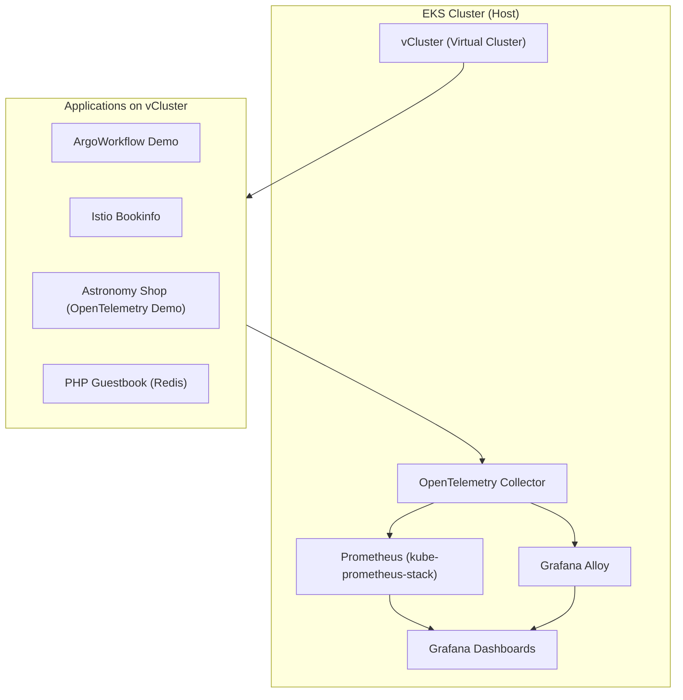

# Prometheus, OpenTelemetry, Grafana を用いた vCluster 監視基盤



| レイヤー | 利用技術 / OSS | 役割 |
| --- | --- | --- |
| **クラウド基盤** | **AWS EKS (Elastic Kubernetes Service)** | ホスト Kubernetes クラスタの提供 |
| **仮想クラスタ** | **vCluster (Loft Labs OSS)** | EKS 上にマルチテナント用の仮想 Kubernetes クラスタを構築 |
| **テストアプリ** | - Redis + PHP Guestbook- (代替候補: Argo Workflow Demo, Istio Bookinfo, OpenTelemetry Astronomy Shop) | vCluster 上で稼働させる対象アプリケーション |
| **メトリクス監視** | **Prometheus (kube-prometheus-stack)** | EKS ホストクラスタに配置。ホスト／vCluster 実体 Pod を k8s_sd でスクレイプし、メトリクス収集 |
| **トレース収集** | **OpenTelemetry SDK (アプリ側)** → **Grafana Alloy (agent/gateway)** → **Tempo** | アプリのトレースデータを OTLP 経由で収集し、Tempo に保存 |
| **ログ収集 (任意)** | **Grafana Alloy (agent)** → **Loki** | Pod のコンテナログを収集・集約して可視化 |
| **データ転送・集約** | **Grafana Alloy** | - vCluster 内 agent（オプション）- EKS monitoring NS に gateway を配置し、OTLP 受信／Tempo・Loki へ転送 |
| **可視化・分析** | **Grafana (kube-prometheus-stack に含まれる)** | Prometheus, Tempo, Loki からデータソースを登録し、ダッシュボードで可視化 |
| **デプロイ管理** | **Helm / vCluster CLI / kubectl** | 各種 OSS のインストール・管理 |
| **Namespace 戦略** | vCluster を **namespace モード**で構築 | vCluster Pod がホストの親NSに実体を持つため、ホスト Prometheus の k8s_sd で直接発見可能 |

```planetext
terraform/
├── main.tf
├── variables.tf
├── outputs.tf
├── eks.tf
└── vcluster.tf
```
