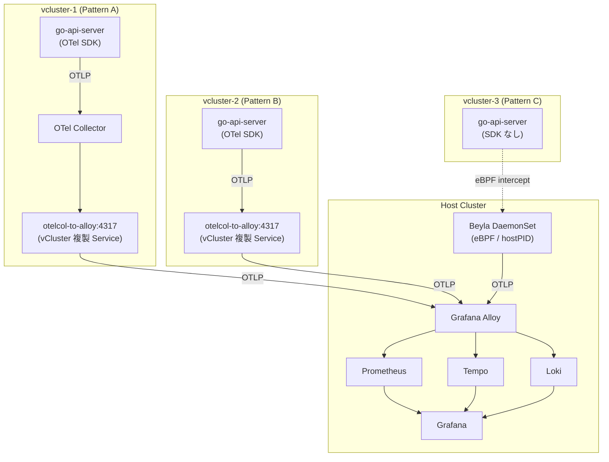

# vCluster × Grafana Alloy × Beyla によるマルチテナント Kubernetes オブザーバビリティ基盤

単一の AWS EKS クラスタ上に vCluster で複数の仮想クラスタ（テナント）を構築し，3 種類の計装方式によるテレメトリを単一の Grafana Alloy ハブで集約・可視化するオブザーバビリティ基盤です．

## アーキテクチャ


```mermaid
flowchart TB
  subgraph vc1["vcluster-1 (Pattern A)"]
    appA["go-api-server\n(OTel SDK)"]
    colA["OTel Collector"]
    svcA["otelcol-to-alloy:4317\n(vCluster 複製 Service)"]
    appA -->|OTLP| colA --> svcA
  end

  subgraph vc2["vcluster-2 (Pattern B)"]
    appB["go-api-server\n(OTel SDK)"]
    svcB["otelcol-to-alloy:4317\n(vCluster 複製 Service)"]
    appB -->|OTLP| svcB
  end

  subgraph vc3["vcluster-3 (Pattern C)"]
    appC["go-api-server\n(SDK なし)"]
  end

  subgraph host["Host Cluster"]
    beyla["Beyla DaemonSet\n(eBPF / hostPID)"]
    alloy["Grafana Alloy"]
    prom["Prometheus"]
    tempo["Tempo"]
    loki["Loki"]
    grafana["Grafana"]

    appC -. "eBPF intercept" .-> beyla
    svcA -->|OTLP| alloy
    svcB -->|OTLP| alloy
    beyla -->|OTLP| alloy
    alloy --> prom & tempo & loki
    prom & tempo & loki --> grafana
  end
```

各仮想クラスタは `replicateServices.fromHost` により `alloy:4317` をクラスタ内に複製し，vCluster 境界を越えた OTLP 送信を実現します．

## コンポーネント一覧

| コンポーネント | バージョン | 役割 |
| --- | --- | --- |
| Terraform | 1.15.5 | EKS クラスタのプロビジョニング |
| Helm | 4.2.0 | Kubernetes コンポーネントのデプロイ管理 |
| Helmfile | 1.5.2 | Helm チャートの宣言的管理 |
| kubectl | v1.36.x (client) / v1.34-eks (server) | クラスタ操作 |
| vCluster / vCluster CLI | v0.34.2 | 仮想クラスタの作成・管理 |
| Grafana Alloy | v1.16.1 (chart 1.8.2) | OTLP 受信・テレメトリ転送ゲートウェイ |
| kube-prometheus-stack | chart 86.2.0 / Prom Operator v0.91.0 | Prometheus + Grafana によるメトリクス監視・アラート |
| Loki | 3.6.7 (chart 6.55.0) | ログ収集・保存・TraceID 相関 |
| Tempo | 2.9.0 (chart 1.24.4) | 分散トレース収集・SpanMetrics 生成 |
| Grafana Beyla | OBI 3.20.0 (chart 1.16.8) | eBPF 自動計装 DaemonSet |

## ディレクトリ構成

```text
.
├── terraform/          # EKS クラスタ (IaC)
├── helm/
│   └── helmfile.yaml   # ホストクラスタ監視スタック
│                       # (Alloy / Tempo / Loki / kube-prometheus-stack / vCluster / Beyla)
├── manifests/
│   ├── monitoring/     # Grafana アラートルール・ダッシュボード ConfigMap
│   ├── storageclass/   # gp3 StorageClass
│   ├── vcluster/       # vCluster 設定ファイル (vcluster-{1,2,3}-config.yaml)
│   ├── pattern-a/      # go-api-server + OTel Collector (OTLP → Alloy)
│   ├── pattern-b/      # go-api-server OTel SDK 直送 (OTLP → Alloy)
│   └── pattern-c/      # go-api-server SDK なし (Beyla eBPF + /metrics scrape)
└── src/
    └── server/         # go-api-server ソースコード (Go / OTel SDK)
                        # ビルド・ECR プッシュ手順は src/server/README.md を参照
```

## セットアップ手順

### 前提条件

- AWS CLI（認証済み）
- Terraform, Helm, Helmfile, kubectl, vCluster CLI がインストール済み

### 1. EKS クラスタの作成

```bash
cd terraform/

# IAM ARN を使って tfvars を生成
echo "eks_access_entry_principal_arn = $(aws sts get-caller-identity --output json --no-cli-pager | jq '.Arn')" > terraform.tfvars

terraform init
terraform plan  -var-file="terraform.tfvars"
terraform apply -var-file="terraform.tfvars"
```

### 2. kubeconfig の設定

```bash
export REGION="ap-northeast-1"
export CLUSTER_NAME="demo-eks-vcluster"

aws eks update-kubeconfig --region $REGION --name $CLUSTER_NAME
kubectl cluster-info
kubectl get nodes
```

### 3. StorageClass の作成

```bash
cd ..
kubectl apply -f manifests/storageclass/gp3-storageclass.yaml
```

### 4. 監視スタックのデプロイ

```bash
helmfile repos -f helm/helmfile.yaml
helm repo update

helmfile sync -f helm/helmfile.yaml

# Grafana アラートルールとダッシュボードを適用
kubectl apply -f manifests/monitoring/grafana-alert-rules.yaml
kubectl apply -f manifests/monitoring/grafana-dashboards.yaml
```

### 5. 仮想クラスタの作成とアプリのデプロイ

```bash
# vcluster-1: Pattern A (OTel SDK + OTel Collector)
vcluster create vcluster-1 \
  --namespace vcluster-1 \
  --upgrade \
  --values manifests/vcluster/vcluster-1-config.yaml
kubectl apply -f manifests/pattern-a/deploy.yaml
vcluster disconnect

# vcluster-2: Pattern B (OTel SDK 直送)
vcluster create vcluster-2 \
  --namespace vcluster-2 \
  --upgrade \
  --values manifests/vcluster/vcluster-2-config.yaml
kubectl apply -f manifests/pattern-b/deploy.yaml
vcluster disconnect

# vcluster-3: Pattern C (Beyla eBPF)
vcluster create vcluster-3 \
  --namespace vcluster-3 \
  --upgrade \
  --values manifests/vcluster/vcluster-3-config.yaml
kubectl apply -f manifests/pattern-c/deploy.yaml
vcluster disconnect
```

### 6. Grafana へのアクセス

```bash
kubectl port-forward svc/kube-prometheus-stack-grafana 3000:80 -n monitoring

# 管理者パスワードを取得
kubectl get secret kube-prometheus-stack-grafana -n monitoring \
  -o jsonpath="{.data.admin-password}" | base64 --decode; echo
```

ブラウザで <http://localhost:3000> を開き，ユーザー名 `admin` でログイン．

### 7. クラスタの削除

```bash
vcluster delete vcluster-1 --namespace vcluster-1
vcluster delete vcluster-2 --namespace vcluster-2
vcluster delete vcluster-3 --namespace vcluster-3

cd terraform/
terraform destroy -var-file="terraform.tfvars"
```

## 計装パターンの比較

| | Pattern A | Pattern B | Pattern C |
| --- | --- | --- | --- |
| **計装方式** | OTel SDK + OTel Collector | OTel SDK 直送 | Beyla eBPF |
| **アプリ変更** | SDK 導入・コード変更必要 | SDK 導入・コード変更必要 | 不要 |
| **Metrics** | ✓ (OTLP) | ✓ (OTLP) | ✓ (eBPF + scrape) |
| **Traces** | ✓ | ✓ | ✓ (eBPF) |
| **Logs** | ✓ | ✓ | ✗ |
| **Prometheus ラベル** | `job=go-api-server-pattern-a` | `job=go-api-server-pattern-b` | `job=vcluster-3/go-api-server-pattern-c` |

## 参考資料

- [vCluster Docs](https://www.vcluster.com/docs/)
- [Grafana Alloy Docs](https://grafana.com/docs/alloy/)
- [Grafana Beyla Docs](https://grafana.com/docs/beyla/)
- [Grafana Tempo Docs](https://grafana.com/docs/tempo/)
- [OpenTelemetry Go Instrumentation](https://opentelemetry.io/docs/languages/go/instrumentation/)
- [OpenTelemetry Semantic Conventions](https://opentelemetry.io/docs/specs/semconv/)
