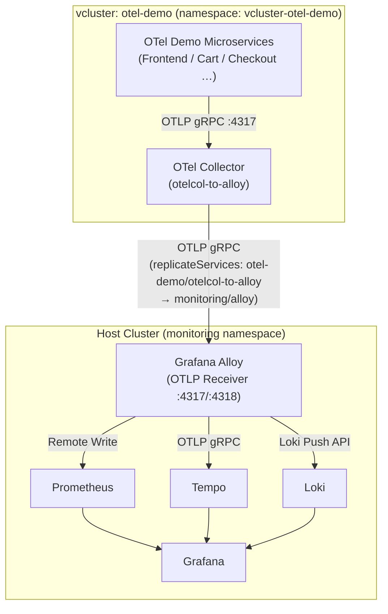
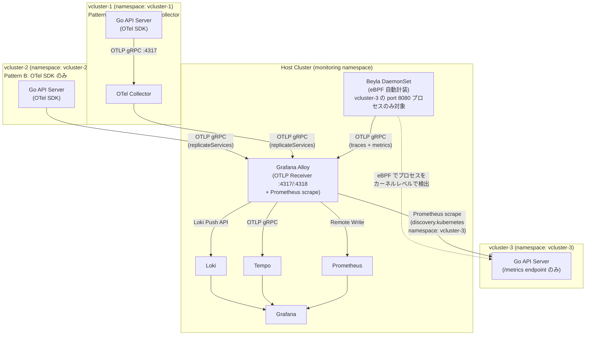

# vCluster と Grafana Alloy によるマルチテナント Kubernetes オブザーバビリティ基盤

単一の AWS EKS クラスタ上に vCluster で仮想クラスタ（テナント）を構築し，Grafana Alloy を集約ゲートウェイとしてメトリクス／トレース／ログを一元管理するオブザーバビリティ基盤です．

## アーキテクチャ

### 検証1: OpenTelemetry Demo による基本動作確認


```mermaid
flowchart TB
  subgraph vc_demo["vcluster: otel-demo (namespace: vcluster-otel-demo)"]
    direction TB
    demo_apps["OTel Demo Microservices\n(Frontend / Cart / Checkout …)"]
    demo_col["OTel Collector\n(otelcol-to-alloy)"]
    demo_apps -->|"OTLP gRPC :4317"| demo_col
  end

  subgraph host["Host Cluster (monitoring namespace)"]
    direction TB
    alloy["Grafana Alloy\n(OTLP Receiver :4317/:4318)"]
    prometheus["Prometheus"]
    tempo["Tempo"]
    loki["Loki"]
    grafana["Grafana"]

    alloy -->|"Remote Write"| prometheus
    alloy -->|"OTLP gRPC"| tempo
    alloy -->|"Loki Push API"| loki
    prometheus & tempo & loki --> grafana
  end

  demo_col -->|"OTLP gRPC\n(replicateServices: otel-demo/otelcol-to-alloy\n→ monitoring/alloy)"| alloy
```

### 検証2: テレメトリ収集パターンの比較（Pattern A / B / C）


```mermaid
flowchart TB
  subgraph vc1["vcluster-1 (namespace: vcluster-1)\nPattern A: OTel SDK + OTel Collector"]
    app1["Go API Server\n(OTel SDK)"]
    col1["OTel Collector"]
    app1 -->|"OTLP gRPC :4317"| col1
  end

  subgraph vc2["vcluster-2 (namespace: vcluster-2)\nPattern B: OTel SDK のみ"]
    app2["Go API Server\n(OTel SDK)"]
  end

  subgraph vc3["vcluster-3 (namespace: vcluster-3)\nPattern C: コード変更なし"]
    app3["Go API Server\n(/metrics endpoint のみ)"]
  end

  subgraph host["Host Cluster (monitoring namespace)"]
    direction TB
    beyla["Beyla DaemonSet\n(eBPF 自動計装)\nvcluster-3 の port 8080 プロセスのみ対象"]
    alloy["Grafana Alloy\n(OTLP Receiver :4317/:4318\n+ Prometheus scrape)"]
    prometheus["Prometheus"]
    tempo["Tempo"]
    loki["Loki"]
    grafana["Grafana"]

    beyla -->|"OTLP gRPC\n(traces + metrics)"| alloy
    alloy -->|"Remote Write"| prometheus
    alloy -->|"OTLP gRPC"| tempo
    alloy -->|"Loki Push API"| loki
    prometheus & tempo & loki --> grafana
  end

  col1 -->|"OTLP gRPC\n(replicateServices)"| alloy
  app2 -->|"OTLP gRPC\n(replicateServices)"| alloy
  alloy -->|"Prometheus scrape\n(discovery.kubernetes\n namespace: vcluster-3)"| app3
  beyla -.->|"eBPF でプロセスを\nカーネルレベルで検出"| app3
```

## コンポーネント一覧

| コンポーネント | バージョン | 役割 |
| --- | --- | --- |
| Terraform | 1.14.4 | EKS クラスタのプロビジョニング |
| Helm / Helmfile | 4.1.1 / 1.3.1 | Kubernetes コンポーネントのデプロイ管理 |
| kubectl | v1.35.1 (client) / v1.34.4-eks (server) | クラスタ操作 |
| vCluster / vCluster CLI | v0.32.1 | 仮想クラスタの作成・管理 |
| Grafana Alloy | v1.13.2 (chart 0.6.2) | OTLP 受信・テレメトリ転送ゲートウェイ |
| kube-prometheus-stack | 0.89.0 (chart 82.10.1) | Prometheus + Grafana によるメトリクス監視 |
| Loki | 3.6.5 (chart 6.53.0) | ログ収集・保存 |
| Tempo | 2.9.0 (chart 1.24.4) | 分散トレース収集・Service Map |
| OpenTelemetry Demo | 2.2.0 (chart 0.40.5) | 検証用デモアプリ |

## ディレクトリ構成

```text
.
├── terraform/          # EKS クラスタ (IaC)
├── helm/
│   ├── helmfile.yaml   # ホストクラスタ監視スタック (Alloy / Tempo / Loki / kube-prometheus-stack / vCluster)
│   └── demo-otel.yaml  # 仮想クラスタ用 OpenTelemetry Demo
├── manifests/
│   ├── storageclass/   # gp3 StorageClass
│   ├── monitoring/     # Grafana アラートルール
│   ├── vcluster/       # vCluster 設定ファイル (config.yaml, vcluster-{1,2,3}-config.yaml)
│   ├── pattern-a/      # Go API Server + OTel Collector (OTLP → Alloy)
│   ├── pattern-b/      # Go API Server (OTel SDK 直接 → Alloy)
│   └── pattern-c/      # Go API Server (/metrics scrape)
└── src/
    └── server01/       # Go API Server ソースコード
```

## セットアップ手順

### 前提条件

- AWS CLI（認証済み）
- Terraform, Helm, Helmfile, kubectl, vCluster CLI がインストール済み

### 1. EKS クラスタの作成

```bash
cd terraform

# IAM ARN を使って tfvars を生成
echo "eks_access_entry_principal_arn = $(aws sts get-caller-identity --output json --no-cli-pager | jq '.Arn')" > terraform.tfvars

# 初期化
terraform init

# 計画・適用
terraform plan -var-file="terraform.tfvars"
terraform apply -var-file="terraform.tfvars"
```

### 2. kubeconfig の設定

```bash
export REGION="ap-northeast-1"
export CLUSTER_NAME="demo-eks-vcluster"

aws eks update-kubeconfig --region $REGION --name $CLUSTER_NAME
kubectl cluster-info
```

### 3. StorageClass の作成

```bash
cd ..
kubectl apply -f manifests/storageclass/gp3-storageclass.yaml
```

### 4. ホストクラスタへの監視スタックデプロイ

```bash
# Helm リポジトリ登録
helmfile repos -f helm/helmfile.yaml
helm repo update

# Alloy / Tempo / Loki / kube-prometheus-stack / vCluster をデプロイ
helmfile sync -f helm/helmfile.yaml

# Grafana アラートルールを適用
kubectl apply -f manifests/monitoring/grafana-alert-rules.yaml
```

### 5. 仮想クラスタの作成とデモアプリのデプロイ（検証 1）

```bash
# 仮想クラスタ otel-demo を作成 (コンテキストが自動で切り替わる)
vcluster create otel-demo \
  --namespace vcluster-otel-demo \
  --upgrade \
  --values manifests/vcluster/config.yaml

# Helm リポジトリ登録
helmfile repos -f helm/demo-otel.yaml
helm repo update

# OpenTelemetry Demo をデプロイ
helmfile sync -f helm/demo-otel.yaml

# ホストクラスタに戻る
vcluster disconnect
```

### 6. 仮想クラスタの作成（検証 2: Pattern A / B / C）

```bash
# Pattern A: OTel Collector あり
vcluster create vcluster-1 \
  --namespace vcluster-1 \
  --upgrade \
  --values manifests/vcluster/vcluster-1-config.yaml
kubectl apply -f manifests/pattern-a/deploy.yaml
vcluster disconnect

# Pattern B: OTel Collector なし
vcluster create vcluster-2 \
  --namespace vcluster-2 \
  --upgrade \
  --values manifests/vcluster/vcluster-2-config.yaml
kubectl apply -f manifests/pattern-b/deploy.yaml
vcluster disconnect

# Pattern C: Prometheus scrape
vcluster create vcluster-3 \
  --namespace vcluster-3 \
  --upgrade \
  --values manifests/vcluster/vcluster-3-config.yaml
kubectl apply -f manifests/pattern-c/deploy.yaml
vcluster disconnect
```

### 7. Grafana へのアクセス

```bash
# Grafana
kubectl port-forward svc/kube-prometheus-stack-grafana 3000:80 -n monitoring

# 管理者パスワードを取得
kubectl get secret kube-prometheus-stack-grafana -n monitoring \
  -o jsonpath="{.data.admin-password}" | base64 --decode | pbcopy
```

ブラウザで <http://localhost:3000> を開き，ユーザー名 `admin`・コピーしたパスワードでログイン．

### 8. クラスタの削除

```bash
vcluster delete otel-demo --namespace vcluster-otel-demo
vcluster delete vcluster-1 --namespace vcluster-1
vcluster delete vcluster-2 --namespace vcluster-2
vcluster delete vcluster-3 --namespace vcluster-3

cd terraform
terraform destroy -var-file="terraform.tfvars"
```

## テレメトリ収集パターンの比較

| | Pattern A | Pattern B | Pattern C |
| --- | --- | --- | --- |
| **OTel Collector** | あり | なし | なし |
| **OTel SDK** | あり | あり | なし |
| **Metrics** | ✓ (OTLP) | ✓ (OTLP) | ✓ (scrape) |
| **Traces** | ✓ | ✓ | ✗ |
| **Logs** | ✓ | ✓ | ✗ |
| **運用コスト** | 高 | 低 | 最低 |

## 参考資料

- [vCluster Docs](https://www.vcluster.com/docs/)
- [Grafana Alloy Docs](https://grafana.com/docs/alloy/)
- [OpenTelemetry Demo](https://opentelemetry.io/docs/demo/)
- [OpenTelemetry Go Instrumentation](https://opentelemetry.io/docs/languages/go/instrumentation/)
