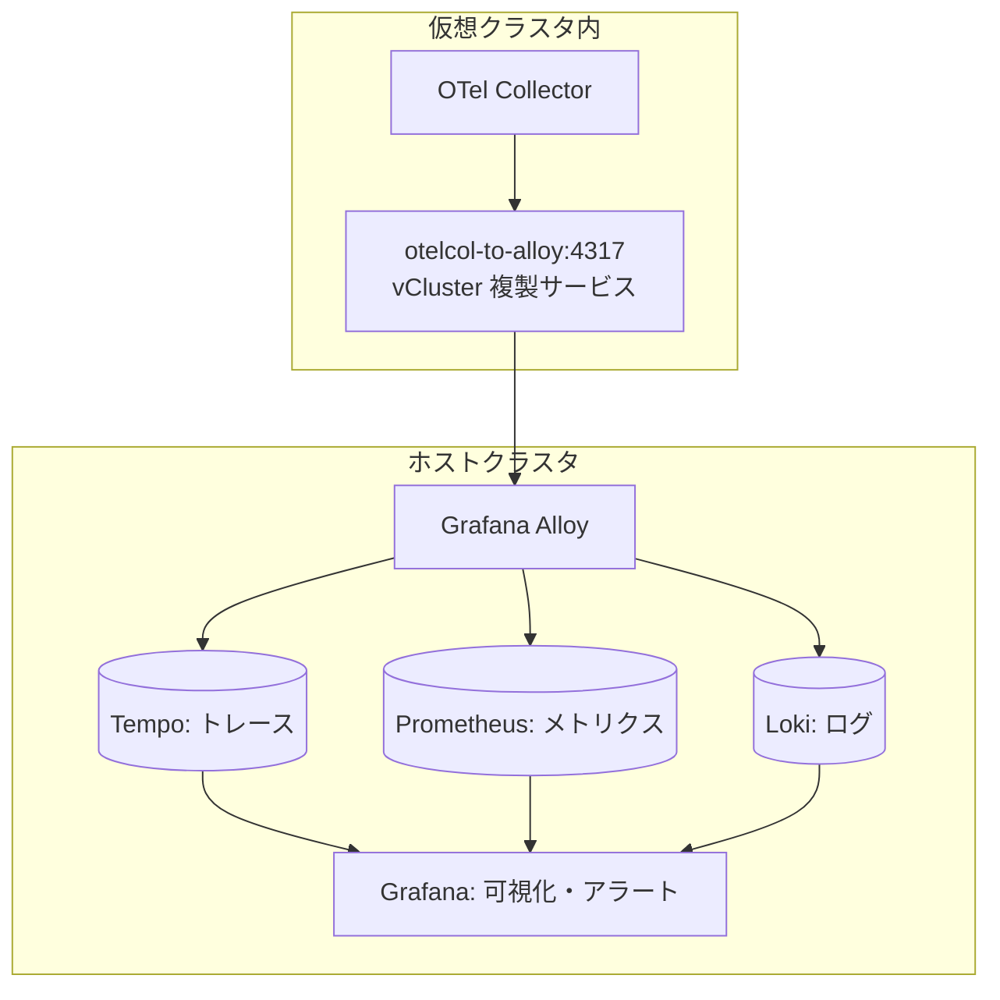
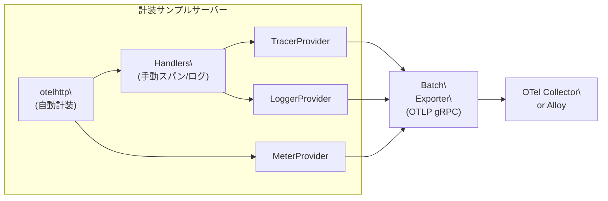
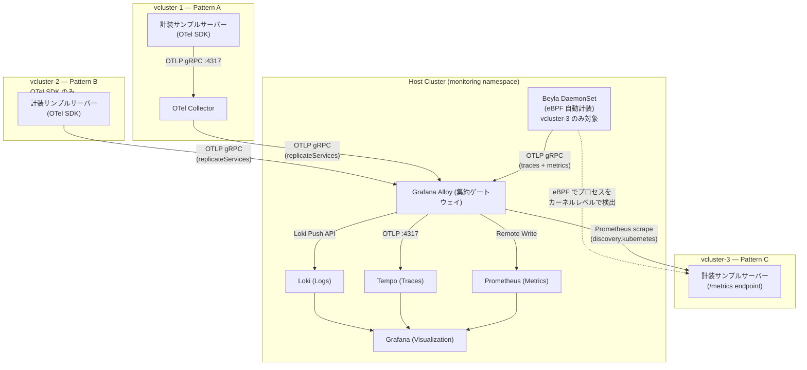
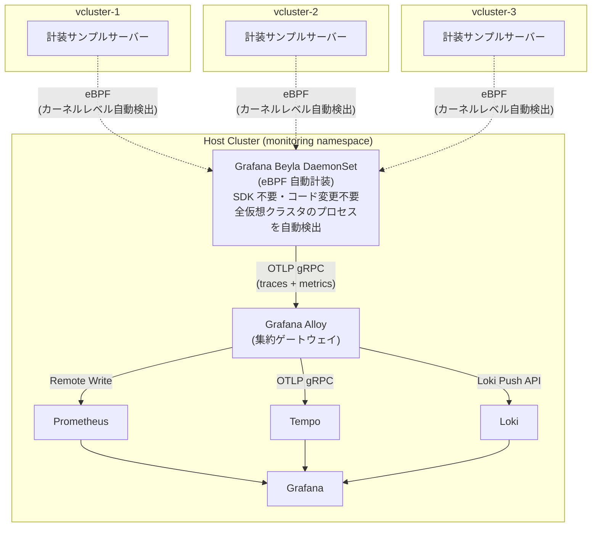

# **vCluster と Grafana Alloy によるマルチテナント Kubernetes 環境のオブザーバビリティ基盤**

## 自己紹介

### **井上 裕介**

千葉工業大学大学院 情報科学研究科 情報科学専攻 修士１年の井上 裕介と申します．

大学では主にメタヒューリスティクスに関する最適化アルゴリズムの研究に従事しております．

## アジェンダ

- はじめに
    - マルチテナント Kubernetes 環境におけるオブザーバビリティの課題
    - 従来のアプローチとその限界
    - 本稿のゴール
- vCluster
    - アーキテクチャ
    - テナンシーモデル
- オブザーバビリティ
    - 主な監視スタック
    - テレメトリパイプラインの設計
- OpenTelemetry による計装
    - OTel の構成: API と SDK の分離
    - 3 つのプロバイダーの初期化
    - Resource: テレメトリの出所を識別する
    - 自動計装: otelhttp ミドルウェア
    - 手動計装: スパンと構造化ログの追加
- 環境構築 1
    - EKS クラスタの作成
    - helmfile を用いてコンポーネントをインストール
    - 仮想クラスタの構成
- 検証 1: OTel Demo を用いたテレメトリパイプラインの動作検証
    - 動作検証: テレメトリパイプライン
    - 動作検証: Feature Flag による障害注入シナリオ
- 環境構築 2
    - 仮想クラスタの作成と計装サンプルサーバーのデプロイ
- 検証 2: Alloy と Beyla による複数のテレメトリパイプライン管理の実践
    - 一対多のテレメトリパイプライン構成
    - Grafana と計装サンプルサーバーへの Port Forward
    - 動作検証: 複数のテレメトリパイプライン
- 検証 3: テナント障害分離の実証
    - シナリオ
    - Phase 6: テナント障害分離確認
    - 検証結果サマリー
- おわりに

## はじめに

### マルチテナント Kubernetes 環境におけるオブザーバビリティの課題

現代のソフトウェア開発では，複数のチームやプロジェクトが同一の Kubernetes 基盤を共有するマルチテナント構成が一般的になっています．

ブランチや PR ごとに独立した環境を用意するユースケースでは，テナント数が増えるにつれて次のような課題が顕在化します．

- 監視基盤の分散:
    
    テナントごとに Prometheus や Grafana を個別にデプロイすると，運用コストがテナント数に比例して増大する
    
- テレメトリの集約困難:
    
    テナントをまたいだメトリクス / トレース / ログの横断分析ができず，障害の全体像が掴みにくい
    
- 分離性の確保:
    
    単一クラスタ内の Namespace 分離では Control Plane を共有するため，テナントごとに異なる CRD やクラスタロールを適用しにくい
    

### 従来のアプローチとその限界

テナントごとに専用クラスタを用意するアプローチには次のような問題があります．

- 監視基盤の分散:
    
    クラスタごとに Prometheus や Grafana を個別にデプロイすると，運用コストがクラスタ数に比例して増大する
    
- テレメトリの集約困難:
    
    環境をまたいだメトリクス / トレース / ログの横断分析ができず，障害の全体像が掴みにくい
    
- Namespace 分離の限界:
    
    単一クラスタ内の Namespace 分離では Control Plane を共有するため，テナントごとに異なる CRD やクラスタロールを適用しにくい
    

### 本稿のゴール

これらの課題に対するアプローチとして，本記事では以下の基盤を構築します．

- vCluster によるマルチテナント環境の構築:
    
    単一の EKS クラスタ上で軽量な仮想クラスタをテナントとして使用し，数十秒での作成・削除を実現
    
- Grafana Alloy を集約ゲートウェイとしたテレメトリパイプラインの構築:
    
    仮想クラスタ内のアプリケーションが出力するメトリクス / トレース / ログを，Alloy を介してホスト側の単一監視基盤に集約するパイプラインを構築
    

上記の基盤を構築した上で，次の 3 つの観点から検証を行います．

1. 検証 1: テレメトリパイプラインの動作確認と障害対応への有効性:
    
    OpenTelemetry Demo を用いて障害を注入し，メトリクス / トレース / ログの 3 シグナルを相関させることで根本原因を特定できるかを確認する
    
2. 検証 2: 複数の仮想クラスタ・テレメトリ収集パターンへのスケールアウト:
    
    OTel Collector あり / なし / Prometheus scrape の 3 パターンを比較し，Alloy による複数仮想クラスタの一元管理を検証する
    
3. 検証 3: テナント障害分離の実証:
    
    あるテナントで障害が発生したとき，他のテナントの監視に影響が出ないかを，vcluster-1 に障害を注入しながら vcluster-2・3 のエラーレートが 0% を維持するかで確認する
    

本稿では，便宜的に vCluster コンポーネントがインストールされた Kubernetes クラスタを「ホストクラスタ」，vCluster が作成した仮想の Kubernetes クラスタを「仮想クラスタ」と呼びます．

## vCluster

vCluster は [Loft Lab](https://www.loft.sh/) 社が開発している OSS であり，Kubernetes クラスタ上に，論理的に独立した Kubernetes クラスタを構築するためのソリューションです．

現在は OSS の他に，有償プランとして Enterprise Plan や vCluster Cloud が提供されています．

有償プランの特徴として，Istio や KubeVirt などの OSS との連携機能，クラウドプロバイダーとの統合などがサポートされます．

表 1 に vCluster を利用するメリット・デメリットをまとめます．

表 1: vCluster のメリットとデメリット

| 観点 | メリット | デメリット |
| --- | --- | --- |
| **コスト** | • 物理ノードを共有し，インフラコストを大幅削減
• 必要時のみ起動する一時環境でリソース効率を最大化 | • 各 vCluster の Control Plane が CPU・メモリを消費
• 小規模ワークロードでは相対的なオーバーヘッドが大きい |
| **運用** | • ホストクラスタに管理を集中し，個別クラスタのメンテナンス不要• 統一されたモニタリング・ロギング基盤で一元管理 | • vCluster 固有の概念とベストプラクティスの学習が必要
• トラブルシューティング時にホストと vCluster 両方の理解が必要 |
| **開発・テスト** | • 数十秒で環境を作成・削除し，CI/CD パイプラインに容易に統合
• ブランチや PR ごとの独立した検証環境を気軽に構築 | • 初期セットアップと CI/CD への組み込みに設計の工夫が必要 |
| **隔離性** | • 独立した API サーバーと etcd により CRD やクラスタリソースを完全分離
• テナント間の障害や不正操作の影響を最小化 | • ホストクラスタの Node レベル機能 (DaemonSet，特定の Device Plugin) へのアクセスは制限される |
| **柔軟性** | • ホストとは独立した Kubernetes バージョンを選択可能
• チームごとに異なるバージョンでの検証を同一基盤上で実現 | • 一部のクラウドプロバイダー固有機能は追加構成や有償プランが必要 |
| **ネットワーク** | • ホストクラスタのネットワークを活用し，柔軟な通信設計が可能
• LoadBalancer，Ingress による外部公開に対応 | • vCluster 間やホスト間の通信設計に注意が必要
• ネットワークポリシーの設定が複雑になる場合がある |
| **ストレージ** | • ホストクラスタの StorageClass をそのまま利用可能
• PV/PVC の管理をホスト側に委譲 | • vCluster 削除時のデータ保持ポリシーを明確に定義する必要
• ストレージクラスの設計がホストクラスタに依存 |

### **アーキテクチャ**

vCluster は仮想 Control Plane と同期メカニズムの2つの主要コンポーネントで構成されています．

- 仮想 Control Plane
    
    各 vCluster は独自の Kubernetes  Control Plane を持ちます．
    
    この Control Plane はホストクラスタの namespace 内に通常の Pod として実行され，以下のコンポーネントを含みます．
    
    - API Server:
        
        仮想クラスタへの全ての Kubernetes API リクエストを処理
        
    - Controller Manager:
        
        ReplicaSet，Deployment などの Kubernetes リソースを管理
        
    - データストア:
        
        デフォルトでは組み込みの SQLite を使用し，高可用性構成では etcd や他のデータストアに切り替え可能
        
    - Syncer:
        
        ホストクラスタと仮想クラスタ間でリソースを同期する vCluster 固有のコンポーネント
        

### **テナンシーモデル**

vCluster は， Control Plane とワーカーノードの展開方法に応じて，5つの主要なテナンシーモデルを提供しています．

各モデルは，隔離性，コスト効率，運用の複雑さのトレードオフが異なります．

表 2: テナンシーモデルの比較

| **モデル** | **物理ノードの扱い** | **分離** | **リソース効率** | **ユースケース** |
| --- | --- | --- | --- | --- |
| Shared Nodes | 共有 | 低 (名前空間レベル)  | 最高 | 開発環境，CI/CD，コスト最適化 |
| Dedicated Nodes | 専有 (論理的)  | 中 (ノードセレクターによる分離)  | 中 | 性能予測が必要な商用，特定チーム用 |
| Virtual Nodes | 仮想化 | 中〜高 (ノード境界を仮想化)  | 高 | セキュリティと効率の両立，SaaS基盤 |
| Private Nodes | 専有 (物理的)  | 最高 (ハードウェアから分離)  | 低 | 高度なコンプライアンス，機密データ |
| Standalone | 不要 (VM/単一コンテナ)  | 独立 (ホストK8sに依存しない)  | 調整可能 | ローカル開発，デモ，エアギャップ環境 |

## オブザーバビリティ

オブザーバビリティ (Observability) とは，システムの外部出力からその内部状態を推測・理解できる能力を指します．

特にマイクロサービスアーキテクチャでは，サービス間の依存関係が複雑になるため，障害発生時に「どのサービスで何が起きているか」を素早く把握する手段として不可欠です．

オブザーバビリティを構成する主要な要素として，次の 3つのシグナル があります．

表 3: 主要なオブザーバビリティシグナル

| シグナル | 役割 | 例 |
| --- | --- | --- |
| Metrics | 時系列の数値データ．
システムの状態をリアルタイムに監視し，異常を検知する． | エラーレート，レイテンシ，CPU 使用率 |
| Traces | リクエストがシステムを通過する際の経路と処理時間の記録． | どのサービスのどの処理で遅延が発生したか |
| Logs | 各サービスが出力するテキストイベント．
障害の詳細な原因調査に使う． | エラーメッセージ，スタックトレース |

3つのシグナルを組み合わせることで，メトリクスで異常を検知し，トレースで問題のあるサービスを特定し，ログで根本原因を調査するという流れで障害対応を効率化できます．

### 主な監視スタック

本検証では，仮想クラスタ内のデモアプリが出力するテレメトリをホストクラスタ側で収集・可視化するため，以下のコンポーネントを採用しました．

- Grafana Alloy
    
    Grafana Alloy は Grafana Labs が開発する OSS のオブザーバビリティパイプラインエージェントです．
    
    OpenTelemetry Protocol (OTLP) を含む複数の受信プロトコルに対応しており，収集したテレメトリを各バックエンドに振り分けるゲートウェイとして機能します．
    
    本構成では Alloy が中心的な役割を担い，仮想クラスタ内の OTel Collector からテレメトリを受け取り，種別ごとに適切なバックエンドへ転送します．
    
- Prometheus / Grafana
    
    kube-prometheus-stack に同梱される Prometheus をメトリクスの保存・アラート評価に使用し，Grafana を可視化・アラート管理の UI として使用します．
    
    アラートルールには SpanMetrics (トレースから自動生成されるメトリクス) を活用しており，サービスごとのエラーレートや P99 レイテンシを PromQL で監視します．
    
- Loki
    
    アプリケーションログを収集・保存するログアグリゲーター．
    
    Grafana の Explore 画面から TraceID を使ってトレースとログを相関させることができます．
    
- Tempo
    
    分散トレースのバックエンド．
    
    Grafana の Tempo DataSource から Service Map を参照し，障害の伝播経路を可視化します．
    

### テレメトリパイプラインの設計

仮想クラスタから外部の監視基盤にテレメトリを転送するため，`vcluster.networking.replicateservices` を使用してホストクラスタ側のサービスを仮想クラスタ内に公開しています．

これにより，仮想クラスタ内の OTel Collector は `otelcol-to-alloy:4317` という仮想サービス経由でホスト側の Alloy にテレメトリを送信できます．



## OpenTelemetry による計装

3 つのシグナルをアプリケーションから出力するためには，計装 (Instrumentation) という作業が必要です．

計装とは，アプリケーションのソースコードにオブザーバビリティ用のコードを組み込み，テレメトリ (スパン・メトリクス・ログ) を生成・送信できるようにすることです．

[OpenTelemetry (OTel)](https://opentelemetry.io/) は，この計装を標準化した OSS のフレームワークです．

ベンダー中立な仕様と実装を提供しており，Datadog / Grafana / Jaeger など異なるバックエンドに対してコードを書き換えることなく切り替えられます．

### OTel の構成: API と SDK の分離

OTel の Go ライブラリは API と SDK の 2 層に分かれています (表 4)．

表 4: OTel ライブラリの構成

| 層 | パッケージ | 役割 |
| --- | --- | --- |
| **API** | `go.opentelemetry.io/otel` | スパン・メトリクス・ログを記録するための *インターフェース* を定義する．アプリやライブラリのコードはこの API のみに依存する． |
| **SDK** | `go.opentelemetry.io/otel/sdk` | API の実装．プロバイダーの設定・バッファリング・エクスポーターへの転送など「どこに・どう送るか」を担う．アプリの起動時に 1 度だけ初期化する． |
| **Exporter** | `go.opentelemetry.io/otel/exporters/otlp/...` | 収集したテレメトリを OTLP (OpenTelemetry Protocol) 形式で Collector や Alloy に送信する．gRPC 版と HTTP 版がある． |

この分離により，ライブラリ開発者は API のみに依存したコードを書き，エンドユーザー (アプリ開発者) が SDK の実装を選択・設定するという役割分担が成立しています．

### 3 つのプロバイダーの初期化

OTel SDK を使う際は，シグナルごとに Provider を初期化してグローバルに登録します．

```go
// otel.go より抜粋 (src/server01)

// 1. TracerProvider: トレース (スパン) の生成・エクスポートを管理
tp := sdktrace.NewTracerProvider(
    sdktrace.WithBatcher(traceExporter), // バッチで OTel Collector に送信
    sdktrace.WithResource(res),          // サービス名などのリソース属性を付与
)
otel.SetTracerProvider(tp) // グローバルに登録

// 2. MeterProvider: メトリクスの生成・エクスポートを管理
mp := sdkmetric.NewMeterProvider(
    sdkmetric.WithReader(sdkmetric.NewPeriodicReader(metricExporter)), // 60s ごとに送信
    sdkmetric.WithResource(res),
)
otel.SetMeterProvider(mp)

// 3. LoggerProvider: 構造化ログのエクスポートを管理
lp := sdklog.NewLoggerProvider(
    sdklog.WithProcessor(sdklog.NewBatchProcessor(logExporter)),
    sdklog.WithResource(res),
)
global.SetLoggerProvider(lp)
```

3 つのプロバイダーはいずれも同一の gRPC コネクションを通じて OTLP データを送信します．各プロバイダーはアプリケーション終了時に `Shutdown()` を呼んでバッファをフラッシュする必要があります．

### Resource: テレメトリの出所を識別する

`resource.Resource` はテレメトリがどのサービスから来たものかをバックエンドが識別するための属性セットです．

`service.name` に設定した値が Grafana の `service_name` ラベルに対応し，ダッシュボードやトレース画面でサービスを絞り込む際に使われます．

```go
res, _ := resource.Merge(
    resource.Default(), // Go バージョン・ホスト名などの標準属性
    resource.NewWithAttributes(
        semconv.SchemaURL,
        semconv.ServiceName("server01-pattern-a"), // ← Grafana の service_name ラベル
    ),
)
```

### 自動計装: otelhttp ミドルウェア

HTTP サーバーへの計装で最も手間がかかるのは，全エンドポイントに共通する「リクエストの受信スパン生成」です．

`go.opentelemetry.io/contrib/instrumentation/net/http/otelhttp` パッケージが提供する `otelhttp.NewHandler` でルーターをラップするだけで，以下が自動的に行われます．

- リクエストごとに HTTP スパンを生成し，`http.method`・`http.route`・`http.status_code` などの標準属性を付与
- W3C Trace Context ヘッダー (`traceparent`) を読み取り，上流サービスのスパンと接続 (分散トレーシング)
- `http.server.request.duration` などの HTTP メトリクスを自動計測
    
    ```go
    // main.go より抜粋 (src/server01)
    
    mux := http.NewServeMux()
    mux.HandleFunc("/", handleRoot)
    mux.HandleFunc("/health", handleHealth)
    
    // ルーター全体を otelhttp でラップ → 全エンドポイントが自動計装される
    handler := otelhttp.NewHandler(mux, "server01")
    
    srv := &http.Server{Addr: ":" + port, Handler: handler}
    ```
    

### 手動計装: スパンと構造化ログの追加

自動計装で生成される HTTP スパンをさらに詳細に記録したい場合は，ハンドラ内で子スパンを手動で作成します．

```go
// handler.go より抜粋 (src/server01)

var tracer = otel.Tracer("server01") // パッケージレベルで取得

func handleRoot(w http.ResponseWriter, r *http.Request) {
    // 子スパンを開始 (親は otelhttp が生成した HTTP スパン)
    ctx, span := tracer.Start(r.Context(), "handle-root")
    defer span.End() // 関数終了時に自動でスパンを閉じる

    // スパン属性: Tempo の詳細画面でキーバリューとして表示される
    span.SetAttributes(
        attribute.String("http.method", r.Method),
        attribute.String("http.path", r.URL.Path),
    )

    // 構造化ログ: ctx を渡すことで TraceID が自動的に埋め込まれる
    // → Grafana の Loki で TraceID からトレースへジャンプ可能
    var rec otellog.Record
    rec.SetSeverity(otellog.SeverityInfo)
    rec.SetBody(otellog.StringValue("handling GET /"))
    global.GetLoggerProvider().Logger("server01").Emit(ctx, rec)

    json.NewEncoder(w).Encode(map[string]string{"message": "Hello"})
}
```

ログに `ctx` を渡すのがポイントで，これにより各ログレコードに現在のトレース ID とスパン ID が紐付けられます．

Grafana でトレースを表示した際に，「このスパン中に出力されたログ」へ直接ジャンプできるのはこの仕組みによるものです．

以上をまとめると，OTel 計装を組み込んだ計装サンプルサーバーのテレメトリ生成フローは以下の通りです．



## 環境構築 1

ここからは検証環境の構築を行なっていきます．

検証 1, 2, 3 は全て AWS EKS 上で実施します

### EKS クラスタの作成

ここからは GitHub リポジトリにあるファイルの使用を前提に解説を行います．

本検証では AWS EKS を使用します．

表 5 に検証で使用する各種コンポーネントを掲載します．

表 5: 検証環境

| **Component** | **Version** |
| --- | --- |
| OS | macOS Tahoe 26.3.1 arm64 |
| Terraform | 1.14.4 |
| Helm | 4.1.1 |
| Helmfile | 1.3.1 |
| kubectl | Client: v1.35.1 / Kustomize: v5.7.1 / Server: v1.34.4-eks-3a10415 |
| vCluster / vCluster CLI | v0.32.1 |
| kube prometheus (Grafana / Prometheus)  | 0.89.0 (kube-prometheus-stack chart 82.10.1)  |
| Loki | 3.6.5 (chart 6.53.0)  |
| Tempo | 2.9.0 (chart 1.24.4)  |
| Alloy | v1.13.2 (chart 0.6.2)  |
| OpenTelemetry Demo | 2.2.0 (chart 0.40.5)  |
1. [GitHub リポジトリ](https://github.com/cyokozai/vcluster-o11y)をローカルに Clone し，ディレクトリを移動する
2. `terraform` ディレクトリへ移動
3. IAM ユーザまたは IAM ロールの ARN を取得し，`terraform.tfvars` を作成する
    
    ```yaml
    echo "eks_access_entry_principal_arn = $(aws sts get-caller-identity --output json --no-cli-pager | jq '.Arn')" > terraform.tfvars
    ```
    
4. Terraform の初期化
    
    ```bash
    # 初回
    terraform init
    
    # 2回目以降
    terraform init -reconfigure
    ```
    
5. `terraform plan` を実行
    
    tfファイルが実行可能かテストを行う
    
    ```bash
    terraform plan -var-file="terraform.tfvars"
    ```
    
6. `terraform apply` を実行
    
    インフラを作成
    
    ```bash
    terraform apply -var-file="terraform.tfvars"
    ```
    
    - 結果
        
        ```bash
        Apply complete! Resources: 58 added, 0 changed, 0 destroyed.
        
        Outputs:
        
        cluster_endpoint = "https://0000.xxx.ap-northeast-1.eks.amazonaws.com"
        cluster_name = "demo-eks-vcluster"
        ```
        
7. リージョンとクラスタ名を変数に保存
    
    ```bash
    export REGION="ap-northeast-1"
    export CLUSTER_NAME="demo-eks-vcluster"
    echo "$REGION\n$CLUSTER_NAME"
    ```
    
8. クレデンシャルを取得
    
    ```bash
    aws eks update-kubeconfig --region $REGION --name $CLUSTER_NAME
    ```
    
    - クラスタに接続できることを確認
        
        ```bash
        kubectl cluster-info
        ```
        
9. EBS CSI Driverが起動していることを確認
    
    ```bash
    kubectl get pods -n kube-system | grep ebs
    ```
    
    - 結果
        
        ```bash
        ebs-csi-controller-f7cf9bc5f-xsmnd   6/6     Running   0          15h
        ebs-csi-controller-f7cf9bc5f-zszbd   6/6     Running   0          15h
        ebs-csi-node-44g8v                   3/3     Running   0          15h
        ebs-csi-node-bcrm4                   3/3     Running   0          15h
        ```
        
10. `gp3` StorageClassを作成
    
    ```bash
    cd ..
    kubectl apply -f manifests/storageclass/gp3-storageclass.yaml
    ```
    

### helmfile を用いてコンポーネントをインストール

helmfileではホストクラスタと仮想クラスタに別々のコンポーネントをインストールします．

まずは，ホストクラスタに必要なコンポーネントを Helm 経由でインストールします．

1. **ホストクラスタへの基盤コンポーネントのデプロイ**
    
    ホストクラスタに，監視スタックおよびマルチテナント環境に必要なコンポーネントを Helm 経由でインストールします．
    
    主に 表 6 の監視関連コンポーネントおよび vCluster をデプロイします．
    
    表 6: ホストクラスタにインストールするコンポーネント
    
    | **Component** | Chart | Version | Namespace | Role | Source |
    | --- | --- | --- | --- | --- | --- |
    | **Alloy** | grafana/alloy | v1.13.2 (chart 0.6.2)  | monitoring | OTLP Receiver (メトリクス / トレース / ログ受信) → Tempo / Prometheus / Loki へ転送 | https://artifacthub.io/packages/helm/grafana/alloy |
    | **Tempo** | grafana/tempo | 2.9.0 (chart 1.24.4)  | monitoring | トレースデータの保存・検索・Service Map の提供 | https://artifacthub.io/packages/helm/grafana/tempo |
    | **Loki** | grafana/loki | 3.6.5 (chart 6.53.0)  | monitoring | ログデータの保存・検索・TraceID によるトレースとの相関 | https://artifacthub.io/packages/helm/grafana/loki |
    | **kube-prometheus-stack** | prometheus-community/kube-prometheus-stack | 0.89.0 (chart 82.10.1)  | monitoring | SpanMetrics ベースのアラートルール評価・メトリクス保存 | https://artifacthub.io/packages/helm/prometheus-community/kube-prometheus-stack |
    | **vCluster** | loft/vcluster | 0.32.1 | vcluster-system | 仮想クラスタの構築と管理 | https://artifacthub.io/packages/helm/loft/vcluster |
    1. Helm リポジトリを登録
        
        ```bash
        helmfile repos -f helm/helmfile.yaml
        helm repo update
        ```
        
    2. 監視スタックをデプロイ
        
        ```bash
        helmfile sync -f helm/helmfile.yaml
        ```
        
    3. Grafana にアラートルールとダッシュボードを適用
        
        `grafana.sidecar.alerts` が ConfigMap を検知し Grafana へ自動的にロードされる
        
        ```bash
        kubectl apply -f manifests/monitoring/grafana-alert-rules.yaml
        kubectl apply -f manifests/monitoring/grafana-dashboards.yaml
        ```
        
2. **仮想クラスタの構築とデモアプリのデプロイ**
    
    ここからは vCluster を使用して仮想クラスタを構築し，デモアプリのデプロイを行なっていきます．
    
    今回監視スタックの動作検証に使用するのは OpenTelemetry が提供しているデモアプリ [OpenTelemetry Demo](https://opentelemetry.io/docs/demo/) です．
    
    表 7 に本検証で使用するデモアプリのコンポーネントを掲載します．
    
    表 7: 仮想クラスタにインストールするコンポーネント
    
    | **Component** | Chart | Version | Namespace | Role | Source |
    | --- | --- | --- | --- | --- | --- |
    | **OpenTelemetry Demo** | open-telemetry/opentelemetry-demo | 2.2.0 (chart 0.40.5)  | otel-demo | Observability Reference Architecture & Demo Application | https://artifacthub.io/packages/helm/opentelemetry-helm/opentelemetry-demo |
    
    **仮想クラスタの要点:**
    
    - Demo に同梱の Jaeger, Prometheus, Grafana, OpenSearch は無効化し，ホストクラスタ側のコンポーネント (Alloy, Tempo, Loki, kube-prometheus-stack) を使用
    - Demo に同梱の OTel Collector は `otelcol-to-alloy:4317` を経由してホスト側の Alloy へテレメトリを転送
    
    1. 仮想クラスタ `otel-demo` を作成
    
    クラスタ作成後，kubectl のコンテキストが自動で仮想クラスタに切り替わる
    
    ```bash
    vcluster create otel-demo \
      --namespace vcluster-otel-demo \
      --upgrade \
      --values manifests/vcluster/config.yaml
    ```
    
    1. 作成した仮想クラスタの確認
        
        ```bash
        vcluster list
        ```
        
        - 結果
            
            ```bash
                  NAME    |     NAMESPACE      | STATUS  | VERSION | CONNECTED | AGE   
              ------------+--------------------+---------+---------+-----------+-------
                otel-demo | vcluster-otel-demo | Running | 0.32.1  | True      | 2m2s  
                vcluster  | vcluster-system    | Running | 0.32.1  |           | 29m   
              
            15:33:42 info Run `vcluster disconnect` to switch back to the parent context
            ```
            
    2. 仮想クラスタのコンテキストを確認
        
        ```bash
        kubectl config current-context
        ```
        
        - 結果
            
            ```bash
            vcluster_otel-demo_vcluster-otel-demo_arn:aws:eks:ap-northeast-1:xxxxxxxxxxxx:cluster/demo-eks-vcluster
            ```
            
    3. Helm リポジトリを登録
        
        ```bash
        helmfile repos -f helm/demo-otel.yaml
        helm repo update
        ```
        
    4. デモアプリを仮想クラスタにデプロイ
        
        ```bash
        helmfile sync -f helm/demo-otel.yaml
        ```
        
    5. 仮想クラスタへの接続/切断
        
        ```bash
        # 接続
        vcluster connect otel-demo
        
        # 切断
        vcluster disconnect
        ```
        

以降の検証では，仮想クラスタに接続して作業することはほとんどないので，切断しておくことを推奨します．

### 仮想クラスタの構成

ここでは，仮想クラスタの動作を制御する主要な設定ファイルの内容を解説します．

1. `manifests/vcluster/config.yaml`
    
    `vcluster create` コマンドに渡される vCluster 本体の設定が記述されたファイル．
    
- 仮想クラスタのポリシーとControl Plane
    
    作成する仮想クラスタの Control Plane と割り当てるリソースの設定を行う (表 8, 9) ．
    
    表 8: Control Plane 
    
    | 項目 | 値 | 詳細 |
    | --- | --- | --- |
    | `distro.k3s` | `v1.31.4-k3s1` | k3s ディストリビューションを採用
    軽量で etcd 不要なため仮想クラスタのオーバーヘッドを最小化 |
    | `backingStore.etcd.deploy.enabled` | `false` | k3s 組み込みの SQLite を使用
    etcd を別途デプロイしないためリソースを節約 |
    | `statefulSet.persistence` | 50Gi / gp3 | Control Plane のデータを永続化
    Pod 再起動後もクラスタ状態を保持 |
    | `statefulSet.resources.limits` | CPU: 8 / Memory: 8Gi | Control Plane Pod (k3s API サーバー, Controller Manager, Syncer) のリソース上限 |
    | `statefulSet.pods.annotations` | `prometheus.io/scrape: "true"` | Prometheus が Control Plane の `:8443/metrics` を自動検出できるようにするアノテーション |
    
    表 9: Resource Quota
    
    | 設定 | 値 | 意味 |
    | --- | --- | --- |
    | `podSecurityStandard` | baseline | 特権昇格やホストネームスペースアクセスを制限する最低限のセキュリティ |
    | `resourceQuota` | pods: 50 / services: 50 | OTel Demo に余裕を持たせた仮想クラスタ全体のリソース上限 |
    | `limitRange.default` | CPU: 500m / Memory: 512Mi | Pod に適用されるデフォルト上限 |
    | `limitRange.defaultRequest` | CPU: 100m / Memory: 128Mi | Pod に適用されるデフォルトリクエスト |
- リソース同期 (sync)
    
    vCluster はホストクラスタと仮想クラスタ間でリソースを同期することで，仮想クラスタがホストのノードやストレージを透過的に利用できる (表 10) ．
    
    表 10: リソース同期の対応
    
    | 方向 | 対象 | 設定 | 詳細 |
    | --- | --- | --- | --- |
    | `toHost` 
    (仮想 → ホスト) | Services | enabled | 仮想クラスタ内の Service をホスト側に実体化 |
    | `toHost` | PersistentVolumeClaims | enabled | 仮想クラスタからホストのストレージ (gp3) を利用 |
    | `toHost` | Ingresses | disabled | 今回は不使用のため無効化 |
    | `fromHost` 
    (ホスト → 仮想) | Nodes | all | ホストの全ノード情報を仮想クラスタに公開 |
    | `fromHost` | StorageClasses / CSI | enabled | ホスト側のストレージクラスと CSI ドライバを仮想クラスタで利用可能に |
- ネットワーク
    
    vCluster によるクラスタ間のテレメトリ転送を実現するにあたり`replicateServices` を使用する．
    
    ```yaml
    networking:
      replicateServices:
        fromHost:
          - from: monitoring/alloy
            to: otel-demo/otelcol-to-alloy
    ```
    
    ホストクラスタの `monitoring` namespace にある `alloy` Service を，仮想クラスタの `otel-demo` namespace に `otelcol-to-alloy` という名前で複製する．
    
    これにより，仮想クラスタ内の OTel Collector は `otelcol-to-alloy:4317` に OTLP でテレメトリを送信でき，実際にはホスト側の Alloy へルーティングされる．
    
1. `helm/helmfile.yaml`
    
    ホストクラスタにインストールするコンポーネントを記述したファイル．
    
- Alloy
    
    Alloy の設定はインライン (`configMap.content`) で定義され，受信・処理・転送の 3 段構成になっている．
    
    ```mermaid
    graph TD
        %% Nodes
        Demo[OTel Demo]
        
        subgraph Collector ["Grafana Alloy (otelcol pipeline)"]
            Receiver["otelcol.receiver.otlp<br/>(gRPC:4317 / HTTP:4318)"]
            Processor["otelcol.processor.batch"]
        end
    
        Prometheus["Prometheus<br/>(Remote Write)"]
        Tempo["Tempo<br/>(OTLP:4317)"]
        Loki["Loki<br/>(/loki/api/v1/push)"]
    
        %% Connections
        Demo --> Receiver
        Receiver --> Processor
        Processor --> Prometheus
        Processor --> Tempo
        Processor --> Loki
    ```
    
    `extraPorts` で 4317 (gRPC) と 4318 (HTTP) を Service に追加しており，`replicateServices` と組み合わせて仮想クラスタ内からアクセスが可能．
    
    ```yaml
      - name: alloy
        namespace: monitoring
        chart: grafana/alloy
        version: "0.6.2"
        values:
          - alloy:
              extraPorts:
                - name: otlp-grpc
                  port: 4317
                  targetPort: 4317
                  protocol: TCP
                - name: otlp-http
                  port: 4318
                  targetPort: 4318
                  protocol: TCP
    ```
    
- Tempo (SpanMetrics / Service Graph)
    
    Tempo の `metricsGenerator` を有効化することで，受信したトレースデータから自動的にメトリクスを生成．
    
    - `span_metrics`:
        
        サービスごとの Rate / Error / Duration (Service Overview ダッシュボード，アラートルール)
        
    - `service_graphs`:
        
        サービス間の呼び出し関係グラフ (Grafana の Service Map)
        
    
    生成されたメトリクスは Prometheus に Remote Write されるため，PromQL でアラートルールを記述できる．
    
- Loki (Logs ↔ Traces)
    
    Grafana の Loki データソースに `derivedFields` を設定しており，ログ中の `"traceID":"..."` パターンを自動抽出して Tempo へのリンクに変換する．
    
    ```yaml
    derivedFields:
      - datasourceUid: tempo
        matcherRegex: '"traceID":"(\\w+)"'
        name: TraceID
        url: '$${__value.raw}'
    ```
    
- Grafana データソース
    
    データソースを`helm/helmfile.yaml` 内の `datasources.yaml` で一括定義している．
    
    `additionalDataSources` を使わず直接定義することで，Helm チャートが生成する `datasources.yaml` との重複登録を回避している (表 11) ．
    
    表 11: データソース
    
    | データソース | uid | 特記設定 |
    | --- | --- | --- |
    | Prometheus | `prometheus` | デフォルト，`httpMethod: POST` |
    | Alertmanager | `alertmanager` | `handleGrafanaManagedAlerts: false` |
    | Tempo | `tempo` | `tracesToLogs.datasourceUid: loki`（トレース → ログ遷移），`serviceMap.datasourceUid: prometheus`（Service Map 用） |
    | Loki | `loki` | `derivedFields` で TraceID を自動リンク化 |

## 検証 1: OTel Demo を用いたテレメトリパイプラインの動作検証

ここからは作成した基盤の動作検証に移ります．

まずはデモアプリの障害注入シナリオを活用した監視基盤の動作確認とホストクラスタのリソース状況などを監視していきます．

### 動作検証: テレメトリパイプライン

まず，仮想クラスタ内のデモアプリからホスト側の Grafana までテレメトリが届いているかを確認します．

Grafana と OpenTelemetry Demo の Web UI に Port Forward でアクセスします．

1. Grafana とデモアプリ のWeb UI に Port forward 経由でブラウザから接続する
    - Grafana | [http://localhost:3000](http://localhost:3000/)
        
        ```bash
        kubectl port-forward svc/kube-prometheus-stack-grafana 3000:80 -n monitoring
        ```
        
        - ログイン情報: ユーザー名 `admin`，パスワードは Secret から取得
            
            ```bash
            export PASSWORD=$ (kubectl get secret kube-prometheus-stack-grafana -n monitoring \
              -o jsonpath="{.data.admin-password}" | base64 --decode) 
            echo $PASSWORD | pbcopy
            ```
            
    - OpenTelemetry Demo | http://localhost:8080/feature
        
        ```bash
        kubectl port-forward svc/frontend-proxy-x-otel-demo-x-otel-demo 8080:8080 -n vcluster-otel-demo
        ```
        

Grafana の Infrastructure Overview ダッシュボードに Pod のメトリクスが表示されていること，Service Overview ダッシュボードにサービスごとのリクエストレートとエラーレートが表示されていることを確認します．

- vCluster dashboard - Infrastructure Overview
    
    
    
    表 12: Kubernetes 時系列パネル
    
    | パネル名 | 表示内容 | メトリクスソース |
    | --- | --- | --- |
    | **CPU Usage % | Kubernetes Namespaces** | Namespace ごとの CPU 使用率 (%) を時系列で表示．
    kube-system / monitoring / vcluster-otel-demo などを色分け表示． | `container_cpu_usage_seconds_total` / ノード総 CPU 容量 |
    | **Memory Usage % | Kubernetes Namespaces** | Namespace ごとのメモリ使用率 (%) を時系列で表示．
    メモリリクエスト値に対する working set の割合． | `container_memory_working_set_bytes` / `kube_pod_container_resource_requests` |
    | **CPU Usage % | vCluster** | `vcluster-otel-demo` / `vcluster-system` namespace 内の Pod ごとの CPU 使用率 (%) ．
    Pod 単位で細分化して表示． | `container_cpu_usage_seconds_total` / ノード総 CPU 容量 |
    | **Memory Usage % | vCluster** | `vcluster-otel-demo` / `vcluster-system` namespace 内の Pod ごとのメモリ使用率 (%) ．
    Pod 単位で細分化して表示． | `container_memory_working_set_bytes` / ノード総メモリ容量 |
    
    表 13: ゲージパネル
    
    | パネル名 | 表示内容 | 閾値 |
    | --- | --- | --- |
    | **CPU Utilization** | 各 Namespace の現在の CPU 使用率 (%) をゲージで表示． | 70%: 黄 / 90%: 赤 |
    | **Memory Utilization** | 各 Namespace の現在のメモリ使用率 (%) をゲージで表示． | 70%: 黄 / 90%: 赤 |
    | **Disk I/O Utilization** | 各 Namespace のディスク読み書き合計スループット (bytes/s) をゲージで表示． | 87.5 MB/s: 黄 / 112.5 MB/s: 赤 |
    | **Throughput (bytes/sec) Utilization** | 各 Namespace のネットワーク送受信合計スループット (bytes/s) をゲージで表示． | 50 MB/s: 黄 / 100 MB/s: 赤 |
    
    表 14: OpenTelemetry Collector 時系列パネル
    
    | パネル名 | 表示内容 | 含まれるシグナル |
    | --- | --- | --- |
    | **Receiver Throughput** | OTel Collector が受信したデータのスループット (件/秒) を時系列で表示． | Spans (トレース) / Metric Points (メトリクス) / Log Records (ログ)  |
    | **Exporter Sent Rate** | OTel Collector が送信に成功したデータのレート (件/秒) を時系列で表示． | Spans / Metric Points / Log Records |
    | **Exporter Send Failed Rate** | OTel Collector が送信に失敗したデータのレート (件/秒) を時系列で表示．
    急増時はバックエンド (Tempo / Prometheus / Loki) への疎通障害の可能性． | Spans / Metric Points / Log Records |
- vCluster dashboard - Service Overview
    
    
    
    表 15: メトリクス 時系列パネル
    
    | パネル名 | 表示内容 | メトリクスソース |
    | --- | --- | --- |
    | **Request Rate by Service** | サービスごとのリクエストレート (req/s) を時系列で表示．
    ad / cart / checkout / currency / email / flagd / frontend / frontend-proxy / payment / product-catalog / product-reviews / quote / recommendation / shipping を色分け． | `traces_span_metrics_calls_total{span_kind="SPAN_KIND_SERVER"}` |
    | **Error Rate by Service** | サービスごとのエラーレート (%) を時系列で表示．
    通常は 0% 付近で推移．
    エラー発生時に値が上昇するサービスを識別できる． | `traces_span_metrics_calls_total{status_code="STATUS_CODE_ERROR"}` / 全リクエスト数 |
    | **Latency by Service (P50 / P95 / P99)** | サービスごとのレイテンシ (ms) を P50 / P95 / P99 で時系列表示．
    外れ値の影響を P99 で検出できる． | `traces_span_metrics_duration_milliseconds_bucket` (histogram_quantile) |
    
    表 16: ノードグラフパネル
    
    | パネル名 | 表示内容 | データソース |
    | --- | --- | --- |
    | **Service Map** | サービス間の依存関係と呼び出しフローを有向グラフで可視化．
    各ノードに平均応答時間・RPS を表示し，Success (緑) / Failed (赤) のエッジ色でエラーフローを識別． | Tempo (Service Graph)  |
    
    表 17: サマリー / アラートリスト
    
    | パネル名 | 表示内容 | ソート |
    | --- | --- | --- |
    | **Service Health Summary** | サービスごとの現在の Request Rate (req/s) と Error Rate (%) を一覧表示．
    エラーレートが高いサービスを上位に表示． | Error Rate 降順 |
    | **Warning Alerts** | 重要度 Warning レベルの発火中アラートを一覧表示．
    アラートがない場合は "No alerts matching filters" と表示． | Grafana Alerting |
    | **Critical Alerts** | 重要度 Critical レベルの発火中アラートを一覧表示．
    アラートがない場合は No alerts matching filters と表示． | Grafana Alerting |

いずれのダッシュボードにもデータが表示されており，仮想クラスタから Alloy 経由でホスト側の監視基盤へのテレメトリ転送が正常に機能していることを確認できます．

### 動作検証: Feature Flag による障害注入シナリオ

OpenTelemetry Demo は flagd と呼ばれる Feature Flag サーバーを内蔵しており，フラグを切り替えるだけで特定サービスに障害を注入できます．

これを使って，実際のシステム障害を模倣した状況でアラート検知能力 (MTTD: Mean Time To Detect) と 3シグナルの相関分析を評価します．

なお，レイテンシの評価指標として本検証では P99 を中心に使用します (表 12 参照) ．

表 18: パーセンタイル評価指標

| 指標 | 意味 | 例 |
| --- | --- | --- |
| **P50** | 半数のリクエストが収まる処理時間 | 50% のリクエストは 10ms 以内 |
| **P95** | 95% のリクエストが収まる処理時間 | 95% のリクエストは 100ms 以内 |
| **P99** | 99% のリクエストが収まる処理時間 | 99% のリクエストは 500ms 以内 |

P99 とは全リクエストを処理時間の短い順に並べたとき 99 番目に位置するリクエストの処理時間であり，ごく一部の「最も遅いリクエスト」がどの程度遅いかを示します．

P50 は平均的なユーザー体験を示す一方，P99 は一部のユーザーが経験する最悪のケースを示すため，オブザーバビリティではスパイクやバグの検出に P95 / P99 を重視します．

Feature Flag による障害の注入は Flagd Configurator から各フラグを Web UI で操作します．

- Flagd Configuratior 操作画面
    
    各フラグのプルダウンをカーソルで操作する
    
    
    

今回はクリティカルパスに位置する Payment サービスに確率的エラーを注入し，エラー率を段階的に引き上げることで，アラートの発火タイミングと Service Map によるカスケード伝播の可視化を評価します．

表 19 に Flagd Configurator で有効化する `paymentFailure` フラグを表示します．

表 19: シナリオの評価

| 評価項目 | 内容 |
| --- | --- |
| Feature Flag | `paymentFailure` |
| 注入対象サービス | Payment |
| 障害の種類 | 確率的エラー (10% → 50% → 100%) |
| 期待されるアラート | `HighErrorRate`（payment, checkout）→ `ServiceDown`（payment） |

Payment は checkout が同期呼び出しするクリティカルパスに位置するため，payment のエラーは checkout にもカスケードします．

障害の注入後に Grafana ダッシュボード側で確認する項目は以下の通りです．

1. **Metrics**: payment と checkout の Error Rate が連動して上昇 (開始 ~2 分)
2. **Service Map**: Tempo > Service Map で payment→checkout エッジがエラー色表示
3. **Alert**: HighErrorRate が payment に Firing (~5 分)
4. **Traces**: checkout のエラートレースを開き，スパン階層で payment が起点と確認

では，手順に沿って障害発生の様子を確認していきましょう．

- Phase A: 10%: Payment へのリクエストのうち 10% がエラーとなる
    1. checkout は payment への呼び出しが失敗するため，エラーレートが連動して上昇
        
        
        
    2. Service Overview の Error Rate パネルで payment の値が約 10% に上昇していることを確認
    3. `HighErrorRate`（閾値: 5%）の Pending 状態に入り Firing となることを確認
        
        
        
- Phase B: 50%: エラー率を 50% に引き上げる
    1. エラーレートは引き続き上昇
        
        
        
    2. `HighErrorRate` が Firing した状態を確認
        
        
        
    3. Service Map では payment → checkout へのエラー伝播が赤いエッジで可視化さ
        
        
        
- Phase C: 100%: エラー率を 100% に引き上げる
    1. payment の成功リクエストレートが実質 0 となり `ServiceDown` アラートが Firing する
        
        checkout への注文処理も完全に停止しており，ビジネスインパクトが最大となる状態
        
        
        
    2. Loki でエラーログを確認すると，TraceID からエラートレースを確認することができる
        
        
        
    3. Service Map では payment → checkout が完全に落ちており，他のサービスへ影響が拡大していることが読み取れる
        
        
        

## 環境構築 2

環境構築 1 の `helmfile sync` で Beyla はホストクラスタ (`monitoring` namespace) に DaemonSet としてデプロイ済みです．

環境構築 2 では 3 つの仮想クラスタを新たに作成し，それぞれに計装サンプルサーバーをデプロイします．

### 仮想クラスタの作成と計装サンプルサーバーのデプロイ

表 20: 仮想クラスタにインストールするコンポーネント（検証 2, 3）

| **Component** | Image | Namespace | Role |
| --- | --- | --- | --- |
| **計装サンプルサーバー** | `ghcr.io/cyokozai/go-api-server:latest` | default | 検証用 HTTP API サーバー（port 8080）．OTel SDK を持たず，Beyla eBPF による自動計装対象 |

vcluster-1, 2, 3 をそれぞれ作成し，各仮想クラスタに計装サンプルサーバーをデプロイします．

1. vcluster-1 を作成（クラスタ作成後，kubectl コンテキストが自動で仮想クラスタに切り替わる）
    
    ```bash
    vcluster create vcluster-1 \\
      --namespace vcluster-1 \\
      --upgrade \\
      --values manifests/vcluster/vcluster-1-config.yaml
    ```
    
2. vcluster-1 に計装サンプルサーバーをデプロイ
    
    ```bash
    kubectl apply -f manifests/pattern-a/deploy.yaml
    ```
    
3. 仮想クラスタから切断し，ホストクラスタのコンテキストに戻る
    
    ```bash
    vcluster disconnect
    ```
    
4. 同様に vcluster-2，vcluster-3 を作成し計装サンプルサーバーをデプロイ
    
    ```bash
    vcluster create vcluster-2 \\
      --namespace vcluster-2 \\
      --upgrade \\
      --values manifests/vcluster/vcluster-2-config.yaml
    
    kubectl apply -f manifests/pattern-b/deploy.yaml
    vcluster disconnect
    
    vcluster create vcluster-3 \\
      --namespace vcluster-3 \\
      --upgrade \\
      --values manifests/vcluster/vcluster-3-config.yaml
    
    kubectl apply -f manifests/pattern-c/deploy.yaml
    vcluster disconnect
    ```
    
5. Beyla が vcluster-1, 2, 3 の計装サンプルサーバーを検出していることをログで確認
    
    ```bash
    kubectl logs -l app.kubernetes.io/name=beyla -n monitoring
    ```
    

## 検証 2: Alloy と Beyla による複数のテレメトリパイプライン管理の実践

検証 1 では OTel Demo を用いてテレメトリパイプラインの基本動作を確認しました．

検証 2 では Grafana Alloy を集約ポイントとして，異なるテレメトリ収集パターンを持つ 3 つの仮想クラスタを単一の監視基盤で監視できることを検証します．

### 一対多のテレメトリパイプライン構成

今回の検証では，自作の計装サンプルサーバーを用意し，テレメトリの収集方式が異なる 3 種類のパターン (表 20) を比較します．

表 21: テレメトリ収集パターンの比較

|  | Pattern A | Pattern B | Pattern C |
| --- | --- | --- | --- |
| **OTel Collector** | あり | なし | なし |
| **OTel SDK** | あり | あり | なし |
| **Metrics** | ✓ (OTLP) | ✓ (OTLP) | ✓ (Prometheus scrape) |
| **Traces** | ✓ | ✓ | ✗ |
| **Logs** | ✓ | ✓ | ✗ |
| **バッファリング** | Collector が担う | Alloy が担う | N/A |
| **運用コスト** | 高 (Collector 管理) | 低 | 最低 |
| **適したユースケース** | 大規模・変換処理が必要 | シンプルな新規構築 | 既存アプリの統合 |

各パターンをそれぞれ独立した仮想クラスタ上にデプロイし，ホストクラスタの単一 Alloy が全パターンのテレメトリを受信・集約します．



テレメトリの転送経路は検証 1 と同様に `replicateServices` を活用しています．

Pattern A・B では仮想クラスタ内からホスト側 Alloy への送信が必要なため，`fromHost` で Alloy Service を複製します．一方 Pattern C は Alloy がスクレイプしに行くため，`toHost` で仮想クラスタ内の Service をホスト側に露出させます．

- 計装サンプルサーバー
    
    今回の検証用に作成した計装サンプルサーバーは 表 21 のエンドポイントを持ちます．
    
    表 21: API サーバのエンドポイント
    
    | エンドポイント | 説明 | Pattern A | Pattern B | Pattern C |
    | --- | --- | --- | --- | --- |
    | `GET /` | Hello レスポンス | ✓ | ✓ | ✓ |
    | `GET /health` | ヘルスチェック | ✓ | ✓ | ✓ |
    | `GET /metrics` | Prometheus 形式メトリクス | - | - | ✓ |
    
    Pattern A・B では OTel SDK を組み込み，リクエストごとにスパンを生成してトレース・メトリクス・ログを OTLP で送信します．
    
    Pattern C では OTel SDK を使用せず，`/metrics` エンドポイントのみを提供し Alloy がスクレイプします．
    
- 動作確認
    
    3 つのパターンのデプロイ完了後，Grafana の Explore 画面から各シグナルの到達状況を確認します (表 22) ．
    
    表 22: 動作確認
    
    | 確認項目 | 手段 | Pattern A | Pattern B | Pattern C |
    | --- | --- | --- | --- | --- |
    | メトリクスが Prometheus に到達 | Grafana Explore | ✓ | ✓ | ✓ |
    | トレースが Tempo に到達 | Grafana Explore | ✓ | ✓ | ✗ |
    | ログが Loki に到達 | Grafana Explore | ✓ | ✓ | ✗ |
    | `service_name` ラベルで区別可能 | Prometheus クエリ | ✓ | ✓ | ✓ |

### Grafana と計装サンプルサーバーへの Port Forward

Grafana ダッシュボードと各仮想クラスタの計装サンプルサーバーに Port Forward でアクセスします．

- Grafana | [http://localhost:3000](http://localhost:3000/)
    
    ```bash
    kubectl port-forward svc/kube-prometheus-stack-grafana 3000:80 -n monitoring
    ```
    
- vcluster-1 の計装サンプルサーバー| [http://localhost:8081](http://localhost:8081/)
    
    ```bash
    vcluster connect vcluster-1 -n vcluster-1
    kubectl port-forward svc/go-api-server 8081:8080 -n default
    ```
    
- vcluster-2 の計装サンプルサーバー| [http://localhost:8082](http://localhost:8082/)
    
    ```bash
    vcluster connect vcluster-2 -n vcluster-2
    kubectl port-forward svc/go-api-server 8082:8080 -n default
    ```
    
- vcluster-3 の計装サンプルサーバー| [http://localhost:8083](http://localhost:8083/)
    
    ```bash
    vcluster connect vcluster-3 -n vcluster-3
    kubectl port-forward svc/go-api-server 8083:8080 -n default
    ```
    

Port Forward が完了したら，curl で各計装サンプルサーバーにリクエストを送信し，Beyla がトラフィックを計装していることを確認します．

```bash
# vcluster-1
curl <http://localhost:8081/>
curl <http://localhost:8081/health>

# vcluster-2
curl <http://localhost:8082/>
curl <http://localhost:8082/health>

# vcluster-3
curl <http://localhost:8083/>
curl <http://localhost:8083/health>
```

- 出力結果
    
    ```bash
    {"message":"Hello from go-api-server"}
    {"status":"ok"}
    ```
    

継続的にリクエストを送信することで Beyla のメトリクスが Grafana に表示されます．

```bash
while true; do 
  curl -s <http://localhost:8081/>
  curl -s <http://localhost:8082/>
  curl -s <http://localhost:8083/>
  sleep 1
done
```

### 動作検証: 複数のテレメトリパイプライン

3 パターンのアーキテクチャが実際に動作し，テレメトリが正しく収集・区別できることを自動化スクリプト（`scripts/verify2.sh`）で確認しました．検証項目は基本的な到達確認に加え，Trace-Log 相関とエラーレート観測を含みます．

#### Phase 0: Pod 稼働確認

各 vCluster の Pod が Running 状態であることを確認します．vCluster の Pod はホストクラスタの `vcluster-1` / `vcluster-2` / `vcluster-3` 名前空間に物理的に存在するため，ホストクラスタのコンテキストから直接確認できます．

```bash
# Pattern A (vcluster-1)
kubectl get pods -n vcluster-1 -l "app=go-api-server,pattern=a" \
  --field-selector=status.phase=Running

# Pattern B (vcluster-2)
kubectl get pods -n vcluster-2 -l "app=go-api-server,pattern=b" \
  --field-selector=status.phase=Running

# Pattern C (vcluster-3)
kubectl get pods -n vcluster-3 -l "app=go-api-server,pattern=c" \
  --field-selector=status.phase=Running
```

#### Phase 1: リクエスト送信

各 Pod にポートフォワードを張り，600 秒間 `GET /` を継続送信します．送信完了後，エラーレート検証のために `GET /status/500` を Pattern A・B 各 10 回送信します．

```bash
# 通常リクエスト (600 秒間)
while [[ $(date +%s) -lt $END_EPOCH ]]; do
  curl -sf http://localhost:8081/ > /dev/null
  curl -sf http://localhost:8082/ > /dev/null
  curl -sf http://localhost:8083/ > /dev/null
  sleep 2
done

# エラー注入 (Pattern A/B 各 10 回)
for i in $(seq 1 10); do
  curl -sf http://localhost:8081/status/500 > /dev/null || true
  curl -sf http://localhost:8082/status/500 > /dev/null || true
done
```

OTel SDK の `PeriodicReader` はデフォルト 60 秒間隔でメトリクスをエクスポートするため，送信完了後さらに 90 秒待機してからデータ確認を行います．

#### Phase 2: Metrics 確認

**Prometheus API** でメトリクスの存在を確認します．OTel SDK（otelhttp）を使う Pattern A/B と，Prometheus クライアントを直接使う Pattern C では，収集されるメトリクス名が異なります．

| Pattern | 収集方法 | 代表的なメトリクス |
|---|---|---|
| A | OTLP → OTel Collector → Alloy → Prometheus | `http_server_request_duration_seconds`，`http_server_request_body_size_bytes` |
| B | OTLP → Alloy → Prometheus | `http_server_request_duration_seconds`，`http_server_request_body_size_bytes` |
| C | Prometheus scrape | `go_goroutines`，`go_memstats_alloc_bytes` 等 Go ランタイムメトリクス |

また，各パターンのメトリクスが `service_name` ラベルで区別可能であることを確認します．

```promql
count by (service_name) ({service_name=~"go-api-server-pattern-.*"})
```

実験では 3 種類の `service_name`（`go-api-server-pattern-a` / `b` / `c`）が確認されました．

#### Phase 3: Traces 確認

**Tempo Search API** でトレースの存在を確認します．OTel SDK を使わない Pattern C はトレース 0 件（期待値通り）です．

| TraceID | Service | 時刻 (UTC) |
|---|---|---|
| 44978eb195567f47da6d3e1aea46c627 | go-api-server-pattern-a | 2026-05-19T09:20:04Z |
| 1b224ba36c299e188bdf9696990fd983 | go-api-server-pattern-a | 2026-05-19T09:20:02Z |
| b4998966430aac5e20a42af94b08915a | go-api-server-pattern-a | 2026-05-19T09:20:00Z |
| 11c493582ec341273f5a9ba273cbe565 | go-api-server-pattern-b | 2026-05-19T09:20:04Z |
| c04b7362fe9193b2e94eec3c373806a7 | go-api-server-pattern-b | 2026-05-19T09:20:02Z |
| 99aebf91e4e9f80ac76a29eb72f3549c | go-api-server-pattern-b | 2026-05-19T09:20:00Z |

`service_name` ラベルによって Pattern A と Pattern B のトレースが正しく区別されていることを確認できます．

#### Phase 4: Logs 確認

**Loki Query Range API** でログの存在を確認します．OTel SDK の Log Bridge により，標準ライブラリのログが JSON 形式でトレース情報（`traceid`・`spanid`）と共に送信されます．

```json
{
  "body": "handling GET /",
  "traceid": "50605a769373a168e5cc14cf9c107974",
  "spanid": "e99e1d42176f267d",
  "flags": 1,
  "resources": {
    "service.name": "go-api-server-pattern-a",
    "telemetry.sdk.language": "go",
    "telemetry.sdk.name": "opentelemetry",
    "telemetry.sdk.version": "1.43.0"
  },
  "instrumentation_scope": { "name": "go-api-server" }
}
```

#### Phase 5: Trace-Log 相関確認

ログに埋め込まれた `traceid` フィールドが Tempo 上の実際のトレースと対応していることを確認します．これにより，Grafana の Explore 画面でログエントリからトレースへの直接ドリルダウンが機能することが実証されます．

```bash
# Loki から traceid を取得
traceid=$(loki_query | jq -r '.data.result[0].values[0][1] | fromjson | .traceid')

# Tempo でそのトレースを照会
curl -sf http://localhost:3200/api/traces/${traceid}  # HTTP 200 を確認
```

| 確認項目 | Pattern A | Pattern B |
|---|---|---|
| Loki ログから traceid 抽出 | `50605a769373a168...` | `09bf7ab5ea5a4b44...` |
| Tempo でトレース存在確認 | ✅ HTTP 200 | ✅ HTTP 200 |

#### Phase 6: エラーレート確認

`GET /status/500` への意図的なリクエストが，OTel SDK によって `http_response_status_code="500"` ラベル付きで Prometheus に記録されることを確認します．これにより Grafana ダッシュボードの「エラーレート」パネルが実際に機能することを実証します．

```promql
# 5xx カウント確認
sum(http_server_request_duration_seconds_count{
  job="go-api-server-pattern-a",
  http_response_status_code="500"
})

# エラーレート計算
100 * sum(...{http_response_status_code=~"5.."}) / sum(...)
```

| 確認項目 | Pattern A | Pattern B | Pattern C |
|---|---|---|---|
| 5xx が Prometheus に記録 | ✅ 796 件 | ✅ 10 件 | N/A |
| エラーレート > 0 | ✅ 0.98% | ✅ 0.01% | N/A |

Pattern A の件数が多いのは過去の実験からの累積カウントを含むためです．

#### 検証結果サマリー

実験（2026-05-19 18:19〜18:31 JST，600 秒リクエスト，90 秒伝播待機）の結果，全 31 項目が合格しました．

| 確認項目 | Pattern A | Pattern B | Pattern C |
|---|---|---|---|
| Metrics → Prometheus | ✅ | ✅ | ✅ |
| Traces → Tempo | ✅ | ✅ | ✅（0 件，期待値通り） |
| Logs → Loki | ✅ | ✅ | ✅（0 件，期待値通り） |
| `service_name` で区別可能 | ✅ | ✅ | ✅ |
| Trace-Log 相関（traceid） | ✅ | ✅ | N/A |
| 5xx → Prometheus 記録 | ✅ | ✅ | N/A |
| エラーレート > 0 | ✅ | ✅ | N/A |

**PASSED: 31 / FAILED: 0 / TOTAL: 31**

3 パターンすべてで `service_name` ラベルによるテレメトリの区別が確認でき，ログとトレースの相関・エラーレートの観測も含めて，vCluster 間のテナント分離と観測可能性が両立できることが実証されました．

## 検証 3: テナント障害分離の実証

検証 2 でテレメトリの収集・区別を確認した次のステップとして，「**あるテナントで障害が発生したとき，他のテナントの監視に影響が出ないか**」を検証しました．これはマルチテナント監視基盤の本質的な価値を問う検証です．

### シナリオ

通常トラフィック（`GET /`）を全 3 vCluster に継続送信しながら，**vcluster-1 にのみ** `GET /status/500` を同じ間隔（2 秒ごと）で並行送信します．これにより vcluster-1 のエラーレートが約 50% に達する状態を意図的に作り出します．

```bash
# 通常トラフィック (全 vCluster, 600 秒間)
while [[ $(date +%s) -lt $END_EPOCH ]]; do
  curl -sf http://localhost:8081/ > /dev/null  # vcluster-1 (Pattern A)
  curl -sf http://localhost:8082/ > /dev/null  # vcluster-2 (Pattern B)
  curl -sf http://localhost:8083/ > /dev/null  # vcluster-3 (Pattern C)
  sleep 2
done

# 障害注入 (vcluster-1 のみ, 上と並行して実行)
while [[ $(date +%s) -lt $END_EPOCH ]]; do
  curl -sf http://localhost:8081/status/500 > /dev/null || true
  sleep 2
done
```

実験前に Pattern B（vcluster-2）の 5xx 累積カウントをベースラインとして記録し，実験後に増加していないことで「障害の非波及」を証明します．

### Phase 6: テナント障害分離確認

| 確認項目 | Pattern A（vcluster-1） | Pattern B（vcluster-2） |
|---|---|---|
| エラーレート（rate[5m]） | **42.5%**（障害注入が記録されている） | **0%**（障害が波及していない） |
| 5xx 累積カウント変化 | 増加（障害注入分） | 10 → 10 件（変化なし） |

vcluster-1 のエラーレートが 42.5% に達した状態でも，vcluster-2 の 5xx カウントはベースラインの 10 件から一切増加せず，Grafana ダッシュボード上でも vcluster-1 のみにエラーレートのスパイクが表示されました．


### 検証結果サマリー

実験（2026-05-20 03:03〜03:14 JST，600 秒リクエスト，90 秒伝播待機）の結果，全 29 項目が合格しました．

| 確認項目 | Pattern A | Pattern B | Pattern C |
|---|---|---|---|
| Metrics → Prometheus | ✅ | ✅ | ✅ |
| Traces → Tempo | ✅ | ✅ | ✅（0 件，期待値通り） |
| Logs → Loki | ✅ | ✅ | ✅（0 件，期待値通り） |
| `service_name` で区別可能 | ✅ | ✅ | ✅ |
| Trace-Log 相関（traceid） | ✅ | ✅ | N/A |
| エラーレート > 20%（障害記録） | ✅ | N/A | N/A |
| エラーレート = 0%（障害非波及） | N/A | ✅ | N/A |
| 5xx カウント増加なし | N/A | ✅ | N/A |

**PASSED: 29 / FAILED: 0 / TOTAL: 29**

vCluster によるテナント境界が，テレメトリの収集レベルでも正しく機能していることが確認されました．あるテナントでの障害は，そのテナントのメトリクス・トレース・ログにのみ記録され，隣接するテナントのシグナルには一切影響を与えません．

### Grafana オブザーバビリティスイートによる実際の構成

検証では比較のために Pattern A・B・C という異なる計装方式を用いましたが，実際のプロダクション環境では次のような問いが生じます．

> **「OTel SDK を入れられないアプリや，既存のアプリを変更せずに監視したい場合はどうすればいいか？」**

この問いに答えるのが，Grafana オブザーバビリティスイートの **Beyla**（eBPF 自動計装）です．

Beyla DaemonSet をホストクラスタに 1 つ配置するだけで，vCluster 内の全アプリプロセスをカーネルレベルで自動検出・計装します．テナント側（仮想クラスタ内）への変更は一切不要です．



vCluster はテナントごとに独立した仮想 Kubernetes API を提供しますが，Pod はホストクラスタのノード上で動作します．Beyla はホスト PID 名前空間を共有することで，どの仮想クラスタに属するプロセスであっても透過的に計装できます．新しいテナント（仮想クラスタ）を追加しても，Beyla の設定変更なしに自動で計装対象となります．

| | 従来（SDK あり） | Beyla eBPF |
| --- | --- | --- |
| **アプリ変更** | SDK 導入・コード修正が必要 | 不要 |
| **テナント追加時** | 各テナントで SDK 設定が必要 | 自動検出・設定変更不要 |
| **Traces** | ✓ | ✓ |
| **Metrics** | ✓ | ✓ |
| **Logs** | ✓ | ✗（別途収集が必要） |

## 考察

### 1. マルチテナント監視基盤としての有効性

#### Alloy をハブとする構成のスケーラビリティ

Grafana Alloy はホストクラスタ上に単一インスタンスとして配置され，3 つの仮想クラスタからのテレメトリを集約します．このハブ構成がボトルネックになる可能性について，Alloy の自己メトリクスを用いて検証しました．

```bash
kubectl exec -n monitoring pod/alloy-p4sxf -- \
  wget -qO- http://localhost:12345/metrics | \
  grep -E "^otelcol_(receiver_accepted|exporter_sent|exporter_send_failed|exporter_queue)"
```

検証 2・3 の実施期間を通じて，Alloy の export queue は常に 0 を維持し，送信失敗もゼロでした．

表 23: Alloy 自己メトリクスの計測結果

| メトリクス | 値 | 評価 |
|-----------|-----|------|
| `otelcol_exporter_queue_size`（metrics / traces） | 0 | キュー積み上がりなし |
| `otelcol_exporter_send_failed_spans_total` | 0 | 送信失敗ゼロ |
| `otelcol_receiver_accepted_spans_total` | 94,531,897 | 受信スパン総数 |
| `otelcol_exporter_sent_spans_total` | 94,531,897 | 送信スパン総数（受信と一致） |

受信数と送信数が一致していることから，データロスは発生していません．今回のワークロード規模（秒数十リクエスト程度）では，単一 Alloy インスタンスがハブとして十分機能することが確認できました．より大規模なスループット（秒数百〜数千リクエスト）でのボトルネック検証は今後の課題として残ります．

#### テナント障害分離の実証

検証 3 では，vcluster-1 にのみ `GET /status/500` を継続注入しながら，vcluster-2・3 のエラーレートが 0% を維持するかを確認しました．

<!-- スクリーンショット: verify3 実施中の Grafana ダッシュボード（エラーレートパネル）vcluster-1 のみ約 45% に上昇，vcluster-2/3 は 0% を維持している様子 -->

表 24: テナント障害分離の検証結果

| テナント | エラーレート（注入中） | 5xx 累積カウント変化 |
|---------|---------------------|-------------------|
| vcluster-1（Pattern A，障害注入対象） | 最大 **45.1%** | 増加（注入分） |
| vcluster-2（Pattern B） | **0%** | 10 → 10 件（変化なし） |
| vcluster-3（Pattern C） | **0%** | N/A |

vcluster-1 のエラーレートが 45% を超えた状態でも，vcluster-2・3 のシグナルには一切影響が出ませんでした．Alloy の `tenant_id` ラベルによるメトリクス分離と vCluster の Kubernetes 名前空間分離が組み合わさることで，**障害の検知と影響範囲の特定を同時に実現**できています．単一クラスタの Namespace 分離では，Control Plane を共有するため監視基盤自体の障害が全テナントに波及するリスクがありますが，vCluster + Alloy 構成ではその影響を論理的に切り離すことができます．

---

### 2. 計装方式のトレードオフ

#### Pattern A vs Pattern B: OTel Collector の役割

検証 2・3 を通じて，Pattern A（OTel SDK + OTel Collector 経由）と Pattern B（OTel SDK → Alloy 直接）では，エラーレート・P99 レイテンシともに差が観測されませんでした．

これは以下の理由によるものと考えられます．

1. **負荷が低すぎた**: 秒 0.5 リクエスト程度の負荷では，Collector のバッファリング効果が顕在化しない
2. **Collector の設定がシンプル**: フィルタや変換処理を入れていないため，Collector が素通しに近い挙動をしている
3. **メトリクスエクスポート間隔が支配的**: OTel SDK の PeriodicReader が 60 秒間隔で送信するため，差が平均化される

ただし，これは「Pattern A に価値がない」ことを意味しません．OTel Collector 層を挟むことで，**アプリを再デプロイせずに Collector の設定変更だけで**サンプリング率の調整・属性の変換・送信先の切り替えが可能になります．Pattern B はシンプルな新規構築に適する一方，将来の拡張性を重視する場合は Pattern A が有利です．

#### Pattern C (Beyla eBPF): 導入コストと観測精度

<!-- スクリーンショット: Grafana ダッシュボードの P99 レイテンシパネル。Pattern C（vcluster-3）の P99 が 949ms に達している一方，Pattern A/B は 4.95ms で安定している様子 -->

Pattern C では P99 の最大値が 949ms に達し，Pattern A/B（4.95ms）と比較して大きく変動しました．この原因を調査した結果，Alloy が `/metrics` エンドポイントをスクレイプする際の HTTP リクエストが Beyla の計測対象に混入していることが判明しました．

```promql
increase(http_server_request_duration_seconds_count{url_path="/metrics"}[1h])
```

`[1h]` のクエリウィンドウで `url_path="/metrics"` に **360 件**のリクエストが記録されており，1 時間あたり **360 回**（平均 10 秒に 1 回）のスクレイプリクエストが全て Beyla に計測されていたことになります．scrape interval 15 秒であれば 1 時間に 240 回のはずが 360 回になっているのは，Prometheus と Alloy の 2 つが同一 Pod をスクレイプしているためと考えられます．

表 25: 計装方式の選択基準

| ユースケース | 推奨パターン | 理由 |
|------------|------------|------|
| SLO 監視・P99 アラートを正確に設定したい | **A / B（OTel SDK）** | アプリが明示的に記録したトラフィックのみを計測，監視インフラのトラフィックが混入しない |
| コード変更なしで素早く可視化したい（レガシーアプリ等） | **C（Beyla）** | eBPF でカーネルレベルに計装するためアプリ変更不要 |
| 将来的にサンプリング・変換を柔軟に制御したい | **A（OTel SDK + Collector）** | Collector 設定変更のみで対応可能，アプリ再デプロイ不要 |

Beyla は「精度が低い」のではなく「計測対象の粒度が違う」と理解するのが正確です．精度が求められる用途では OTel SDK との併用，または Beyla の `url_path` フィルタリング設定の追加を検討すべきです．

---

### 3. まとめ

本検証を通じて，以下の 3 点が実証されました．

1. **マルチテナント障害分離**: vcluster-1 のエラーレートが 45% を超えた状態でも vcluster-2・3 のシグナルへの波及はゼロ
2. **単一 Alloy ハブの有効性**: 現行ワークロード規模では queue_size = 0，データロスなし
3. **計装方式の使い分け**: OTel SDK は精度と拡張性，Beyla はゼロコスト導入というトレードオフが明確

一方で，以下は今後の課題として残ります．

- **Alloy の性能限界**: 秒数百〜数千リクエスト規模でのスループット検証
- **Pattern A vs B の差の顕在化**: 高負荷・複雑なCollector設定での比較
- **Beyla の /metrics トラフィック除外**: `url_path` フィルタを追加した上での P99 精度の再評価

## おわりに

- 

## 参考資料

- [Architecture | vCluster Docs](https://www.vcluster.com/docs/vcluster/introduction/architecture)
- [「vCluster」で仮想Kubernetesクラスターを構築する | Kubernetesスペシャリストが注目する関連ツール探求 第14回](https://thinkit.co.jp/article/38121)
- [OpenTelemetry Demo Docs | OpenTelemetry](https://opentelemetry.io/docs/demo/)
- [Instrumentation | OpenTelemetry](https://opentelemetry.io/docs/languages/go/instrumentation/)