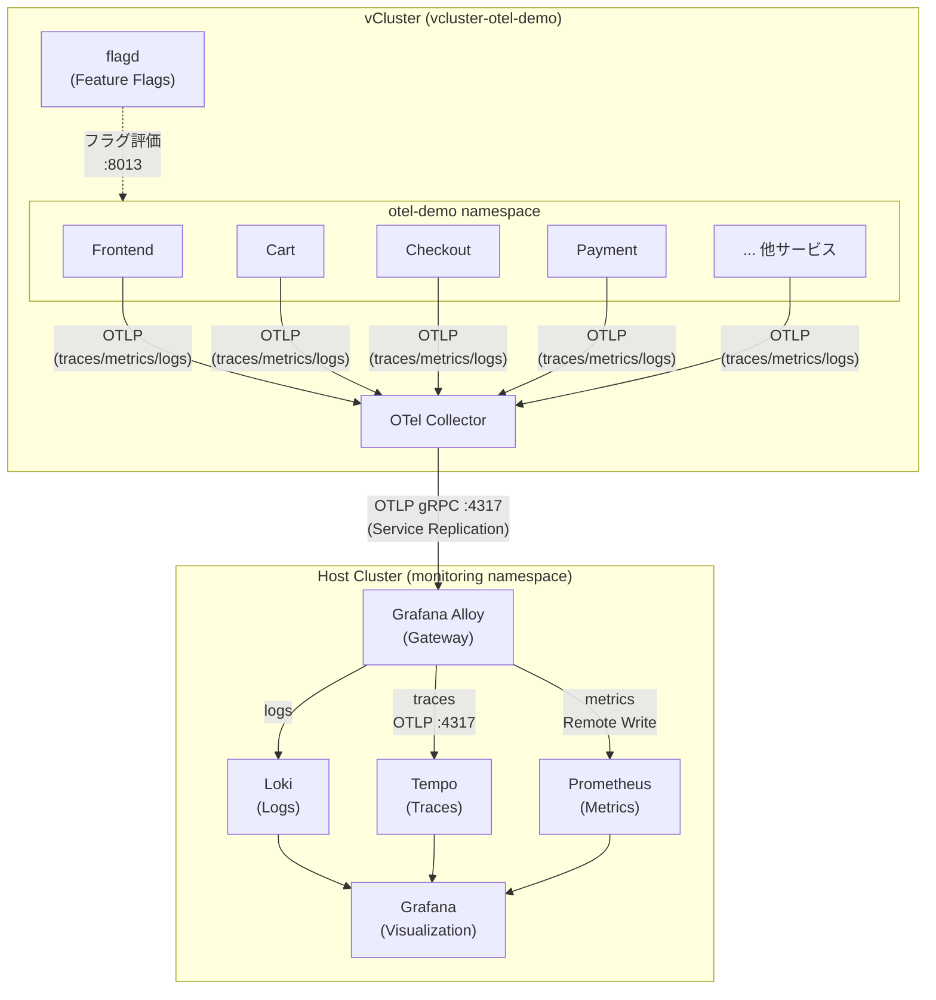

# オブザーバビリティ技術検証 - 要件定義・実施手順

## 1. 概要

vCluster 上の OpenTelemetry Demo (Astronomy Shop) と Grafana スタックを活用し、マイクロサービス環境におけるオブザーバビリティの技術検証を実施する。

### 検証環境

| コンポーネント | 詳細 |
|---|---|
| インフラ | AWS EKS (ap-northeast-1, t3.large x2) |
| 仮想クラスタ | vCluster v0.30.4 (k3s v1.31.4) |
| アプリケーション | OpenTelemetry Demo v0.40.1 (20+ マイクロサービス) |
| メトリクス | Prometheus (kube-prometheus-stack v80.2.0) |
| トレース | Grafana Tempo v1.24.3 |
| ログ | Grafana Loki v6.52.0 |
| テレメトリ収集 | Grafana Alloy v0.5.0 |
| 可視化 | Grafana (kube-prometheus-stack 同梱) |
| Feature Flags | flagd (OpenTelemetry Demo 同梱) |

### テレメトリデータフロー



---

## 2. 検証テーマと目的

### テーマ 1: vCluster 環境でのオブザーバビリティパイプラインの実現性
- **目的**: マルチテナント Kubernetes 環境で、テナント (vCluster) のテレメトリデータをホストクラスタの監視基盤に集約するパターンの信頼性を検証する
- **評価指標**: データロス率、転送遅延

### テーマ 2: Feature Flag による障害注入と検知能力の評価
- **目的**: flagd で障害を注入し、ダッシュボード・アラートが異常を検知できるかを定量的に評価する
- **評価指標**: MTTD (平均検知時間)、アラート発火の正確性

### テーマ 3: 3つのシグナル (Metrics/Traces/Logs) の相関分析
- **目的**: TraceID をキーとしたシグナル間の紐付けが、障害原因の特定を加速するかを検証する
- **評価指標**: 根本原因特定までのステップ数・所要時間

### テーマ 4: SpanMetrics によるトレースベースのメトリクス自動生成
- **目的**: トレースから RED メトリクス (Rate/Error/Duration) を自動生成する実用性を検証する
- **評価指標**: 生成されるメトリクスの精度とカバレッジ

---

## 3. Feature Flag 一覧

OpenTelemetry Demo v0.40.1 で利用可能な全 15 フラグ。全てデフォルトは `off`。

| # | Flag 名 | 対象サービス | 効果 | 検証用途 |
|---|---|---|---|---|
| 1 | `adFailure` | Ad | GetAds の 1/10 でエラー発生 | エラーレート監視 |
| 2 | `adHighCpu` | Ad | 高 CPU 負荷を発生 | リソース監視・アラート |
| 3 | `adManualGc` | Ad | 手動 GC サイクルによるレイテンシ増加 | レイテンシ異常検知 |
| 4 | `cartFailure` | Cart | EmptyCart 呼び出し時にエラー | カスケード障害の可視化 |
| 5 | `emailMemoryLeak` | Email | メモリリークをシミュレート | リソース枯渇の検知 |
| 6 | `failedReadinessProbe` | Cart | Readiness Probe 失敗 | Pod ヘルスチェック監視 |
| 7 | `imageSlowLoad` | Frontend | 商品画像の読み込み遅延 | フロントエンドレイテンシ |
| 8 | `kafkaQueueProblems` | Kafka | キュー過負荷 + コンシューマ遅延 | メッセージキュー監視 |
| 9 | `llmInaccurateResponse` | LLM | 不正確な商品サマリを返却 | (本環境では対象外) |
| 10 | `llmRateLimitError` | LLM | 断続的に HTTP 429 を返却 | (本環境では対象外) |
| 11 | `loadGeneratorFloodHomepage` | Load Generator | トップページへの大量リクエスト | 負荷テスト・スロットリング |
| 12 | `paymentFailure` | Payment | charge メソッドでエラー | クリティカルパス障害検知 |
| 13 | `paymentUnreachable` | Checkout | Payment Service 到達不能 | タイムアウト・リトライ可視化 |
| 14 | `productCatalogFailure` | Product Catalog | 特定商品でサービス障害 | 依存サービスへの影響分析 |
| 15 | `recommendationCacheFailure` | Recommendation | キャッシュの指数的肥大化 (メモリリーク) | メモリ監視・OOM 検知 |

### flagd の操作方法

```bash
# flagd-ui へのポートフォワード (vCluster コンテキスト)
kubectl port-forward svc/flagd-ui 8080:8080 -n otel-demo

# ブラウザで http://localhost:8080 にアクセスしてフラグを切り替え
```

---

## 4. ダッシュボード要件

### Dashboard 1: サービス概要 (Service Overview)

**目的**: 全マイクロサービスのヘルスを一覧で把握する

| パネル | 種類 | データソース | クエリ概要 |
|---|---|---|---|
| サービスマップ | Node Graph | Tempo | サービス間の依存関係と通信状態 |
| エラーレート一覧 | Table / Stat | Prometheus | `rate(traces_span_metrics_calls_total{status_code="STATUS_CODE_ERROR"}[5m])` |
| レイテンシ P50/P95/P99 | Time Series | Prometheus | `histogram_quantile(0.99, rate(traces_span_metrics_duration_milliseconds_bucket[5m]))` |
| リクエストレート | Time Series | Prometheus | `rate(traces_span_metrics_calls_total[5m])` by service |

### Dashboard 2: RED メトリクス詳細 (RED Metrics Deep Dive)

**目的**: 特定サービスの Rate/Error/Duration を詳細に分析する

| パネル | 種類 | 内容 |
|---|---|---|
| Request Rate | Time Series | サービス・エンドポイント別のリクエスト数/秒 |
| Error Rate | Time Series + Stat | ステータスコード別エラー率 |
| Duration Distribution | Histogram | レイテンシ分布 (P50/P95/P99) |
| Slow Traces リンク | Table | 閾値超過トレースへの直接リンク |

### Dashboard 3: インフラ & vCluster 監視

**目的**: vCluster 基盤の健全性を監視する

| パネル | 種類 | 内容 |
|---|---|---|
| vCluster CPU/Memory | Time Series | コントロールプレーンのリソース使用量 |
| Pod リソース使用率 | Gauge / Bar | 各 Pod の CPU/Memory 使用率 vs リミット |
| ResourceQuota 消費率 | Gauge | vCluster の割り当て上限に対する使用率 |
| PVC 使用率 | Gauge | Tempo/Loki/Prometheus のストレージ消費 |

### Dashboard 4: テレメトリパイプライン監視

**目的**: 監視システム自体の健全性を監視する

| パネル | 種類 | 内容 |
|---|---|---|
| Alloy スループット | Time Series | 処理されたテレメトリデータ量 |
| Alloy ドロップ率 | Stat | データロスの検知 |
| Loki Ingestion Rate | Time Series | ログ取り込み速度 |
| Tempo Ingestion Rate | Time Series | トレース取り込み速度 |

---

## 5. アラートルール要件

| # | アラート名 | 条件 | 重要度 | 評価間隔 |
|---|---|---|---|---|
| 1 | HighErrorRate | サービスのエラー率 > 5% (5分間持続) | Critical | 1m |
| 2 | HighLatencyP99 | P99 レイテンシ > 2s (5分間持続) | Warning | 1m |
| 3 | ServiceDown | 成功リクエストが 0 (3分間持続) | Critical | 1m |
| 4 | PodOOMKillRisk | Memory 使用率 > 90% of limit | Warning | 1m |
| 5 | vClusterQuotaExhaustion | ResourceQuota 使用率 > 80% | Warning | 5m |
| 6 | TelemetryPipelineDrop | Alloy のデータドロップ発生 | Warning | 1m |
| 7 | StorageNearFull | PVC 使用率 > 85% | Warning | 5m |

---

## 6. 実施手順

### Step 1: Feature Flag の一覧を確認しベースラインを把握

1. flagd-ui にアクセスし、全 15 フラグが `off` であることを確認
2. Grafana にアクセスし、現在のデータソース (Prometheus/Tempo/Loki) の接続状態を確認
3. SpanMetrics が正常に生成されているか PromQL で確認
4. 正常時のメトリクス値 (エラーレート、レイテンシ、リクエストレート) をベースラインとして記録

### Step 2: サービス概要ダッシュボードを構築

1. Grafana で新規ダッシュボード「Service Overview」を作成
2. SpanMetrics ベースのパネルを追加 (エラーレート、レイテンシ、リクエストレート)
3. Tempo の Node Graph (サービスマップ) を追加
4. ダッシュボード JSON をエクスポートし `grafana/` に保存

### Step 3: アラートルールを設定

1. Grafana Alert Rules でアラートルールを定義
2. Contact Point (通知先) を設定
3. アラートルールの動作確認 (テスト発火)
4. アラートルール設定をコードとしてエクスポート

### Step 4: Feature Flag で障害注入し検証

1. 障害シナリオを定義 (どのフラグをどの順番で有効にするか)
2. flagd-ui で Feature Flag を有効化
3. ダッシュボードで異常が検知されることを確認
4. アラートが発火することを確認
5. Traces → Logs の相関で根本原因を特定するワークフローを実施
6. 各シナリオの検知時間・特定ステップを記録

### Step 5: 結果をドキュメント化して技術検証レポート作成

1. 各 Step の実施結果をまとめる
2. 検証テーマごとの評価結果を記載
3. スクリーンショットを含むレポートを作成
4. 今後の改善提案を記載

---

## 7. 検証で使用する主要 PromQL クエリ

### SpanMetrics ベース

```promql
# サービス別リクエストレート
rate(traces_spanmetrics_calls_total[5m])

# サービス別エラーレート
rate(traces_spanmetrics_calls_total{status_code="STATUS_CODE_ERROR"}[5m])
/ rate(traces_spanmetrics_calls_total[5m])

# サービス別レイテンシ P99
histogram_quantile(0.99,
  rate(traces_spanmetrics_duration_milliseconds_bucket[5m])
)

# サービス別レイテンシ P95
histogram_quantile(0.95,
  rate(traces_spanmetrics_duration_milliseconds_bucket[5m])
)

# サービス別レイテンシ P50
histogram_quantile(0.50,
  rate(traces_spanmetrics_duration_milliseconds_bucket[5m])
)
```

### インフラ監視

```promql
# Pod CPU 使用率 (対 limit)
sum(rate(container_cpu_usage_seconds_total{namespace="vcluster-otel-demo"}[5m])) by (pod)
/ sum(kube_pod_container_resource_limits{namespace="vcluster-otel-demo", resource="cpu"}) by (pod)

# Pod Memory 使用率 (対 limit)
sum(container_memory_working_set_bytes{namespace="vcluster-otel-demo"}) by (pod)
/ sum(kube_pod_container_resource_limits{namespace="vcluster-otel-demo", resource="memory"}) by (pod)

# PVC 使用率
kubelet_volume_stats_used_bytes / kubelet_volume_stats_capacity_bytes
```
