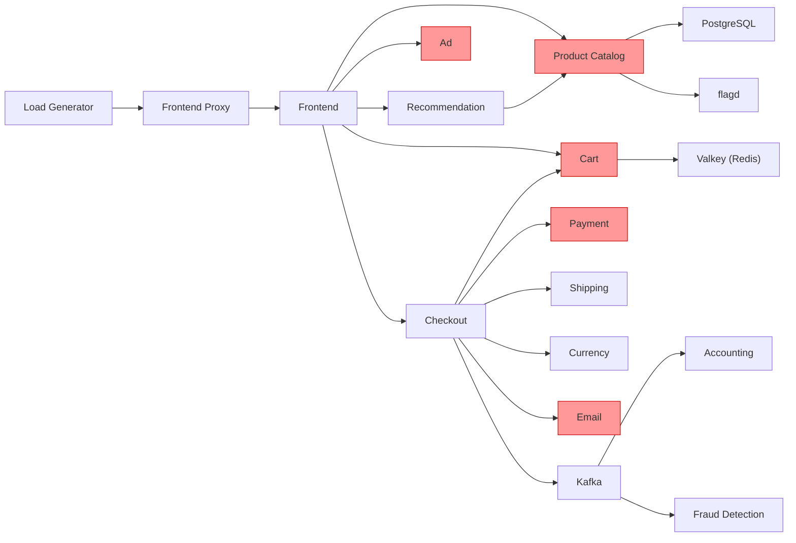

# Step 4: Feature Flag 障害注入シナリオと検証手順

## 前提条件

- Step 2 のダッシュボード (Service Overview / RED Metrics / Infrastructure / Telemetry Pipeline) が構築済み
- Step 3 のアラートルール (7 ルール) が設定済み
- `valkey-cart` の Pending 問題が解消済み (全サービスが正常稼働)
- 全 Feature Flag が `off` 状態 (ベースライン)

### flagd-ui へのアクセス

```bash
# host クラスターから直接接続 (vcluster connect 不要)
# flagd-ui は /feature パスで配信されており、直接ポート 4000 アクセスは不可
kubectl port-forward svc/frontend-proxy-x-otel-demo-x-otel-demo 8080:8080 -n vcluster-otel-demo

# ブラウザで http://localhost:8080/feature にアクセス
```

### Grafana へのアクセス

```bash
# 別ターミナルで
kubectl port-forward svc/kube-prometheus-stack-grafana 3000:80 -n monitoring
# ブラウザで http://localhost:3000
```

---

## サービス依存関係

検証シナリオの理解のため、OTEL Demo の主要なリクエストフローを示す。



> 赤色のサービスは Feature Flag による障害注入対象。

---

## シナリオ一覧

| # | シナリオ名 | 使用フラグ | 検証テーマ | 難易度 |
|---|---|---|---|---|
| 1 | 単一サービスのエラー注入 | `adFailure` | エラーレート検知の基本動作 | 基礎 |
| 2 | クリティカルパスの障害 | `paymentFailure` | 決済フローへの影響と段階的エラー率制御 | 基礎 |
| 3 | カスケード障害の発生 | `productCatalogFailure` | 依存サービスへの障害伝播の可視化 | 応用 |
| 4 | リソース枯渇によるサービス劣化 | `adHighCpu` + `emailMemoryLeak` | インフラメトリクスからの異常検知 | 応用 |
| 5 | 負荷集中とキュー滞留 | `loadGeneratorFloodHomepage` + `kafkaQueueProblems` | スループット飽和とバックプレッシャー | 応用 |
| 6 | 複合障害 (実運用を想定) | `paymentFailure` + `recommendationCacheFailure` + `imageSlowLoad` | マルチシグナル相関による根本原因特定 | 総合 |

---

## シナリオ 1: 単一サービスのエラー注入

### 想定状況

広告サービスが断続的にエラーを返す。ユーザー体験には軽微な影響 (広告が表示されない) だが、エラーレートの上昇を検知できるかを検証する。

### 手順

#### 1-1. ベースライン確認 (所要: 2分)

1. Grafana で **Service Overview** ダッシュボードを開く
2. `ad` サービスの現在値を記録:
   - リクエストレート: 0.0667 req/s
   - エラーレート: 0 %
   - P99 レイテンシ: 0.94 ms
3. **Alerting > Alert rules** で全ルールが `Normal` であることを確認

#### 1-2. 障害注入 (所要: 1分)

1. flagd-ui (http://localhost:4000) を開く
2. `adFailure` を `on` に変更
3. 変更時刻を記録: ____:____

#### 1-3. 検知確認 (所要: 5-10分)

確認項目を時系列で記録する:

| 経過時間 | 確認項目 | 期待される結果 | 実際の結果 |
|---|---|---|---|
| 1分後 | Service Overview - Error Rate | ad のエラーレートが上昇開始 | |
| 2分後 | RED Metrics - ad のエンドポイント別 | `oteldemo.AdService/GetAds` にエラーが集中 | |
| 3分後 | Tempo - トレース検索 | ad サービスにエラースパンが出現 | |
| 5分後 | Alert - HighErrorRate | ad に対してアラートが Pending → Firing | |
| 5分後 | Service Map (Node Graph) | ad ノードがエラー状態で表示 | |

#### 1-4. 相関分析ワークフロー (所要: 5分)

以下の手順で「メトリクス → トレース → ログ」の相関分析を実施する:

1. **メトリクス**: Service Overview で ad のエラーレート上昇を確認
2. **トレース**: Tempo でエラー状態のトレースを検索
   - Service Name: `ad`
   - Status: `error`
   - 該当トレースを開き、エラーが発生しているスパンを特定
3. **ログ**: トレース詳細画面から TraceID をコピーし、Loki で検索
   - クエリ: `{service_name="ad"} |= "<TraceID>"`
   - エラーログの詳細を確認

**記録項目:**
- エラーレート上昇を最初に視認した時刻: ____:____
- MTTD (検知時間 = 視認時刻 - 注入時刻): ____ 分
- 根本原因特定までのステップ数: ____ ステップ
- 根本原因特定までの所要時間: ____ 分

#### 1-5. 復旧とクリーンアップ (所要: 5分)

1. flagd-ui で `adFailure` を `off` に戻す
2. 復旧時刻を記録: ____:____
3. Service Overview でエラーレートが正常値に戻ることを確認
4. アラートが `Resolved` になることを確認
5. MTTR (復旧時間 = 正常化時刻 - 復旧操作時刻): ____ 分

### オブザーバビリティの観点での評価

| 評価項目 | 評価基準 | 結果 |
|---|---|---|
| **検知速度** | アラートが 5 分以内に Firing になるか | |
| **影響範囲の特定** | ad サービスのみが影響を受けていることをダッシュボードから即座に判断できるか | |
| **根本原因の特定** | トレース → ログの相関で `adFailure` フラグが原因であると特定できるか | |
| **復旧確認** | フラグ OFF 後、メトリクスの回復をリアルタイムに確認できるか | |

### 実運用で想定される対策

- **短期**: エラーレートのアラート閾値を ad サービスに適したレベルに調整 (例: 10% で Warning、20% で Critical)
- **中期**: Ad サービスに Circuit Breaker を導入し、エラー時は空の広告を返すフォールバック
- **長期**: Ad サービスの冗長化 (レプリカ数の増加)、Canary デプロイ時のエラーレート監視

---

## シナリオ 2: クリティカルパスの障害

### 想定状況

決済サービスが段階的にエラーを返す。チェックアウトフローの直接的な障害であり、ビジネスへの影響が大きい。`paymentFailure` は確率的なエラー率を制御できるため、段階的に障害を拡大する。

### 手順

#### 2-1. ベースライン確認 (所要: 2分)

1. `checkout` と `payment` サービスの現在値を記録
2. checkout フローの正常なトレースを 1 件確認し、正常時のスパン構成を把握

#### 2-2. 段階的障害注入 (所要: 20分)

3 段階でエラー率を引き上げる:

**Phase A: 10% エラー (5分間観察)**

1. flagd-ui で `paymentFailure` を `10%` に変更
2. 時刻を記録: ____:____

| 経過時間 | 確認項目 | 期待される結果 | 実際の結果 |
|---|---|---|---|
| 2分後 | payment エラーレート | ~10% に上昇 | |
| 2分後 | checkout エラーレート | 連動して上昇 | |
| 5分後 | HighErrorRate アラート | payment に対して Pending or Firing | |

**Phase B: 50% エラー (5分間観察)**

1. `paymentFailure` を `50%` に変更
2. 時刻を記録: ____:____

| 経過時間 | 確認項目 | 期待される結果 | 実際の結果 |
|---|---|---|---|
| 1分後 | payment エラーレート | ~50% に上昇 | |
| 2分後 | checkout エラーレート | 大幅に上昇 | |
| 2分後 | frontend エラーレート | チェックアウト起因のエラー伝播 | |
| 3分後 | Service Map | payment → checkout のエッジがエラー表示 | |

**Phase C: 100% エラー (5分間観察)**

1. `paymentFailure` を `100%` に変更
2. 時刻を記録: ____:____

| 経過時間 | 確認項目 | 期待される結果 | 実際の結果 |
|---|---|---|---|
| 1分後 | payment エラーレート | 100% | |
| 3分後 | ServiceDown アラート | payment に対して Firing | |
| 3分後 | checkout エラーレート | checkout も大幅な影響 | |

#### 2-3. 相関分析ワークフロー (所要: 5分)

1. **メトリクス**: checkout のエラーレート上昇を確認
2. **トレース**: checkout のエラートレースを開く
   - エラーが `payment` サービスのスパンに集中していることを確認
   - checkout → payment の呼び出しチェーンで、エラーの起点が payment であることを特定
3. **ログ**: payment サービスのエラーログを Loki で確認
   - クエリ: `{service_name="payment"} |= "error"` または `{service_name="payment"} | json | level="error"`

**記録項目 (Phase ごと):**

| Phase | エラー率設定 | 実測 payment エラー率 | 実測 checkout エラー率 | アラート発火 | 検知時間 |
|---|---|---|---|---|---|
| A | 10% | | | | |
| B | 50% | | | | |
| C | 100% | | | | |

#### 2-4. 復旧 (所要: 3分)

1. `paymentFailure` を `off` に戻す
2. 各サービスの回復を確認

### オブザーバビリティの観点での評価

| 評価項目 | 評価基準 | 結果 |
|---|---|---|
| **段階的劣化の可視化** | 10% → 50% → 100% のエラー率変化がリアルタイムにグラフに反映されるか | |
| **カスケード影響の把握** | payment → checkout → frontend への影響伝播がダッシュボードで追跡可能か | |
| **閾値の適切性** | 10% の段階で HighErrorRate アラートが発火するか (閾値 5%) | |
| **トレースによる起点特定** | checkout のエラートレースから payment が起点であることを特定できるか | |

### 実運用で想定される対策

- **短期**: Payment サービスに対するヘルスチェックの強化、Readiness Probe の閾値調整
- **中期**: Checkout → Payment 間に Circuit Breaker を導入し、Payment 障害時に「後から決済」のフォールバックを実装
- **長期**: Payment サービスの冗長化、複数決済プロバイダへのフォールオーバー
- **アラート改善**: payment に特化したアラート (低い閾値 + 短い Pending) を追加。ビジネスクリティカルなサービスは専用の SLO/SLI を設定

---

## シナリオ 3: カスケード障害の発生

### 想定状況

Product Catalog サービスが特定商品で障害を起こす。このサービスは Frontend、Recommendation、Checkout から参照されるため、障害が複数サービスに波及する。

### 手順

#### 3-1. ベースライン確認 (所要: 2分)

1. `product-catalog`, `recommendation`, `frontend` の現在値を記録
2. Service Map で product-catalog への依存関係を確認

#### 3-2. 障害注入 (所要: 1分)

1. flagd-ui で `productCatalogFailure` を `on` に変更
2. 時刻を記録: ____:____

#### 3-3. カスケード影響の観察 (所要: 10分)

| 経過時間 | 確認項目 | 期待される結果 | 実際の結果 |
|---|---|---|---|
| 1分後 | product-catalog エラーレート | 上昇 (特定商品リクエスト時) | |
| 2分後 | recommendation エラーレート | product-catalog 依存による上昇 | |
| 3分後 | frontend エラーレート | 商品詳細ページでエラー | |
| 3分後 | checkout エラーレート | カートに障害商品がある場合エラー | |
| 5分後 | Service Map | product-catalog を起点にエラーが放射状に伝播 | |
| 5分後 | アラート | product-catalog + 影響サービスに HighErrorRate | |

#### 3-4. 影響範囲の特定ワークフロー (所要: 10分)

1. **Service Map**: Tempo の Node Graph で赤くなっているノードとエッジを確認
2. **メトリクス**: 各サービスのエラーレート上昇タイミングを比較し、時系列的にどのサービスが最初にエラーを出したかを特定
3. **トレース**: frontend のエラートレースを開き、スパンの階層をたどって根本原因が product-catalog であることを特定
4. **ログ**: product-catalog のエラーログを確認し、特定商品 ID に関連する障害であることを確認

**記録項目:**

| サービス | エラー開始時刻 | 最大エラーレート | 根本原因との因果関係 |
|---|---|---|---|
| product-catalog | | | 障害元 |
| recommendation | | | 直接依存 |
| frontend | | | 直接依存 |
| checkout | | | 間接依存 |

#### 3-5. 復旧 (所要: 3分)

1. `productCatalogFailure` を `off` に戻す
2. 全影響サービスの回復を確認

### オブザーバビリティの観点での評価

| 評価項目 | 評価基準 | 結果 |
|---|---|---|
| **伝播パターンの可視化** | 障害がどのサービスにどの順番で伝播したかを時系列で追跡できるか | |
| **根本原因の特定** | 複数サービスのエラーの中から product-catalog が起点であることを Service Map またはトレースから特定できるか | |
| **影響範囲の限定** | 影響を受けていないサービス (payment, shipping 等) が正常であることを確認できるか | |

### 実運用で想定される対策

- **短期**: Product Catalog サービスのエラーハンドリング強化 (特定商品の障害が全体に波及しないように)
- **中期**: Recommendation サービスにキャッシュとフォールバックロジックを追加
- **長期**: Product Catalog のデータベースレベルでの整合性チェック、デプロイ前のデータ検証パイプライン

---

## シナリオ 4: リソース枯渇によるサービス劣化

### 想定状況

Ad サービスで CPU 高負荷が発生し、同時に Email サービスでメモリリークが進行する。メトリクスベースのアラート (PodOOMKillRisk) が正しく動作するか、またリソース起因のレイテンシ劣化がトレースに反映されるかを検証する。

### 手順

#### 4-1. ベースライン確認 (所要: 2分)

1. Infrastructure ダッシュボードで ad と email の現在のリソース使用量を記録:
   - ad: CPU ____ cores, Memory ____ Mi
   - email: CPU ____ cores, Memory ____ Mi
2. 各サービスの resource limits を確認:
   - ad: CPU 2000m, Memory 350Mi
   - email: CPU 2000m, Memory 150Mi

#### 4-2. CPU 高負荷の注入 (所要: 10分)

1. flagd-ui で `adHighCpu` を `on` に変更
2. 時刻を記録: ____:____

| 経過時間 | 確認項目 | 期待される結果 | 実際の結果 |
|---|---|---|---|
| 1分後 | Infrastructure - ad CPU | CPU 使用量が急上昇 | |
| 2分後 | RED Metrics - ad レイテンシ | P99 レイテンシが増加 | |
| 5分後 | HighLatencyP99 アラート | ad に対して Firing | |
| 5分後 | Tempo - ad トレース | スパン duration が正常時より長い | |

#### 4-3. メモリリークの注入 (所要: 15分)

> CPU 高負荷はそのまま維持

1. flagd-ui で `emailMemoryLeak` を `10x` に変更 (中程度のリーク速度)
2. 時刻を記録: ____:____

| 経過時間 | 確認項目 | 期待される結果 | 実際の結果 |
|---|---|---|---|
| 2分後 | Infrastructure - email Memory | メモリ使用量が徐々に増加 | |
| 5分後 | Memory 使用率 | 上昇傾向が明確に | |
| 10分後 | PodOOMKillRisk アラート | email に対して Firing (90% 超過時) | |
| 10-15分後 | Pod の挙動 | OOM Kill によるリスタートの可能性 | |

> メモリリークの速度が遅い場合は `100x` に変更して加速させる。

#### 4-4. リソース起因の劣化分析 (所要: 5分)

1. **メトリクス**: Infrastructure ダッシュボードで CPU/Memory の時系列変化を確認
2. **トレース**: ad サービスのスパン duration を比較
   - ベースラインの duration vs 障害中の duration
   - CPU スロットリングによる処理遅延がスパンに反映されているか
3. **ログ**: email サービスの OOM Kill 関連ログを Loki で確認
   - クエリ: `{namespace="vcluster-otel-demo"} |= "OOMKilled"` または `{service_name="email"} |= "memory"`

**記録項目:**

| メトリクス | ベースライン | 障害中 (5分後) | 障害中 (10分後) |
|---|---|---|---|
| ad CPU 使用量 | | | |
| ad P99 レイテンシ | | | |
| email Memory 使用量 | | | |
| email Memory 使用率 (vs limit) | | | |

#### 4-5. 復旧 (所要: 5分)

1. `adHighCpu` を `off` に戻す
2. `emailMemoryLeak` を `off` に戻す
3. ad の CPU 使用量が正常化することを確認
4. email のメモリが正常化することを確認 (OOM Kill が発生した場合はリスタート後のメモリ)
5. アラートが `Resolved` になることを確認

### オブザーバビリティの観点での評価

| 評価項目 | 評価基準 | 結果 |
|---|---|---|
| **リソースメトリクスの可視化** | CPU/Memory の異常がリアルタイムにダッシュボードに反映されるか | |
| **リソース → パフォーマンスの因果関係** | CPU 高負荷がレイテンシ増加としてトレースに反映されるか | |
| **漸進的劣化の検知** | メモリリークのような徐々に進行する問題をアラートで検知できるか | |
| **OOM Kill の検知** | Pod の再起動がメトリクス/ログから確認できるか | |

### 実運用で想定される対策

- **短期**: リソースの requests/limits を適切に設定し、CPU スロットリングの影響を軽減
- **中期**: HPA (Horizontal Pod Autoscaler) を導入し、CPU 使用率に応じた自動スケーリング
- **長期**: メモリプロファイリングを CI/CD に組み込み、メモリリークをリリース前に検出
- **アラート改善**: Memory 増加率 (derivative) に基づくアラートを追加し、OOM Kill 前に早期警告

---

## シナリオ 5: 負荷集中とキュー滞留

### 想定状況

フロントページへの大量アクセスが発生し (Flash Sale 等)、同時に Kafka キューが問題を起こしている。スループットの飽和とバックプレッシャーがシステム全体に与える影響を観察する。

### 手順

#### 5-1. ベースライン確認 (所要: 2分)

1. Service Overview で frontend のリクエストレートを記録
2. Telemetry Pipeline ダッシュボードで OTel Collector の Queue Size を記録

#### 5-2. 負荷集中の注入 (所要: 10分)

1. flagd-ui で `loadGeneratorFloodHomepage` を `on` に変更
2. 時刻を記録: ____:____

| 経過時間 | 確認項目 | 期待される結果 | 実際の結果 |
|---|---|---|---|
| 1分後 | frontend リクエストレート | 大幅に増加 | |
| 2分後 | frontend レイテンシ | 負荷増による上昇 | |
| 3分後 | Infrastructure - Pod CPU/Memory | frontend, frontend-proxy の使用量増加 | |
| 5分後 | Telemetry Pipeline | テレメトリデータ量の増加 | |
| 5分後 | OTel Collector Queue Size | キューサイズの増加 | |

#### 5-3. Kafka 問題の追加注入 (所要: 10分)

> 負荷集中はそのまま維持

1. flagd-ui で `kafkaQueueProblems` を `on` に変更
2. 時刻を記録: ____:____

| 経過時間 | 確認項目 | 期待される結果 | 実際の結果 |
|---|---|---|---|
| 2分後 | checkout 後の accounting/fraud-detection | 処理遅延 | |
| 5分後 | Kafka 関連サービスのレイテンシ | 大幅に増加 | |
| 5分後 | HighLatencyP99 アラート | 関連サービスに対して Firing | |

#### 5-4. バックプレッシャーの分析 (所要: 5分)

1. **メトリクス**: リクエストレートとレイテンシの相関を Service Overview で確認
2. **テレメトリパイプライン**: OTel Collector の Queue Size がキャパシティに対してどの程度消費されているか
3. **トレース**: 負荷集中下のトレースで、各サービスの処理時間がどの程度増加しているか

#### 5-5. 復旧 (所要: 5分)

1. `kafkaQueueProblems` を `off` に戻す
2. `loadGeneratorFloodHomepage` を `off` に戻す
3. リクエストレートとレイテンシが正常化することを確認
4. Kafka キューの滞留が解消されることを確認

### オブザーバビリティの観点での評価

| 評価項目 | 評価基準 | 結果 |
|---|---|---|
| **スループット飽和の可視化** | リクエストレートの急増とレイテンシ増加の相関がグラフから読み取れるか | |
| **バックプレッシャーの検知** | OTel Collector の Queue Size 増加やテレメトリデータのドロップを検知できるか | |
| **非同期処理の監視** | Kafka 経由の accounting/fraud-detection への影響がトレースで追跡可能か | |

### 実運用で想定される対策

- **短期**: Rate Limiting の導入 (API Gateway レベル)
- **中期**: Kafka Consumer の自動スケーリング、Dead Letter Queue の設定
- **長期**: CDN/キャッシュ戦略の強化、負荷テストの CI/CD パイプラインへの統合
- **アラート改善**: リクエストレートの急増 (spike) 検知アラートの追加、Kafka Consumer Lag のモニタリング

---

## シナリオ 6: 複合障害 (実運用を想定)

### 想定状況

実際のインシデントに近い状況を再現する。複数の問題が同時に発生した場合に、3 つのシグナル (Metrics/Traces/Logs) の相関分析を活用して根本原因を特定できるかを検証する。

**シナリオ**: デプロイ後に決済エラーが発生し、同時にフロントエンドで画像読み込みが遅延、レコメンデーションのキャッシュに問題が発生している。

### 手順

#### 6-1. ベースライン確認 (所要: 2分)

1. 全サービスが正常であることを確認
2. Service Overview のスクリーンショットを撮影 (正常時の証跡)

#### 6-2. 複合障害の注入 (所要: 2分)

以下の 3 つのフラグを同時に有効にする:

| フラグ | 設定値 | 効果 |
|---|---|---|
| `paymentFailure` | `25%` | 決済の 25% がエラー |
| `recommendationCacheFailure` | `on` | レコメンデーションキャッシュのメモリリーク |
| `imageSlowLoad` | `5sec` | 商品画像の 5 秒遅延 |

時刻を記録: ____:____

#### 6-3. インシデント対応シミュレーション (所要: 20分)

「オンコールエンジニアとして、以下の流れでインシデント対応を行う」という想定で実施する。

**Phase 1: 初動確認 (5分)**

1. Service Overview ダッシュボードで全体のヘルスを確認
2. アラートが発火しているサービスを確認
3. 影響を受けているサービスの一覧を作成

| 確認項目 | 結果 |
|---|---|
| アラート発火サービス | |
| エラーレート上昇サービス | |
| レイテンシ上昇サービス | |
| リソース異常サービス | |

**Phase 2: 影響の切り分け (5分)**

1. 問題を以下のカテゴリに分類:
   - **エラー系**: どのサービスでエラーが発生しているか
   - **レイテンシ系**: どのサービスでレイテンシが上昇しているか
   - **リソース系**: どのサービスでリソース使用量が異常か
2. 各問題が独立した問題か、カスケードによる影響かを判断

**Phase 3: 根本原因の特定 (10分)**

問題ごとに根本原因を特定する:

**問題 A: 決済エラー**
1. payment のエラートレースを Tempo で検索
2. エラースパンの詳細を確認
3. ログで具体的なエラーメッセージを確認

**問題 B: フロントエンドの遅延**
1. frontend のレイテンシが高いトレースを検索
2. 画像読み込みスパンの duration を確認
3. 他のサービスへの影響を確認 (独立した問題か)

**問題 C: レコメンデーションの劣化**
1. recommendation のメモリ使用量の推移を確認
2. キャッシュ肥大化によるレイテンシ影響を確認
3. メモリリークのペースから OOM Kill までの予測

**記録項目 (根本原因特定):**

| 問題 | 最初に気づいたシグナル | 根本原因特定方法 | 特定までの時間 | 正しく特定できたか |
|---|---|---|---|---|
| 決済エラー | | | | |
| 画像遅延 | | | | |
| キャッシュ肥大化 | | | | |

#### 6-4. 復旧 (所要: 5分)

1. 影響の大きい順に復旧:
   1. `paymentFailure` を `off` (ビジネスインパクト最大)
   2. `imageSlowLoad` を `off` (UX への影響)
   3. `recommendationCacheFailure` を `off` (漸進的な劣化)
2. 各ステップの復旧をダッシュボードで確認

### オブザーバビリティの観点での評価

| 評価項目 | 評価基準 | 結果 |
|---|---|---|
| **複数問題の同時検知** | 3 つの独立した問題をそれぞれ正しく認識できるか | |
| **問題の優先順位付け** | ビジネスインパクト (決済 > UX > パフォーマンス) に基づいて対応順序を判断できるか | |
| **マルチシグナル相関** | Metrics → Traces → Logs の流れで各問題の根本原因を特定できるか | |
| **独立性の判断** | 3 つの問題が互いに独立していることをダッシュボードから判断できるか | |
| **復旧の段階的確認** | 復旧操作のたびにメトリクスの改善をリアルタイムに確認できるか | |

### 実運用で想定される対策

- **短期**: インシデント対応のランブック (手順書) を整備し、ダッシュボードの確認順序を標準化
- **中期**: SLO/SLI の導入により、「どの問題を優先的に対応すべきか」を定量的に判断できるようにする
- **長期**: AIOps による異常検知の自動化、根本原因推定のアシスト

---

## 検証結果の記録テンプレート

各シナリオ終了後、以下の情報を記録する:

```markdown
### シナリオ X: [シナリオ名]

**実施日時**: YYYY-MM-DD HH:MM
**実施者**:

#### タイムライン
| 時刻 | イベント |
|---|---|
| | 障害注入開始 |
| | 最初の異常をダッシュボードで視認 |
| | アラート Pending |
| | アラート Firing |
| | 根本原因を特定 |
| | 復旧操作実施 |
| | メトリクス正常化確認 |
| | アラート Resolved |

#### 定量評価
| 指標 | 値 |
|---|---|
| MTTD (検知時間) | |
| MTTR (復旧時間) | |
| 根本原因特定ステップ数 | |
| 根本原因特定時間 | |
| 影響サービス数 | |
| アラート発火の正確性 | 正確 / 誤検知あり / 検知漏れあり |

#### 定性評価
| 項目 | 評価 (1-5) | コメント |
|---|---|---|
| ダッシュボードの有用性 | | |
| アラートの適切性 | | |
| トレース相関の有効性 | | |
| ログの追跡性 | | |

#### スクリーンショット
- [ ] 正常時のダッシュボード
- [ ] 障害検知時のダッシュボード
- [ ] トレース詳細
- [ ] ログ検索結果
- [ ] アラート状態
```

---

## 実施スケジュール (推奨)

| 順序 | シナリオ | 所要時間 | 備考 |
|---|---|---|---|
| 1 | シナリオ 1: 単一サービスのエラー | 25分 | ウォームアップとして最初に実施 |
| 2 | シナリオ 2: クリティカルパスの障害 | 35分 | 段階的エラー率制御の検証 |
| 3 | シナリオ 3: カスケード障害 | 30分 | Service Map の活用がポイント |
| - | 休憩 | 10分 | メトリクスを安定させる |
| 4 | シナリオ 4: リソース枯渇 | 35分 | メモリリークの観察に時間を要する |
| 5 | シナリオ 5: 負荷集中とキュー滞留 | 30分 | テレメトリパイプラインへの影響にも注目 |
| - | 休憩 | 10分 | メトリクスを安定させる |
| 6 | シナリオ 6: 複合障害 | 35分 | 総合演習として最後に実施 |
| **合計** | | **約 3.5 時間** | |
