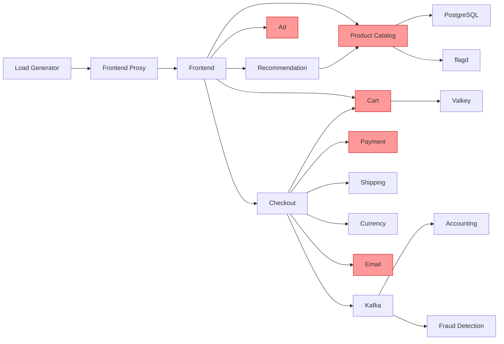

# Step 4: Feature Flag 障害注入シナリオ

## 検証の目的

オブザーバビリティスタック（Metrics / Traces / Logs / Alerts）が各種障害を正しく検知・可視化できるかを確認する動作検証。

## 計測対象リソース

| リソース | 確認ポイント |
|---|---|
| Service Overview | Error Rate、Request Rate、Latency (P99) |
| Infrastructure | CPU Usage %、Memory Usage % |
| Alerting | アラート Pending/Firing 到達時間 |
| Tempo (Explore) | エラースパン検索、Service Map |
| Loki (Explore) | エラーログ、TraceID 相関 |

## 前提条件

- Step 2 のダッシュボードが構築済み
- Step 3 のアラートルール（7 ルール）が設定済み
- 全 Feature Flag が `off` 状態

```bash
# Grafana
kubectl port-forward svc/kube-prometheus-stack-grafana 3000:80 -n monitoring
# flagd-ui
kubectl port-forward svc/frontend-proxy-x-otel-demo-x-otel-demo 8080:8080 -n vcluster-otel-demo
```

## サービス依存関係



> 赤色のサービスは Feature Flag による障害注入対象。

---

## シナリオ一覧

| # | フラグ | 検証テーマ |
|---|---|---|
| 1 | `adFailure` | エラーレート検知と 3 シグナル相関 |
| 2 | `paymentFailure` | クリティカルパスの障害と Service Map |
| 3 | `productCatalogFailure` | カスケード障害の伝播可視化 |
| 4 | `adHighCpu` + `emailMemoryLeak` | リソース起因の劣化とアラート |
| 5 | `loadGeneratorFloodHomepage` + `kafkaQueueProblems` | スループット飽和の検知 |
| 6 | `paymentFailure` + `recommendationCacheFailure` + `imageSlowLoad` | 複合障害の切り分け |

---

## シナリオ 1: エラーレート検知（adFailure）

**検証テーマ**: 単一サービスのエラーを Metrics → Traces → Logs の 3 シグナルで追跡できるか

### 注入

`adFailure` を `on`

### 確認項目

1. **Metrics**: Service Overview > ad の Error Rate 上昇（~1分）
2. **Alert**: HighErrorRate が Pending → Firing（~5分）
3. **Traces**: Explore > Tempo > Service Name=`ad`、Status=`error` でエラースパン取得
4. **Logs**: `{service_name="ad"} |= "<TraceID>"` でエラーメッセージ確認

### 復旧

`adFailure` を `off`

---

## シナリオ 2: クリティカルパスの障害（paymentFailure）

**検証テーマ**: 決済障害が checkout にカスケードし、Service Map に反映されるか

### 注入

`paymentFailure` を `50%`

### 確認項目

1. **Metrics**: payment と checkout の Error Rate が連動して上昇（~2分）
2. **Service Map**: Tempo > Service Map で payment→checkout エッジがエラー色表示
3. **Alert**: HighErrorRate が payment に Firing（~5分）
4. **Traces**: checkout のエラートレースを開き、スパン階層で payment が起点と確認

### 復旧

`paymentFailure` を `off`

---

## シナリオ 3: カスケード障害（productCatalogFailure）

**検証テーマ**: 単一障害の伝播パターンを Service Map とトレースで可視化できるか

### 注入

`productCatalogFailure` を `on`

### 確認項目

1. **Service Map**: product-catalog 起点で recommendation・frontend への伝播エッジが赤表示
2. **Metrics**: 影響サービスの Error Rate 上昇タイミングの時系列を確認
3. **Alert**: HighErrorRate が複数サービスに Firing
4. **Traces**: frontend のエラートレースのスパン階層で product-catalog が根本原因と特定

### 復旧

`productCatalogFailure` を `off`

---

## シナリオ 4: リソース起因の劣化（adHighCpu + emailMemoryLeak）

**検証テーマ**: インフラメトリクスの異常がレイテンシ劣化とアラートに反映されるか

### 注入（順序あり）

1. `adHighCpu` を `on`
2. 2分後に `emailMemoryLeak` を `10x`

### 確認項目

1. **Infra**: Infrastructure > CPU Usage % | vCluster で ad pod の急上昇（~1分）
2. **Latency**: Service Overview > ad の P99 レイテンシ増加
3. **Alert**: HighLatencyP99 が ad に Firing（~5分）
4. **Infra**: Infrastructure > Memory Usage % | vCluster で email pod の緩やかな上昇（~2分）
5. **Alert**: PodOOMKillRisk が email に Firing（~10分）

### 復旧

`adHighCpu` と `emailMemoryLeak` を `off`

---

## シナリオ 5: スループット飽和（loadGeneratorFloodHomepage + kafkaQueueProblems）

**検証テーマ**: 負荷増大をリクエストレートとテレメトリパイプラインで検知できるか

### 注入

1. `loadGeneratorFloodHomepage` を `on`
2. 2分後に `kafkaQueueProblems` を `on`

### 確認項目

1. **Metrics**: Service Overview > frontend のリクエストレート急増（~1分）
2. **Infra**: Infrastructure > Receiver Throughput グラフでテレメトリ量増加
3. **Latency**: accounting / fraud-detection の P99 増加（Kafka 注入後 ~2分）
4. **Alert**: HighLatencyP99 が関連サービスに Firing

### 復旧

`kafkaQueueProblems` → `loadGeneratorFloodHomepage` の順で `off`

---

## シナリオ 6: 複合障害（paymentFailure + recommendationCacheFailure + imageSlowLoad）

**検証テーマ**: 複数の独立した障害を 3 シグナルで切り分け、根本原因をそれぞれ特定できるか

### 注入（同時）

| フラグ | 設定値 |
|---|---|
| `paymentFailure` | `25%` |
| `recommendationCacheFailure` | `on` |
| `imageSlowLoad` | `5sec` |

### 確認項目

1. **切り分け**: Service Overview で Error Rate・Latency・Resource の異常サービスを列挙し、問題を 3 種類に分類
2. **決済エラー**: Tempo > payment エラートレース → Loki でエラーメッセージ確認
3. **画像遅延**: frontend の遅いトレースで image-provider スパンの duration を確認
4. **キャッシュ肥大化**: Infrastructure > recommendation の Memory 上昇トレンドを確認
5. **独立性の確認**: Service Map で 3 問題が互いにカスケードしていないことを確認

### 復旧（影響大きい順）

`paymentFailure` → `imageSlowLoad` → `recommendationCacheFailure` の順で `off`
