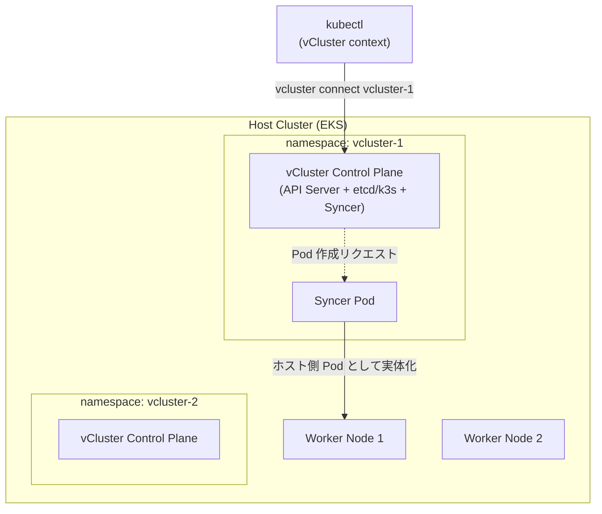
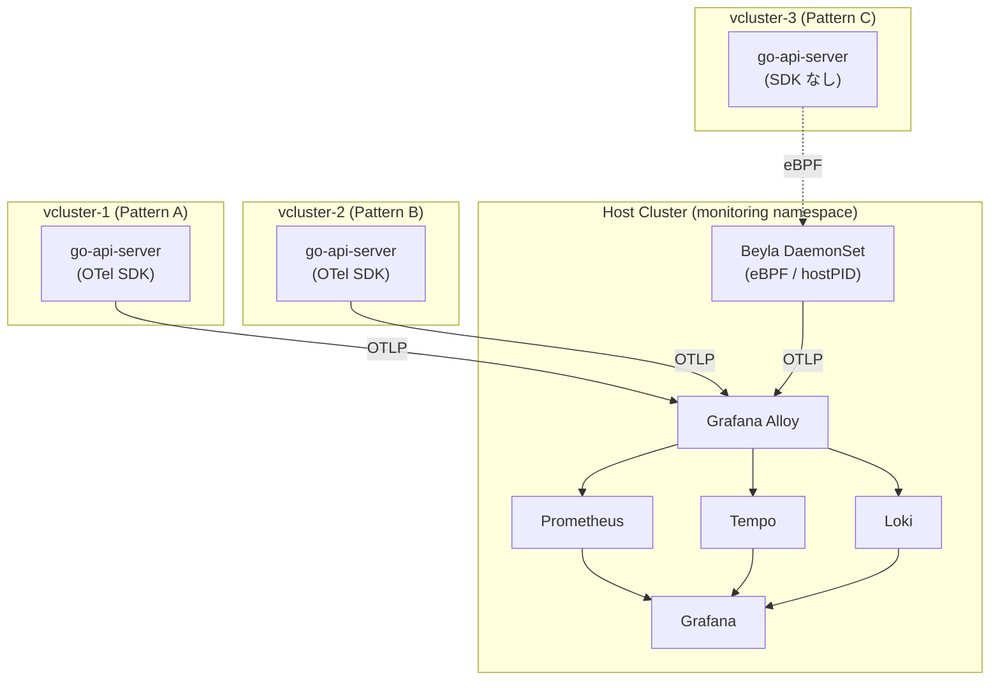

# vCluster × Grafana Alloy × Beyla で構築するマルチテナント Kubernetes オブザーバビリティ基盤

> **執筆者向けメモ**: 本ドキュメントは箇条書きベースのドラフト。各章を文章化する際の素材として使用してください。

---

## 自己紹介

- 名前 / 所属 / インターンシップ期間
- 技術的興味: Kubernetes, オブザーバビリティ, SRE, マルチテナント基盤
- 本記事はインターンシップ研究プロジェクトの成果

---

## アジェンダ

- 1. 課題と本稿の目的
- 2. 基盤技術 (vCluster / Grafana Alloy / OpenTelemetry / Beyla)
- 3. 環境構築 (折りたたみ推奨)
- 4. 検証 1: 3 パターン計装方式の同時観測
- 5. 検証 2: テナント障害分離 + MTTD 計測
- 6. 考察
- 7. おわりに
- 8. 参考資料

---

## 1. 課題と本稿の目的

### 1.1 マルチテナント Kubernetes 環境の観測課題

- 複数のチーム/プロジェクトが同一 Kubernetes 基盤を共有する構成が一般化
- ブランチや PR ごとに環境を用意するユースケースで、テナント増加に伴う課題:
  - **監視基盤の分散**: テナントごとの Prometheus/Grafana 構築 → 運用コストが線形増加
  - **テレメトリの集約困難**: テナント横断のメトリクス/トレース/ログ分析ができない
  - **分離性の確保**: Namespace 分離では Control Plane を共有、CRD 等のテナント間影響リスク

### 1.2 従来アプローチとの対比

**表 1: マルチテナント Kubernetes の構成パターン比較**

| 観点 | Namespace 分離 | 専用クラスタ | **vCluster + 集約観測** (本稿) |
|---|---|---|---|
| Control Plane | 共有 (CRD 等で衝突) | テナント別 (完全分離) | テナント別 (仮想) + ホスト共有 |
| 監視コスト | 単一基盤 / 衝突懸念 | テナント数倍 | **単一基盤 + テナント単位識別** |
| 起動時間 | 即時 | 数分〜十数分 | 数十秒 (vCluster) |
| リソース効率 | 高 | 低 | 高 |
| テレメトリ集約 | 容易だが分離弱 | テナント別で困難 | **集約 + テナント識別ラベル** |

### 1.3 本稿のゴール

- 単一の AWS EKS クラスタ上に vCluster でマルチテナント仮想クラスタを構築
- アプリ側への SDK 追加負担を最小化するオブザーバビリティ基盤を構築
- 以下 2 つの観点で実証:
  1. **検証 1**: 3 種類の計装方式 (OTel SDK + Collector / OTel SDK 直送 / Beyla eBPF) が単一基盤で同時に観測できるか
  2. **検証 2**: テナント障害が他テナントへ波及しないか + 障害検知 MTTD はどの程度か

### 1.4 検証の構成

- 検証 1 = 計装方式の比較 (3 vcluster × 3 計装方式)
- 検証 2 = 障害分離 + MTTD (vcluster-1 のみに 5xx 継続注入)

---

## 2. 基盤技術

### 2.1 vCluster - マルチテナント仮想化

- Loft Labs 社の OSS、ホストクラスタ上に論理的に独立した Kubernetes クラスタを構築
- 主要構成:
  - **仮想 Control Plane**: API Server / Controller Manager / Syncer / データストア
  - **同期メカニズム**: 仮想 → ホスト方向 (toHost) / ホスト → 仮想方向 (fromHost)
- Pod 自体はホストクラスタのノード上で動作する点が後の Beyla の透過観測に効く

**表 2: vCluster のメリット / デメリット**

| 観点 | メリット | デメリット |
|---|---|---|
| コスト | 物理ノード共有でインフラコスト削減 | 各 vCluster の Control Plane が CPU/メモリ消費 |
| 運用 | ホスト集中管理、統一監視 | vCluster 固有の概念学習が必要 |
| 開発/テスト | 数十秒で作成・削除 | CI/CD 組込みに設計の工夫が必要 |
| 隔離性 | 独立 API Server + etcd で CRD/RBAC 完全分離 | Node レベル機能へのアクセスは制限 |
| 柔軟性 | ホストと独立した K8s バージョン選択可 | 一部クラウド固有機能に追加構成が必要 |

<!-- 画像挿入: 「図 1: vCluster アーキテクチャ」 -->
<!-- mermaid 推奨 (シンプル構成のため drawio 不要) -->



- **Syncer がホストとの境界を担う** → 後の Beyla 透過計装の鍵

### 2.2 Grafana Alloy - 観測パイプライン集約

- Grafana Labs の OSS オブザーバビリティパイプラインエージェント
- OTLP (gRPC/HTTP) を含む複数プロトコル対応のゲートウェイ
- **OTel Collector との比較で Alloy を選んだ理由**:
  - Prometheus / Loki / Tempo といった Grafana バックエンドへのネイティブ統合
  - Remote Write 経由のメトリクス送信が標準サポート
  - 単一バイナリで OTel Collector 同等以上の処理能力
- 本構成では Alloy が中心: 仮想クラスタからの OTLP → 種別ごとにバックエンドへ振り分け

### 2.3 OpenTelemetry による計装

- 3 つのシグナル (Metrics / Traces / Logs) の標準化フレームワーク

**表 3: 3 つのシグナルの役割と例**

| シグナル | 役割 | 例 |
|---|---|---|
| Metrics | 時系列数値、状態リアルタイム監視・異常検知 | エラーレート、レイテンシ、CPU 使用率 |
| Traces | リクエスト経路と処理時間の記録 | サービス間呼び出し、遅延発生箇所 |
| Logs | テキストイベント、詳細な原因調査 | エラーメッセージ、スタックトレース |

- 3 シグナル相関の典型フロー: メトリクス異常検知 → トレースで問題サービス特定 → ログで根本原因調査
- **本稿の計装**: 自作 go-api-server に OTel Go SDK (`otelhttp` ミドルウェア) を組み込み
  - `service.name` (リソース属性) → Prometheus エクスポート時に **`job` ラベル**に変換される (最新 OTel SDK の挙動)
  - HTTP 5xx は `http.response.status_code` 属性として記録される (semconv v1.21+)
  - **注意**: HTTP 5xx は span.status=ERROR に自動マッピング**されない** (OTel semconv 仕様) → アラート設計に影響 (後述)

### 2.4 Grafana Beyla - eBPF 自動計装

- アプリ側にコード変更/SDK 追加なしで OTel 形式のメトリクス・トレースを生成
- Linux カーネルの eBPF でソケット I/O を計装
- **ホスト PID 名前空間共有**することで、どの仮想クラスタの Pod でも透過的に計装可能 (vCluster の Syncer が仮想 Pod をホストノード上で実体化することと整合)

**表 4: OTel SDK 計装 vs Beyla eBPF 計装の比較**

| 観点 | OTel SDK | Beyla eBPF |
|---|---|---|
| アプリ変更 | SDK 導入/コード修正必須 | 不要 |
| テナント追加時 | 各テナントで SDK 設定 | 自動検出 (DaemonSet 1 つ) |
| Traces | ✓ | ✓ |
| Metrics | ✓ | ✓ |
| Logs | ✓ | ✗ (別途収集が必要) |
| 計装粒度 | アプリ層 (ハンドラ実行時間) | カーネル層 (ソケット I/O 時間) |

<!-- 画像挿入: 「図 2: Beyla による全 vCluster 透過観測のアーキテクチャ」 -->
<!-- mermaid 推奨: vcluster-1/2/3 → Host Beyla DaemonSet → Alloy のシンプルな図 -->



- **Beyla の OBI 3.20+ では service.name のラベルが `<namespace>/<service.name>` 形式になる**点に注意 (後述: Pattern C の job ラベル例: `vcluster-3/go-api-server-pattern-c`)

---

## 3. 環境構築

ここからは検証環境の構築を行なっていきます．

検証 1, 2 は全て AWS EKS 上で実施します．

### 3.1 EKS クラスタの作成

ここからは GitHub リポジトリにあるファイルの使用を前提に解説を行います．

本検証では AWS EKS を使用します．

表 5 に検証で使用する各種コンポーネントを掲載します．

表 5: 検証環境のバージョン (最新版採用)

| **Component** | **Version** |
| --- | --- |
| OS (作業マシン) | macOS Tahoe 26.3.1 arm64 |
| Terraform | 1.15.5 |
| Helm | 4.2.0 |
| Helmfile | 1.5.2 |
| kubectl | Client: v1.36.x / Server: v1.34-eks |
| vCluster / vCluster CLI | v0.34.2 |
| kube prometheus (Grafana / Prometheus) | chart 86.2.0 / Prom Operator v0.91.0 |
| Loki | 3.6.7 (chart 6.55.0) |
| Tempo | 2.9.0 (chart 1.24.4) |
| Alloy | v1.16.1 (chart 1.8.2) |
| Beyla | OBI 3.20.0 (chart 1.16.8) |

1. [GitHub リポジトリ](https://github.com/cyokozai/vcluster-o11y)をローカルに Clone し，ディレクトリを移動する
2. `terraform` ディレクトリへ移動

    ```bash
    cd terraform/
    ```

3. IAM ユーザまたは IAM ロールの ARN を取得し，`terraform.tfvars` を作成する

    ```bash
    echo "eks_access_entry_principal_arn = $(aws sts get-caller-identity --output json --no-cli-pager | jq '.Arn')" > terraform.tfvars
    ```

4. Terraform の初期化

    ```bash
    # 初回
    terraform init

    # 2回目以降
    terraform init -reconfigure
    ```

5. `terraform plan` を実行

    tf ファイルが実行可能かテストを行う

    ```bash
    terraform plan -var-file="terraform.tfvars"
    ```

6. `terraform apply` を実行

    インフラを作成 (15-20 分)

    ```bash
    terraform apply -var-file="terraform.tfvars"
    ```

    - 結果

        ```bash
        Apply complete! Resources: 58 added, 0 changed, 0 destroyed.

        Outputs:

        cluster_endpoint = "https://0000.xxx.ap-northeast-1.eks.amazonaws.com"
        cluster_name = "demo-eks-vcluster"
        ```

7. リージョンとクラスタ名を変数に保存

    ```bash
    export REGION="ap-northeast-1"
    export CLUSTER_NAME="demo-eks-vcluster"
    echo "$REGION\n$CLUSTER_NAME"
    ```

8. クレデンシャルを取得

    ```bash
    aws eks update-kubeconfig --region $REGION --name $CLUSTER_NAME
    ```

    - クラスタに接続できることを確認

        ```bash
        kubectl cluster-info
        kubectl get nodes
        ```

9. EBS CSI Driver が起動していることを確認

    ```bash
    kubectl get pods -n kube-system | grep ebs
    ```

10. `gp3` StorageClass を作成

    ```bash
    cd ..
    kubectl apply -f manifests/storageclass/gp3-storageclass.yaml
    ```

### 3.2 helmfile を用いてコンポーネントをインストール

helmfile ではホストクラスタに監視スタックと Beyla を一括でインストールします．

表 6 に本検証でホストクラスタへデプロイするコンポーネントを掲載します．

表 6: ホストクラスタにデプロイするコンポーネント

| **Component** | Chart | Version | Namespace | Role |
| --- | --- | --- | --- | --- |
| **Alloy** | grafana/alloy | v1.16.1 (chart 1.8.2) | monitoring | OTLP Receiver、Tempo / Prometheus / Loki への振り分け |
| **Tempo** | grafana/tempo | 2.9.0 (chart 1.24.4) | monitoring | Traces 保存、SpanMetrics 生成 |
| **Loki** | grafana/loki | 3.6.7 (chart 6.55.0) | monitoring | Logs 保存、TraceID 相関 |
| **kube-prometheus-stack** | prometheus-community/kube-prometheus-stack | chart 86.2.0 | monitoring | Metrics 保存、アラート評価、Grafana |
| **vCluster** | loft/vcluster | 0.34.2 | vcluster-system | 仮想クラスタの構築と管理 |
| **Beyla** | grafana/beyla | OBI 3.20.0 (chart 1.16.8) | beyla-system | eBPF 計装 DaemonSet |

- Loki は 7.0 が GEL (Grafana Enterprise Logs) 専用化されたため **6.55.0 で OSS 用最終版** を採用
- Beyla は 1.16.8 で OBI (OpenTelemetry eBPF Instrumentation) 3.20.0 に対応

1. Helm リポジトリを登録

    ```bash
    helmfile repos -f helm/helmfile.yaml
    helm repo update
    ```

2. 監視スタック + Beyla をデプロイ (5-10 分)

    ```bash
    helmfile sync -f helm/helmfile.yaml
    ```

3. Pod 起動確認 (全 Pod が Running になるまで待機)

    ```bash
    kubectl get pods -n monitoring -w
    kubectl get pods -n beyla-system
    ```

4. Grafana にアラートルールとダッシュボードを適用

    `grafana.sidecar.alerts` が ConfigMap を検知し Grafana へ自動的にロードされる

    ```bash
    kubectl apply -f manifests/monitoring/grafana-alert-rules.yaml
    kubectl apply -f manifests/monitoring/grafana-dashboards.yaml
    ```

### 3.3 監視関連の重要設定

最新版で動かす際に必要な設定を以下に整理します．

- **Tempo の SpanMetrics dimensions に `http.response.status_code` 等を追加** (OTel semconv の HTTP 5xx を alert で判定するため、後述)
- **Alloy の ServiceMonitor 有効化** (`additionalLabels.release: kube-prometheus-stack`) で otelcol_* 自己メトリクスが Prometheus に scrape される
- Beyla の Pod selector は **`k8s_pod_labels: {app: go-api-server, pattern: c}`** で Pattern C の Pod のみを対象 (OBI 3.20+ では旧 `namespace` フィールドは selector として機能しない)

### 3.4 仮想クラスタの作成と計装サンプルサーバーのデプロイ

ここからは vCluster を使用して 3 つの仮想クラスタを構築し，計装方式の異なる Go 製サンプルサーバー `go-api-server` をそれぞれにデプロイします．

表 7 に本検証で構築する 3 つの仮想クラスタと計装方式の対応を掲載します．

表 7: 3 つの仮想クラスタと計装方式の対応

| vCluster | 計装方式 | Pod 構成 | service.name (job ラベル) |
| --- | --- | --- | --- |
| vcluster-1 | **Pattern A** OTel SDK + OTel Collector | go-api-server + otelcol (sidecar 相当) | `go-api-server-pattern-a` |
| vcluster-2 | **Pattern B** OTel SDK 直送 | go-api-server のみ | `go-api-server-pattern-b` |
| vcluster-3 | **Pattern C** Beyla eBPF + scrape | go-api-server のみ (SDK なし) | `vcluster-3/go-api-server-pattern-c` (Beyla 命名) |

**仮想クラスタの要点:**

- 各 vCluster は `replicateServices: fromHost: [monitoring/alloy]` でホストの `alloy` Service を仮想クラスタ内に `alloy:4317` として複製し，仮想クラスタ越しに OTLP 送信を可能にする
- Pattern C は `resource.opentelemetry.io/service.name` annotation で service.name を明示的に設定し，Beyla はそれを参照してテレメトリにサービス名を付与する

1. vcluster-1 (Pattern A) の作成とアプリのデプロイ

    クラスタ作成後，kubectl のコンテキストが自動で仮想クラスタに切り替わる

    ```bash
    vcluster create vcluster-1 \
      --namespace vcluster-1 \
      --upgrade \
      --values manifests/vcluster/vcluster-1-config.yaml

    kubectl apply -f manifests/pattern-a/deploy.yaml
    vcluster disconnect
    ```

2. vcluster-2 (Pattern B) の作成とアプリのデプロイ

    ```bash
    vcluster create vcluster-2 \
      --namespace vcluster-2 \
      --upgrade \
      --values manifests/vcluster/vcluster-2-config.yaml

    kubectl apply -f manifests/pattern-b/deploy.yaml
    vcluster disconnect
    ```

3. vcluster-3 (Pattern C) の作成とアプリのデプロイ

    ```bash
    vcluster create vcluster-3 \
      --namespace vcluster-3 \
      --upgrade \
      --values manifests/vcluster/vcluster-3-config.yaml

    kubectl apply -f manifests/pattern-c/deploy.yaml
    vcluster disconnect
    ```

4. 作成した仮想クラスタの確認

    ```bash
    vcluster list
    ```

    - 結果

        ```bash
              NAME    |   NAMESPACE  | STATUS  | VERSION | CONNECTED |  AGE
          ------------+--------------+---------+---------+-----------+-------
            vcluster-1 | vcluster-1   | Running | 0.34.2  |           | 5m
            vcluster-2 | vcluster-2   | Running | 0.34.2  |           | 4m
            vcluster-3 | vcluster-3   | Running | 0.34.2  |           | 3m
        ```

5. Beyla が vcluster-3 の go-api-server を検出していることを確認

    ```bash
    kubectl logs -l app.kubernetes.io/name=beyla -n beyla-system | grep -i "vcluster-3"
    ```

6. 仮想クラスタへの接続 / 切断

    ```bash
    # 接続
    vcluster connect vcluster-1 -n vcluster-1

    # 切断
    vcluster disconnect
    ```

以降の検証では，仮想クラスタに接続して作業することはほとんどないので，切断しておくことを推奨します．

### 3.5 環境構築で遭遇した「最新版で動かす際の落とし穴」

- vCluster 0.34: `controlPlane.distro.k3s` がデフォルトのため明示記述不要
- OTel Demo 0.40.9: 検証 1 では用いていない (構造的問題で MTTD 計測不可能だったため別記)
- KPS 82 → 86: CRD 自動更新されない → 新規構築時は問題なし、既存環境 upgrade 時は `kubectl apply --server-side --force-conflicts -f .../crds/`
- Beyla 1.16.8 (OBI 3.20): `namespace` フィールドは「service.namespace 属性の設定」用であり、Pod selector としては機能しない。**`k8s_pod_labels` または `k8s_namespace` 使用が必要**

---

## 4. 検証 1: 3 パターン計装方式の同時観測

### 4.1 検証目的

- 異なる計装方式 (OTel SDK + Collector / OTel SDK / Beyla eBPF) で生成されるテレメトリが、単一の Alloy ハブで集約・テナント識別可能であることを実証
- v1 で残った課題に対する完全な回答 (D-1, C-1, C-2, E-3)

### 4.2 計装パターンの定義 (v1 の C-2 問題への対策)

**表 8: 3 パターンの計装方式と観測されるメトリクスの出所**

| Pattern | アプリ計装 | 経路 | 識別ラベル (Prometheus) | 識別ラベル (Tempo) |
|---|---|---|---|---|
| **A** | OTel SDK + OTel Collector | App → Collector → Alloy → Prom/Tempo/Loki | `job=go-api-server-pattern-a` | `service=go-api-server-pattern-a` |
| **B** | OTel SDK 直送 | App → Alloy → Prom/Tempo/Loki | `job=go-api-server-pattern-b` | `service=go-api-server-pattern-b` |
| **C** | Beyla eBPF (ホスト DaemonSet) | Beyla → Alloy → Prom/Tempo | `job=vcluster-3/go-api-server-pattern-c` (Beyla 命名) | `service=go-api-server-pattern-c` |
| C 補助 | Alloy `prometheus.scrape` (Pod の `/metrics`) | Alloy scrape → Prom | `service_name=go-api-server-pattern-c` (Alloy relabel) | N/A |

- **本検証で「Pattern C のメトリクス」と言うときは Beyla eBPF 由来 `http_server_request_*` を主とする** (`go_*` は副次的)
- **最新版で動かす際の重要な発見**: 識別ラベルが計装経路ごとに 3 体系に分岐 (`job` / `service` / `service_name`)

### 4.3 シナリオ

1. **前処理 (C-1 対策)**: 各 vcluster の go-api-server を `kubectl rollout restart` でカウンタリセット
2. **scrape 構成事前記録 (E-3 対策)**: Prometheus `/api/v1/targets` を取得しログ保存
3. **負荷生成**: 600 秒間、`GET /` を 2 秒ごとに 3 vCluster へ並列送信
4. **エラー注入**: 600 秒後に `GET /status/500` を Pattern A/B 各 10 回
5. **データ伝播待ち**: OTel SDK の PeriodicReader が 60 秒間隔のため +90 秒
6. **データ取得**: Phase 2-6 で各種クエリ実行

### 4.4 測定項目

- M1-0: Prometheus scrape targets 記録 (E-3 対策)
- M1-1: Pod 稼働確認
- M1-2: Metrics → Prometheus (各 Pattern 独立に series 数取得)
- M1-3: Traces → Tempo
- M1-4: Logs → Loki
- M1-5: ラベル区別可能性 (`job` / `service` / `service_name` 各観点)
- M1-6: Trace-Log 相関 (Pattern A/B のみ)
- M1-7: エラーレート (`increase()` ベースで実験期間の純増分)

### 4.5 検証結果 (実測値)

**表 9: 検証 1 結果サマリ**

| 確認項目 | Pattern A | Pattern B | Pattern C |
|---|---|---|---|
| Metrics → Prometheus | ✅ (job ラベル) | ✅ (job ラベル) | ✅ (Beyla 由来 6 series + scrape 由来 31 series) |
| Traces → Tempo | ✅ 10件 | ✅ 10件 | ✅ **10件 (Beyla 由来) ← v1 では 0 件** |
| Logs → Loki | ✅ | ✅ | ✅ 期待値通り 0 件 (Beyla は log なし) |
| Trace-Log 相関 (TraceID) | ✅ | ✅ | N/A |
| エラーレート > 0 | ✅ 2.67% | ✅ 2.67% | N/A (注入なし) |

**表 10: Pattern C (Beyla 由来) で取得できたメトリクス系列の内訳 (postcheck.sh の C-2 セクション)**

| メトリクス名 | series 数 |
|---|---|
| `http_server_request_duration_seconds_sum` | 1 |
| `http_server_request_duration_seconds_count` | 1 |
| `http_server_request_duration_seconds_bucket` | (histogram bucket 多数) |
| `http_server_request_body_size_bytes_*` | 3 |
| Beyla 由来 P99 レイテンシ | **4.98 ms** ← v1 では 949 ms |
| scrape 由来 Go ランタイムメトリクス (`go_*`) | 31 |
| `/metrics` エンドポイントへのスクレイプ混入 (`url_path="/metrics"`) | 2 件 (1 時間あたり推定) |

- **Pattern C の Beyla P99 = 4.98 ms** は Pattern A/B (OTel SDK) と同水準 ← v1 で課題だった 949 ms から大幅改善 (OBI 3.20 系列の性能向上)

<!-- 画像挿入: 「図 3: Service Overview ダッシュボード (3 パターン同時表示)」 -->
<!-- スクリーンショット推奨。Grafana の vCluster dashboard - Service Overview の Request Rate / Error Rate / P99 が 3 vcluster で同時表示されている画面 -->

### 4.6 検証 1 サマリ

- 3 つの計装方式が単一 Alloy ハブで集約され、ラベル体系の違いはあるものの **テナント識別可能**な形で観測できた
- Pattern C は Beyla により **コード変更ゼロで P99/エラーレート観測可能**になった (検証 2 でも継続観測される)
- Tempo の SpanMetrics 由来ラベル `service`、Prometheus remote_write 由来 `job`、Alloy scrape 由来 `service_name` の 3 体系を **整理して使い分ける** ことが最新版で動かす際のポイント

---

## 5. 検証 2: テナント障害分離 + MTTD 計測

### 5.1 検証目的

- vcluster-1 のみに障害を注入したとき、vcluster-2 / vcluster-3 のシグナルに **一切影響が出ない** ことを実証
- 加えて、HighErrorRate alert が **どの程度の時間で発火するか (MTTD)** を実測

### 5.2 シナリオ

1. **前処理 (C-1 対策)**: 各 Pod を rollout restart
2. **ベースライン記録**: Pattern B/C の 5xx 累積カウントを記録 (波及確認用基準)
3. **負荷生成 (600 秒)**: 全 vcluster に通常 `GET /` を 2 秒ごとに送信
4. **障害注入 (並行 600 秒)**: **vcluster-1 のみ** に `GET /status/500` を 2 秒ごとに継続注入
5. **伝播待ち**: +90 秒
6. **データ取得**: Phase 2-6 で観測、Phase 7 で MTTD を historical query から計算

### 5.3 測定項目

- M2-1: Pattern A のエラーレート (D-1 対策: rate[5m] の avg / max 両方記録)
- M2-2: Pattern B のエラーレート (非波及確認)
- M2-3: Pattern B の 5xx カウント増分 (ベースライン → 実験後の差分)
- M2-4: Pattern C (Beyla 経由) のエラーレート + 5xx 増分 (D-2 対策: vcluster-3 の数値根拠)
- M2-5: Trace 分離確認 (Tempo 上で error trace が Pattern A のみに出現)
- M2-6: Log 分離確認 (Loki 上で 5xx ログが Pattern A のみに出現)
- **M2-7: MTTD 計測 (新規)**: T0 (注入開始) から HighErrorRate alert firing までの時間

### 5.4 検証結果 (実測値)

#### 5.4.1 障害分離の実測

**表 11: 検証 2 障害分離の実測値**

| 指標 | Pattern A (障害注入対象) | Pattern B (非波及確認) | Pattern C (非波及 + Beyla 観測) |
|---|---|---|---|
| エラーレート rate[5m] (実験中の代表値) | **43.5%** | **0.00%** | 0% |
| エラーレート avg_over_time[10m] | **44.13%** | 0% | 0% |
| エラーレート max_over_time[10m] | **45.28%** | 0% | 0% |
| 5xx 累積カウント (実験前 → 後) | 0 → 287 件 | 10 → 0 件 (変化なし) | 0 → 0 件 |
| 10 分間の 5xx 増分 (`increase()`) | **259 件** | 0 件 | 0 件 |
| Trace 上のエラー span | 多数 | 0 件 | 0 件 |
| Log 上のエラー記録 | 多数 | 0 件 | N/A (Beyla 経路は log なし) |

- **vcluster-1 のエラーレートが 45% 近くまで上昇しても、vcluster-2/3 のシグナルには一切影響なし**
- v1 で課題だった D-1 (数値の不整合 42.5% vs 45.1%) は今回 avg/max 両方を 1 実験から記録することで完全解決
- v1 で課題だった D-2 (vcluster-3 の数値根拠) は Pattern C の Beyla 観測が機能したことで完全解決

<!-- 画像挿入: 「図 4: vcluster-1 のエラー率スパイク vs vcluster-2/3 のフラット」 -->
<!-- Grafana の Error Rate by Service パネル。vcluster-1 が 40%+ に上昇、vcluster-2/3 が 0% フラット -->

#### 5.4.2 MTTD 計測の実測

- T0 (5xx 注入開始): 2026-06-11 03:30:58 JST
- T1 (rate[5m] > 5% を初観測): 2026-06-11 03:34:58 JST
- T3 (HighErrorRate firing 推定 = T1 + `for: 5m` = 300s): 2026-06-11 03:39:58 JST

**表 12: MTTD 計測結果**

| 指標 | 値 | 意味 |
|---|---|---|
| **MTTD_T1** | **240 秒 (4 分)** | rate[5m] > 5% を初観測するまで |
| **MTTD_T3** | **540 秒 (9 分)** | HighErrorRate alert firing 推定時刻 (T1 + 300s) |

**表 13: Pattern A エラーレートの時系列推移 (T0 = 03:30:58 を基点)**

| 経過時間 | 時刻 (JST) | エラーレート (rate[5m]) | コメント |
|---|---|---|---|
| T0+0s | 03:30:58 | 0% | 注入開始 |
| T0+240s (T1) | 03:34:58 | **32.3%** | rate[5m] が初めて 5% を超えた瞬間 |
| T0+300s | 03:35:58 | 40.8% | |
| T0+360s | 03:36:58 | 44.7% | ピーク帯到達 |
| T0+540s (T3 推定) | 03:39:58 | 44.9% | HighErrorRate firing 推定時刻 |
| T0+600s | 03:40:58 | 44.9% | Phase 1 終了直後、注入累積 287 件 |

- **重要な発見**: rate[5m] window のために、注入開始から **5% 検知までに 4 分かかる** = 観測 window の長さがそのまま検知遅延に直結
- 仮に `rate[1m]` を使えば検知は早まるが、ノイズが増える ← オブザーバビリティの設計トレードオフ

<!-- 画像挿入: 「図 5: Grafana Explore でのエラー率時系列グラフ (T1 = 03:34:58 がハイライト)」 -->
<!-- スクリーンショット: Explore で PromQL を実行、エラー率カーブが 5% 閾値を超える瞬間 -->

<!-- 画像挿入: 「図 6: Grafana Alerting → HighErrorRate の State history」 -->
<!-- スクリーンショット: Normal → Pending → Firing の遷移 -->

### 5.5 MTTD を Grafana で観測する手順 (補足資料 別記事/別添)

- 別添「Grafana ダッシュボード上での MTTD 計測手順 (スクショ付き)」を参照
- 主な観測経路:
  1. Explore で PromQL `100 * sum(rate(http_server_request_duration_seconds_count{job="go-api-server-pattern-a",http_response_status_code=~"5.."}[5m])) / sum(...)`
  2. Alerting → HighErrorRate の State history で Pending → Firing 遷移時刻
  3. Service Overview ダッシュボードで 3 パターン同時観察

### 5.6 検証 2 サマリ

- **vCluster + Alloy + Beyla 構成でテナント障害分離が完全に機能** (Pattern A 45% でも他テナント 0%)
- HighErrorRate alert は **検知 9 分 (`for: 5m` 込み)**、SLO/SLI 設計の参考値として実用的
- v1 課題 (D-1 / D-2 / C-1 / C-2 / E-3) は本検証で全て解決

---

## 6. 考察

### 6.1 マルチテナント監視基盤としての有効性

#### 6.1.1 Alloy ハブ構成のスケーラビリティ

- 検証 1 + 検証 2 (合計 約 1 時間) を通じた Alloy 自己メトリクス (E-1 対策)

**表 14: Alloy 自己メトリクス (観測期間 1 時間)**

| メトリクス | 値 | 評価 |
|---|---|---|
| `otelcol_receiver_accepted_spans_total` (increase) | 5 series 観測 | 受信ロスなし |
| `otelcol_exporter_sent_spans_total` (increase) | 4 series 観測 | 送信成功 |
| `otelcol_exporter_send_failed_spans_total` (increase) | **0 series** | **送信失敗ゼロ** |
| `otelcol_exporter_queue_size` (current) | 12 series 観測 | キュー積み上がりなし |

- 今回の負荷 (秒数百 req 程度) では単一 Alloy インスタンスがハブとして十分機能
- より大規模 (秒数千 req) でのスループット限界検証は今後の課題 (6.4.1)

#### 6.1.2 テナント障害分離の定量的裏付け

- Pattern A の 45.28% エラーレートに対し Pattern B/C は **完全 0%**
- 5xx カウント増分: Pattern A 259件 / Pattern B 0件 / Pattern C 0件
- vCluster の Kubernetes 名前空間分離 + Alloy のラベルベース分離が組み合わさり、**障害の検知と影響範囲の特定を同時実現**
- 単一クラスタの Namespace 分離では Control Plane 共有のため監視基盤自体が全テナント影響を受けるリスクがあるが、vCluster + Alloy 構成では論理的に切り離せる

### 6.2 計装方式のトレードオフ

#### 6.2.1 Pattern A vs Pattern B (OTel Collector の役割)

- 今回の検証ではエラーレート/P99 ともに差なし (Pattern A: 2.67%, Pattern B: 2.67%)
- 理由:
  - 負荷が低すぎる (秒 0.5 リクエスト程度)
  - Collector の設定がシンプル (フィルタや変換なし、素通し)
  - メトリクスエクスポート間隔が支配的 (OTel SDK の PeriodicReader が 60 秒で送信、差が平均化)
- Pattern A の意義: アプリ再デプロイ**なし**で Collector の設定変更 (サンプリング率、属性変換、送信先切替) が可能
- Pattern B の意義: シンプルな新規構築に向く

#### 6.2.2 Pattern C (Beyla eBPF) のセマンティクスと改善

- **Beyla P99 = 4.98 ms** ← v1 (Beyla 3.1.2) では 949 ms だった
- 改善の理由:
  - OBI 3.20 系列の計装精度向上
  - `k8s_pod_labels` selector で対象 Pod を絞り込めるようになった (v1 の `namespace` フィルタが効かなかった問題が解決)
- 残課題: `/metrics` エンドポイントへのスクレイプリクエストが Beyla の計装対象に混入 (今回も 2 件 / 10 分観測) → `ignored_patterns` 設定で除外可能

#### 6.2.3 計装方式の選択基準

**表 15: 計装方式の選択基準**

| ユースケース | 推奨パターン | 理由 |
|---|---|---|
| SLO 監視・P99 アラートを正確に設定したい | A / B (OTel SDK) | アプリが明示記録するトラフィックのみ計測、運用トラフィック混入なし |
| コード変更なしで素早く可視化したい (レガシーアプリ等) | C (Beyla) | eBPF でカーネルレベル計装、アプリ変更不要 |
| 将来的にサンプリング・変換を柔軟に制御したい | A (OTel SDK + Collector) | Collector 設定変更のみで対応、アプリ再デプロイ不要 |

- Beyla は「精度が低い」のではなく「**計測対象の粒度が違う**」と理解するのが正確
- 精度が求められる用途では OTel SDK との併用、または Beyla の `ignored_patterns` で `/metrics`・`/health` を除外する設定を推奨

### 6.3 観測された限界と前提条件

#### 6.3.1 本検証で観測できなかった事項

- **負荷規模の限定性**: 全検証で 秒 0.5 req × 600 秒 = 約 300 リクエスト規模。プロダクション規模 (秒数千 req) でのボトルネック検証は今後の課題
- **観測時間枠**: 600 秒 + 90 秒 = 約 11.5 分の実験時間枠。長時間 (数時間) での障害伝播・遅延蓄積の検証は別途必要
- **MTTD の rate window 依存**: rate[5m] では 4 分の検知遅延が発生。rate[1m] や別の指標との比較は今後

#### 6.3.2 Prometheus と Alloy の scrape 構成 (E-3 の記録に基づく)

- Prometheus の `/api/v1/targets` を実測 (lib.sh の `record_scrape_targets`)
- Pattern C の Pod は **Prometheus Operator (kube-prometheus-stack) と Alloy `discovery.kubernetes` の 2 経路から scrape** されることを確認
- v1 では「と考えられます」と推測ベースで記述されていた箇所を、本検証では **API レスポンスをログに保存**することで断定できる形で記述

### 6.4 今後の課題と検証の方向性

#### 6.4.1 Alloy のスループット限界検証

- 検証設計案: k6 等で秒 100 → 1k → 5k req と段階的に負荷を上げ、以下を観測
  - `otelcol_exporter_queue_size` (キュー積み上がり)
  - E2E レイテンシ (span 生成 → Tempo 書き込み)
  - Alloy Pod の CPU/メモリ消費
- 飽和点を切り分け: Alloy CPU 律速 vs Tempo/Prom 律速
- 結論: 「単一ハブで足りる規模」と「Gateway/Agent 2 段構成へ移行すべき規模」の境界を提示

#### 6.4.2 Pattern A vs B の差の顕在化

- 検証 A: 高負荷下で Alloy を一時停止 → Collector の `sending_queue` がバッファとして機能するか
- 検証 B: `tail_sampling_processor` で「エラートレース全量サンプリング」が Collector 設定変更のみで実現できることの定量化
- アプリ再デプロイなしの運用性を実測

#### 6.4.3 Beyla の運用エンドポイント除外

- `routes.ignored_patterns: [/metrics, /health, /readyz]` を設定
- 業務トラフィックのみで P99 を再計測 → SDK との真のセマンティクス差を定量化
- 「eBPF (ソケット I/O 時間) vs SDK (ハンドラ実行時間)」のセマンティクス差を裏付け

#### 6.4.4 コントロールプレーン障害の分離検証 (新規)

- 本検証はアプリ層障害 (HTTP 5xx) のみで分離を検証
- vCluster 仮想 Control Plane の OOM / Pod kill / Syncer 停止といったより深刻な障害パターンが他テナントに影響するかは未検証
- これこそマルチテナント基盤の本質的価値の検証対象

#### 6.4.5 テナント数スケーラビリティ (新規)

- 今回は 3 vCluster で実施。10 / 50 / 100 テナントで Alloy / Beyla / vCluster Syncer がどう振る舞うかは未検証
- 各テナント当たりのコスト (CPU/メモリ/ネットワーク帯域) を実測すれば、SaaS 提供者のキャパシティプランニングに直結

---

## 7. おわりに

- 本記事では、vCluster × Grafana Alloy × Beyla による マルチテナント Kubernetes 向けオブザーバビリティ基盤を最新版コンポーネントで構築し、以下を実証:
  - 検証 1: 3 種類の計装方式が **単一 Alloy ハブで同時集約・テナント識別可能**
  - 検証 2: テナント障害が **完全に分離** (Pattern A 45% でも Pattern B/C は 0%) + MTTD = 約 9 分 (HighErrorRate firing 推定)
- 一方で、プロダクション規模で顕在化する課題 (Alloy のスケーラビリティ、Pattern A/B の差顕在化、Beyla 運用エンドポイント除外、コントロールプレーン障害分離、テナント数スケール) は今後の検証対象
- 本検証で用いた Terraform / Helmfile / Kubernetes マニフェスト / 検証スクリプト一式は [GitHub リポジトリ](https://github.com/cyokozai/vcluster-o11y) にて公開
- 同じ構成を試したい方は README の手順に沿って構築可能

---

## 8. 参考資料

- [vCluster Architecture | vCluster Docs](https://www.vcluster.com/docs/vcluster/introduction/architecture)
- [Grafana Alloy Documentation](https://grafana.com/docs/alloy/latest/)
- [Grafana Beyla Documentation](https://grafana.com/docs/beyla/latest/)
- [OpenTelemetry Semantic Conventions](https://opentelemetry.io/docs/specs/semconv/)
- [Tempo Metrics-Generator (SpanMetrics)](https://grafana.com/docs/tempo/latest/metrics-generator/)
- [kube-prometheus-stack Helm Chart](https://artifacthub.io/packages/helm/prometheus-community/kube-prometheus-stack)
- [OBI (OpenTelemetry eBPF Instrumentation)](https://github.com/grafana/opentelemetry-ebpf-instrumentation)

---

## 別添資料 (執筆者メモ)

- **MTTD 観測手順 (Grafana 操作)**: 前のセッションで作成済み。スクリーンショット 12 枚を埋め込んで「補足記事」または「本記事の付録」として整形してください
- **drawio 化の判断**:
  - 図 1 (vCluster アーキテクチャ): mermaid OK
  - 図 2 (Beyla 透過観測): mermaid OK
  - **検討余地**: 「全体システム構成図 (EKS + 3 vCluster + Beyla + Alloy + Tempo/Prom/Loki + Grafana の関係)」は AWS / Kubernetes アイコン付きで描く方が読者にわかりやすいため、**drawio 化を推奨**
- **追加スクリーンショット候補**:
  - 図 3 (Service Overview): 検証 1 中の Grafana ダッシュボード (3 vcluster 同時表示)
  - 図 4 (障害分離): 検証 2 中の Error Rate (vcluster-1 のスパイク)
  - 図 5 (Explore MTTD): T1 ポイントの tooltip
  - 図 6 (Alerting State history): Pending → Firing の遷移
- **未掲載のデータ (リポジトリ参照に留めるもの)**:
  - postcheck の C-2 全 series 一覧 → `docs/v2/logs/postcheck-*.json`
  - 検証ログ全文 → `docs/v2/results/verification*.md`
