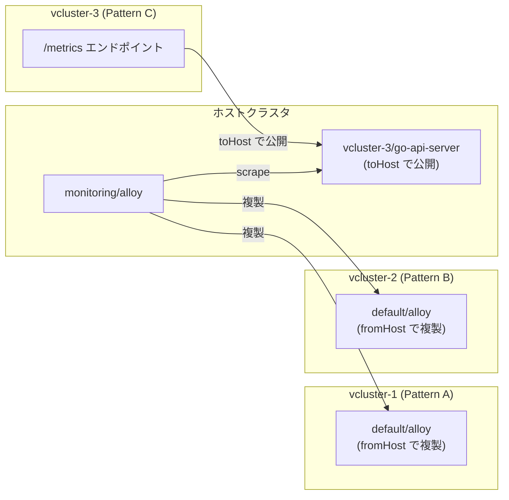

# 検証 2: Go API Server デプロイ手順

## 前提条件

- EKS クラスタと監視スタック (Alloy / Tempo / Loki / Prometheus) が起動済み
- ECR リポジトリが作成済み
- `vcluster` CLI がインストール済み
- ホストクラスタのコンテキストが設定済み

---

## Step 1: Docker イメージのビルドと ECR へのプッシュ

```bash
cd apps/go-api-server

# ECR リポジトリ URI を変数に保存
export ECR_REPO="<AWS_ACCOUNT_ID>.dkr.ecr.ap-northeast-1.amazonaws.com/go-api-server"

# ECR にログイン
aws ecr get-login-password --region ap-northeast-1 \
  | docker login --username AWS --password-stdin $ECR_REPO

# イメージをビルド (go mod tidy はコンテナ内で実行される)
docker build -t go-api-server:latest .

# ECR にプッシュ
docker tag go-api-server:latest ${ECR_REPO}:latest
docker push ${ECR_REPO}:latest
```

> **Note**: `docker build` の `dev` ステージで `go mod tidy` と `go build` がコンテナ内で自動実行されます。

マニフェストの `<ECR_REPO>` を実際の URI に置換します。

```bash
export ECR_REPO="<実際のECR URI>"
find manifests/vcluster/pattern-{a,b,c} -name "*.yaml" \
  -exec sed -i "" "s|<ECR_REPO>|${ECR_REPO}|g" {} \;
```

---

## Step 2: 仮想クラスタの作成

3 つの仮想クラスタをそれぞれ異なる namespace に作成します。

```bash
# vcluster-1 (Pattern A: OTel Collector あり)
kubectl create namespace vcluster-1
vcluster create vcluster-1 -n vcluster-1 \
  --values manifests/vcluster/vcluster-1-config.yaml

# vcluster-2 (Pattern B: OTel Collector なし)
kubectl create namespace vcluster-2
vcluster create vcluster-2 -n vcluster-2 \
  --values manifests/vcluster/vcluster-2-config.yaml

# vcluster-3 (Pattern C: Prometheus scrape)
kubectl create namespace vcluster-3
vcluster create vcluster-3 -n vcluster-3 \
  --values manifests/vcluster/vcluster-3-config.yaml
```

全クラスタの起動を確認します。

```bash
vcluster list
```

期待される出力:

```
      NAME    |   NAMESPACE   | STATUS  | VERSION | CONNECTED | AGE
  ------------+---------------+---------+---------+-----------+------
 vcluster-1  | vcluster-1    | Running | 0.32.1  |           | 1m
 vcluster-2  | vcluster-2    | Running | 0.32.1  |           | 1m
 vcluster-3  | vcluster-3    | Running | 0.32.1  |           | 1m
```

### replicateServices の仕組み

各パターンの `replicateServices` 設定により、クラスタ間のテレメトリ転送を実現しています。



| パターン | 方向 | 設定 | 効果 |
|---|---|---|---|
| A / B | ホスト → 仮想 | `fromHost` | ホストの `monitoring/alloy` を仮想クラスタ内の `default/alloy` として利用可能にする |
| C | 仮想 → ホスト | `toHost` | 仮想クラスタ内の `default/go-api-server` を `vcluster-3/go-api-server` としてホスト側に公開する |

---

## Step 3: Pattern A のデプロイ (vcluster-1)

OTel Collector と Go API Server をデプロイします。

```bash
# vcluster-1 に接続
vcluster connect vcluster-1 -n vcluster-1

# OTel Collector + Go API Server をデプロイ
kubectl apply -f manifests/vcluster/pattern-a/deploy.yaml

# 起動確認
kubectl get pods
```

期待される出力:

```
NAME                              READY   STATUS    RESTARTS
go-api-server-xxxxxxxxx-xxxxx    1/1     Running   0
otel-collector-xxxxxxxxx-xxxxx   1/1     Running   0
```

テレメトリフロー: `Go API Server` → OTLP → `otel-collector:4317` → OTLP → `alloy:4317` (複製サービス) → ホスト Alloy

```bash
# ホストクラスタのコンテキストに戻る
vcluster disconnect
```

---

## Step 4: Pattern B のデプロイ (vcluster-2)

OTel Collector なしで、Go API Server から Alloy に直接送信します。

```bash
vcluster connect vcluster-2 -n vcluster-2

kubectl apply -f manifests/vcluster/pattern-b/deploy.yaml

kubectl get pods
```

テレメトリフロー: `Go API Server` → OTLP → `alloy:4317` (複製サービス) → ホスト Alloy

```bash
vcluster disconnect
```

---

## Step 5: Pattern C のデプロイ (vcluster-3)

OTel SDK なし。Alloy がホスト側からメトリクスをスクレイプします。

```bash
vcluster connect vcluster-3 -n vcluster-3

kubectl apply -f manifests/vcluster/pattern-c/deploy.yaml

kubectl get pods
```

テレメトリフロー: ホスト Alloy → HTTP scrape → `vcluster-3/go-api-server:8080/metrics` (toHost で公開)

```bash
vcluster disconnect
```

### Alloy の scrape 設定追加

ホストクラスタ側の Alloy 設定 (`helm/helmfile.yaml`) に以下の scrape ジョブを追記します。

```alloy
// Pattern C: vcluster-3 の /metrics をスクレイプ
prometheus.scrape "vcluster3_go_api" {
  targets = [{
    __address__ = "go-api-server.vcluster-3.svc.cluster.local:8080",
    service_name = "go-api-server-pattern-c",
  }]
  metrics_path   = "/metrics"
  scrape_interval = "15s"
  forward_to = [prometheus.remote_write.default.receiver]
}
```

設定を反映します。

```bash
helmfile sync -f helm/helmfile.yaml
```

---

## Step 6: 動作確認

### Grafana の Explore で確認

```bash
# Grafana に転送
kubectl port-forward svc/kube-prometheus-stack-grafana 3000:80 -n monitoring
```

| 確認項目 | 手段 | Pattern A | Pattern B | Pattern C |
|---|---|---|---|---|
| メトリクス | Prometheus Explore | ✓ | ✓ | ✓ |
| トレース | Tempo Explore | ✓ | ✓ | ✗ |
| ログ | Loki Explore | ✓ | ✓ | ✗ |
| `service_name` ラベル | PromQL | `pattern-a` | `pattern-b` | `pattern-c` |

### 確認 PromQL クエリ例

```promql
# 各パターンのリクエスト数を一覧
http_server_request_duration_seconds_count{
  service_name=~"go-api-server-.*"
}

# Pattern A のリクエストレート (1分間)
rate(http_server_request_duration_seconds_count{
  service_name="go-api-server-pattern-a"
}[1m])
```

---

## クリーンアップ

```bash
vcluster delete vcluster-1 -n vcluster-1
vcluster delete vcluster-2 -n vcluster-2
vcluster delete vcluster-3 -n vcluster-3

kubectl delete namespace vcluster-1 vcluster-2 vcluster-3
```
