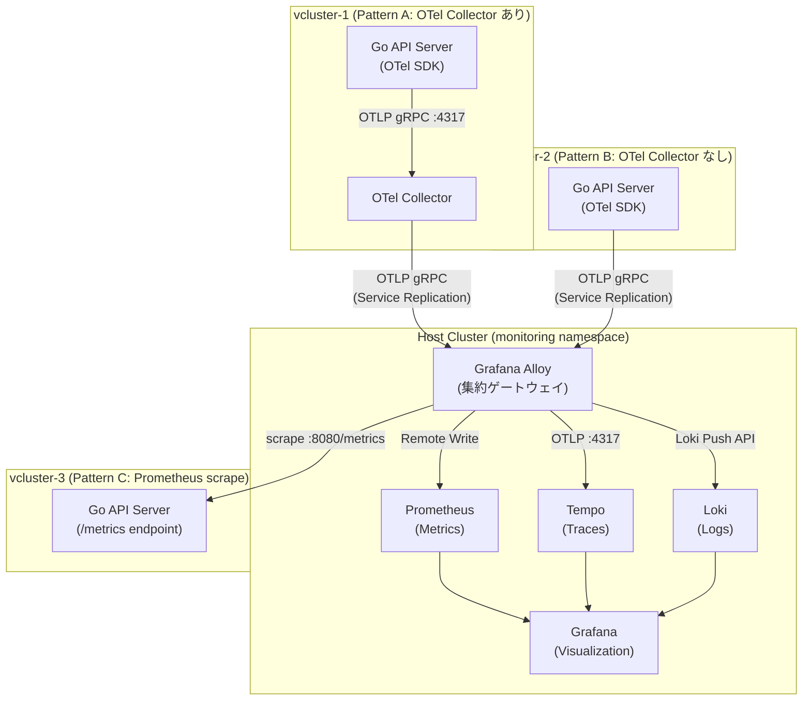

# 検証2: 複数 vCluster の一元監視

## 1. 概要

Grafana Alloy を集約ポイントとして、異なるテレメトリ収集パターンを持つ 3 つの仮想クラスタを
単一の監視基盤で監視できることを検証する。

### 検証の目的

検証1では OTel Demo を用いてテレメトリパイプラインの基本動作を確認した。
検証2では以下を目的とする。

- **複数 vCluster の同時監視**: Alloy が複数の仮想クラスタからのテレメトリを集約できることを示す
- **収集パターンの比較**: OTel Collector あり・なし・Prometheus scrape の 3 パターンを比較する
- **各パターンのトレードオフ**: 取得できるシグナルの種類と運用コストの違いを明示する

### 検証環境

| コンポーネント | 詳細 |
| --- | --- |
| インフラ | AWS EKS (ap-northeast-1) |
| 仮想クラスタ | vCluster v0.32.1 × 3 台 |
| アプリケーション | 自作 Go API Server |
| メトリクス | Prometheus (kube-prometheus-stack) |
| トレース | Grafana Tempo |
| ログ | Grafana Loki |
| テレメトリ収集 | Grafana Alloy |
| 可視化 | Grafana |

---

## 2. アーキテクチャ

### テレメトリデータフロー



### パターン比較

| | Pattern A | Pattern B | Pattern C |
| --- | --- | --- | --- |
| **OTel Collector** | あり | なし | なし |
| **OTel SDK** | あり | あり | なし |
| **Metrics** | ✓ (OTLP) | ✓ (OTLP) | ✓ (scrape) |
| **Traces** | ✓ | ✓ | ✗ |
| **Logs** | ✓ | ✓ | ✗ |
| **バッファリング** | Collector が担う | Alloy が担う | N/A |
| **運用コスト** | 高 (Collector 管理) | 低 | 最低 |
| **適したユースケース** | 大規模・変換処理が必要 | シンプルな新規構築 | 既存アプリの統合 |

---

## 3. Go API Server の仕様

### エンドポイント

| エンドポイント | 説明 | Pattern A/B | Pattern C |
| --- | --- | --- | --- |
| `GET /` | Hello レスポンス | ✓ | ✓ |
| `GET /health` | ヘルスチェック | ✓ | ✓ |
| `GET /metrics` | Prometheus 形式メトリクス | - | ✓ |

### 環境変数

| 変数名 | デフォルト値 | 説明 |
| --- | --- | --- |
| `OTEL_EXPORTER_OTLP_ENDPOINT` | `localhost:4317` | OTLP エクスポート先エンドポイント |
| `OTEL_SERVICE_NAME` | `go-api-server` | サービス名 |
| `PORT` | `8080` | リスニングポート |

### ディレクトリ構成

```text
apps/go-api-server/
├── main.go       # HTTPサーバ・シグナルハンドリング
├── otel.go       # OTel SDK 初期化（TracerProvider・MeterProvider）
├── handler.go    # HTTPハンドラ（span 生成）
└── go.mod
```

---

## 4. 実施手順

### Step 1: 仮想クラスタの作成

3 つの仮想クラスタをそれぞれ異なる namespace に作成する。

```bash
# vcluster-1 (Pattern A)
kubectl create namespace vcluster-1
vcluster create vcluster-1 -n vcluster-1

# vcluster-2 (Pattern B)
kubectl create namespace vcluster-2
vcluster create vcluster-2 -n vcluster-2

# vcluster-3 (Pattern C)
kubectl create namespace vcluster-3
vcluster create vcluster-3 -n vcluster-3
```

### Step 2: サービスレプリケーションの設定

各 vCluster から Alloy へアクセスするため、ホストクラスタの Alloy Service を vCluster 内に複製する。

Pattern A (vcluster-1) および Pattern B (vcluster-2) の vCluster 設定に追加：

```yaml
networking:
  replicateServices:
    fromHost:
      - from: monitoring/alloy
        to: default/alloy
```

Pattern C (vcluster-3) は Alloy が scrape するため、逆方向の設定が必要：

```yaml
networking:
  replicateServices:
    toHost:
      - from: default/go-api-server
        to: vcluster-3/go-api-server
```

### Step 3: Go API Server のビルドと push

```bash
cd apps/go-api-server

# コンテナイメージのビルド
docker build -t go-api-server:latest .

# ECR などにプッシュ（環境に合わせて変更）
docker tag go-api-server:latest <ECR_REPO>/go-api-server:latest
docker push <ECR_REPO>/go-api-server:latest
```

### Step 4: Pattern A のデプロイ (vcluster-1)

vcluster-1 に接続し、OTel Collector と Go API Server をデプロイする。

```bash
vcluster connect vcluster-1 -n vcluster-1

# OTel Collector のデプロイ
kubectl apply -f manifests/vcluster/pattern-a/otel-collector.yaml

# Go API Server のデプロイ（OTLP 送信先: OTel Collector）
kubectl apply -f manifests/vcluster/pattern-a/api-server.yaml
```

`api-server.yaml` の環境変数設定：

```yaml
env:
  - name: OTEL_EXPORTER_OTLP_ENDPOINT
    value: "otel-collector:4317"
  - name: OTEL_SERVICE_NAME
    value: "go-api-server-pattern-a"
```

### Step 5: Pattern B のデプロイ (vcluster-2)

vcluster-2 に接続し、Go API Server を Alloy 直接送信でデプロイする。

```bash
vcluster connect vcluster-2 -n vcluster-2

# Go API Server のデプロイ（OTLP 送信先: Alloy）
kubectl apply -f manifests/vcluster/pattern-b/api-server.yaml
```

`api-server.yaml` の環境変数設定：

```yaml
env:
  - name: OTEL_EXPORTER_OTLP_ENDPOINT
    value: "alloy:4317"
  - name: OTEL_SERVICE_NAME
    value: "go-api-server-pattern-b"
```

### Step 6: Pattern C のデプロイ (vcluster-3)

vcluster-3 に接続し、`/metrics` エンドポイントのみの API Server をデプロイする。

```bash
vcluster connect vcluster-3 -n vcluster-3

# Go API Server のデプロイ（OTel SDK なし）
kubectl apply -f manifests/vcluster/pattern-c/api-server.yaml
```

Alloy の設定に scrape ジョブを追加する（ホストクラスタ側）：

```alloy
prometheus.scrape "vcluster3_go_api" {
  targets = [{
    __address__ = "go-api-server.vcluster-3.svc.cluster.local:8080",
  }]
  forward_to = [prometheus.remote_write.default.receiver]
}
```

---

## 5. 動作確認

### 確認観点

| 確認項目 | 手段 | Pattern A | Pattern B | Pattern C |
| --- | --- | --- | --- | --- |
| メトリクスが Prometheus に到達 | Grafana Explore | ✓ | ✓ | ✓ |
| トレースが Tempo に到達 | Grafana Explore | ✓ | ✓ | ✗ (期待値) |
| ログが Loki に到達 | Grafana Explore | ✓ | ✓ | ✗ (期待値) |
| service_name ラベルで区別可能 | Prometheus クエリ | ✓ | ✓ | ✓ |

### 確認クエリ例

```promql
# 各パターンのメトリクスを一覧表示
http_server_request_duration_seconds_count{
  service_name=~"go-api-server-.*"
}

# パターン別リクエストレート
rate(http_server_request_duration_seconds_count{
  service_name="go-api-server-pattern-a"
}[1m])
```

---

## 6. 期待される結果

1. **Grafana の単一ダッシュボード**で 3 つのサービス（`pattern-a`, `pattern-b`, `pattern-c`）のメトリクスを同時に確認できる
2. Pattern A・B ではトレースとログも取得でき、Pattern C ではメトリクスのみ確認できる
3. `service_name` ラベルにより、どの vCluster 由来のデータか区別できる

---

## 7. 参考資料

- [Grafana Alloy 公式ドキュメント](https://grafana.com/docs/alloy/)
- [OpenTelemetry Go SDK](https://opentelemetry.io/docs/languages/go/)
- [vCluster Service Replication](https://www.vcluster.com/docs/networking/service-sync)
