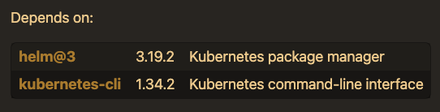

# アドホックな解決策

私の環境でも同様の現象が起きていたので、アドホックな解決案を示します。  
私の環境では、Homebrewのアップデートを行った直後から同様の問題を抱えています。

## 検証環境

AWS EKSクラスタを使用しています。  

| **Component** | **Version** |
| --- | --- |
| OS | macOS Tahoe 26.1 arm64 |
| Helm | 4.0.1/3.19.2 |
| kubectl | Client Version: v1.34.2 |
| vcluster/vcluster cli | 0.30.2 |

## vClusterの依存関係について

現在vCluster v0.30.2は以下のライブラリに依存しています。

- [Homebrew | vcluster](https://formulae.brew.sh/formula/vcluster#default)

  

## helmをv3.19.2にロールバックする

アドホックな解決策として、Helm, KubectlのvClusterが指定するバージョンにロールバックする方法があります。  

[!WARNING]
この方法ではhelmを一度アンインストールする必要があるため、仮想環境などで試すことをお勧めします。  
Helmfileなどの他のOSSもHelmと依存関係にある可能性があるためです。  
この方法を行った結果被った損害について保証はできかねますので予めご了承ください。🙇‍♂️  

### Homebrewからhelm@3をインストール

- アンインストールが必要な場合は以下のコマンドを実行する  
  エラーとなる場合は`--ignore-dependencies`をつければ実行できます  
  再三申し上げるとおり、このコマンドを実行した場合依存関係を無視して実行されるため十分注意してください
  
  ```bash
  brew uninstall helm
  ```

- 以下のリンクからHelmのv3.19.2をインストール
  - [Homebrew | helm@3](http://formulae.brew.sh/formula/helm@3)
- `search`で目的のパッケージformulaが存在することを確認
  
  ```bash
  brew search helm@3
  ```
  
  - 出力結果

    ```bash
    ==> Formulae
    helm@3                    helm                      elm

    ==> Casks
    helo
    ```

- `helm@3`をインストール

  ```bash
  brew install helm@3
  ```

- PATHを通す

  ```bash
  cd ~
  echo 'export PATH="/opt/homebrew/opt/helm@3/bin:$PATH"' >> ~/.zshrc
  source .zshrc
  ```

- バージョンを確認

  ```bash
  helm version
  ```

  - 出力結果

    ```bash
    version.BuildInfo{Version:"v3.19.2", GitCommit:"8766e718a0119851f10ddbe4577593a45fadf544", GitTreeState:"clean", GoVersion:"go1.25.4"}
    ```

### vClusterの動作検証

- バージョンを確認

  ```bash
  vcluster version
  ```

  - 出力結果
  
    ```bash
    vcluster version 0.30.2
    ```

- 仮想クラスタを作成する
  
  ```bash
  vcluster create test-cluster-0 -n test-cluster-0 --debug
  ```

  - 出力結果

    ```bash
    17:35:19 info Downloading [command helm]
    17:35:26 debug VirtualClusterInstance resources are not available on the server.

    ~~~

    17:36:06 done vCluster is up and running
    17:36:06 debug Successfully retrieved vCluster kube config
    17:36:07 info Starting background proxy container...
    17:36:10 done Switched active kube context to vcluster_test-cluster-0_test-cluster-0_arn:aws:eks:ap-northeast-1:xxxxxxxxxxxx:cluster/demo-eks-vcluster
    - Use `vcluster disconnect` to return to your previous kube context
    - Use `kubectl get namespaces` to access the vcluster
    ```

- 問題なく仮想クラスタが作成され、通常通り動作した

  ```bash
  vcluster list
  ```

  - 出力結果
  
    ```bash
           NAME      |    NAMESPACE    | STATUS  | VERSION | CONNECTED | AGE  
    -----------------+-----------------+---------+---------+-----------+------
      test-cluster-0 | test-cluster-0  | Running | 0.30.2  | True      | 67s  
      vcluster       | vcluster-system | Running | 0.30.2  |           | 27h  
    
    17:36:37 info Run `vcluster disconnect` to switch back to the parent context
    ```

- 仮想クラスタの削除

  ```bash
  vcluster delete test-cluster-0 -n test-cluster-0
  ```

  - 出力結果

    ```bash
    17:40:27 info Delete vcluster test-cluster-0...
    17:40:28 done Successfully deleted virtual cluster test-cluster-0 in namespace test-cluster-0
    17:40:28 info Deleting CoreDNS components...
    17:40:29 done Successfully deleted virtual cluster namespace test-cluster-0
    17:40:29 info Waiting for virtual cluster to be deleted...
    17:40:41 done Virtual Cluster is deleted
    ```

## 終わりに

このIssueの問題の本質は、**エラー内容が不明瞭かつエラーの原因が表示されず、トラブルシューティングをより困難にした点**だと思います。  

```bash
$ vcluster create test-cluster-0 -n test-cluster-0
11:30:58 fatal exit status 1
$ vcluster create test-cluster-0 -n test-cluster-0 --debug
11:31:07 fatal exit status 1
```

本件に合わせて`debug`の機能改善や`dry-run`の実装などを検討してはいかがでしょうか？
